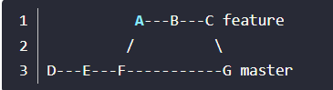

# 1. github简介

此处以github为git仓库进行讲解，国内可以使用码云作为

## 1.1 github的介绍

- github是为开发者提供Git仓库托管服务，并且可以和其他人分享代码，实现社会化编程。

- 其中git仓库管理功能是Github的核心，所以使用github前，要首先先掌握git的相关知识。
- Git是由Linux的创始人Linus Torvalds再2005开发了git的原型程序，目的就是为了解决linux内核开发中的版本系统更换问题


# 2. git安装和使用

## 2.1 Linux环境

系统环境：Rocky 8.4

### 2.1 安装git

```bash
[root@localhost ~]# yum install -y git
Last metadata expiration check: 0:00:10 ago on Mon 11 Jul 2022 12:12:40 PM CST.
Dependencies resolved.
.......

Installed:
  git-2.27.0-1.el8.x86_64             git-core-2.27.0-1.el8.x86_64   git-core-doc-2.27.0-1.el8.noarch    
  perl-Error-1:0.17025-2.el8.noarch   perl-Git-2.27.0-1.el8.noarch   perl-TermReadKey-2.37-7.el8.x86_64  

Complete!

```


## 2.2 初始化设置

1. 设置使用git的姓名和邮箱地址（名字请使用英文）

   ```bash
   [root@localhost ~]# git config --global user.name "xxr"
   [root@localhost ~]# git config --global user.email  "1627389570@qq.com"
   
   [root@localhost ~]# cat ~/.gitconfig 
   [user]
   	name = xxr
   	email = 1627389570@qq.com
   
   ```

   注意：这些姓名和邮箱会保留再提交日志中

2. 提高命令的输出可读性

   ```bash
   [root@localhost ~]# git config --global color.ui  auto 
   [root@localhost ~]# cat ~/.gitconfig 
   [user]
   	name = xxr
   	email = 1627389570@qq.com
   [color]
   	ui = auto
   
   ```


## 2.3 使用github的前期准备

### 2.3.1 创建账号

[码云账号创建参考](https://blog.csdn.net/weixin_47556601/article/details/123498915)


### 2.3.2 设置SSH key

Git的Remote要使用SSH地址, 使用SSH可以让本地电脑和远程git仓库建立安全的连接。

1. 创建SSH KEY

```bash
[root@localhost ~]# ssh-keygen -t rsa -C "1627389570@qq.com"
Generating public/private rsa key pair.
Enter file in which to save the key (/root/.ssh/id_rsa): 
Created directory '/root/.ssh'.
Enter passphrase (empty for no passphrase): 
Enter same passphrase again: 
Your identification has been saved in /root/.ssh/id_rsa.
Your public key has been saved in /root/.ssh/id_rsa.pub.
The key fingerprint is:
SHA256:lqurdC6PfyA+WLrnPtFM6XW4W12fhaZTPtpzlgGF1dI 1627389570@qq.com
The key's randomart image is:
+---[RSA 3072]----+
|              oo.|
|             ...E|
|       . .    .o |
|      o o..  .= .|
|     = .So . *..o|
|    + =.... + oo.|
|   =.o...o   + .o|
|  o.*+ .o   . o.o|
|  .==B*o       + |
+----[SHA256]-----+

# 注意：生成的密钥保存在~/.ssh/下，其中id_rsa是私钥，id_rsa.pub是公钥。
[root@localhost ~]# ls .ssh/
id_rsa  id_rsa.pub
```


2. 添加公钥

   - 查看复制公钥内容

   ```bash
   [root@localhost ~]# cat ~/.ssh/id_rsa.pub 
   ssh-rsa AAAAB3NzaC1yc2EAAAADAQABAAABgQDUmqVCId6SYI0wtCjEmFujP8uByo4s7oe0p4Apz3Vro1sNMjJd42M3tM721Ylob/z/cA5J48TSQOw/l6eolDNQnjBrLNVazylZReln/1ZeLpVZNCCueJrsHinEFEwA0O1HMf7Rk8pQ4ZuSATrqKlbMy398ZZpbptXc/wIjhoT28cvBXCnk5pcezKQzQdSUmS8w5BbrEys5HC1cJc+L18cofF5bXbwLN0mnLbksFuPlT6tqmTj+TPHRy1E1LDbdPeAWfRxqCYPIygknH/Nx1S4P3JsZnalDZDniwFD/FYKaUXRM0Npy0JJXU0XE6IR20/gFKumwGVxN6XaXYDCdggLCCMp/B2EUCMZ97AQlUXh3grI1Y8= 1627389570@qq.com
   
   ```

   - 将复制的内容粘贴到github上的安全设置中的ssh公钥中

     此处以码云为例，github一样的方法

     

     

​	点击**确定**后然后输入当前**登录账号的密码**即可完成添加


-  测试ssh是否配置成功

```bash
[root@localhost ~]# ssh -T git@gitee.com
The authenticity of host 'gitee.com (212.64.63.215)' can't be established.
ECDSA key fingerprint is SHA256:FQGC9Kn/eye1W8icdBgrQp+KkGYoFgbVr17bmjey0Wc.
Are you sure you want to continue connecting (yes/no/[fingerprint])? yes
Warning: Permanently added 'gitee.com,212.64.63.215' (ECDSA) to the list of known hosts.
Hi 不甜的枇杷膏! You've successfully authenticated, but GITEE.COM does not provide shell access.
```


## 2.4 创建仓库 


点击创建后，即可将仓库创建完毕


## 2.5 公开代码

### 2.5.1 clone已有仓库

将远程仓库clone至本地的开发环境中。


本地开发环境配置

```bash
# 创建一个目录用来专门存放github上的远程仓库
[root@localhost ~]# mkdir shell
[root@localhost ~]# ls
anaconda-ks.cfg  Downloads             Pictures  Templates
Desktop          initial-setup-ks.cfg  Public    Videos
Documents        Music                 shell
[root@localhost ~]# cd shell/
# 将远程仓库clone至本地目录下和仓库名同名的目录中
[root@localhost shell]# git clone git@gitee.com:xxrclzm/shell-study.git
Cloning into 'shell-study'...
remote: Enumerating objects: 4, done.
remote: Counting objects: 100% (4/4), done.
remote: Compressing objects: 100% (4/4), done.
remote: Total 4 (delta 0), reused 0 (delta 0), pack-reused 0
Receiving objects: 100% (4/4), done.

[root@localhost shell]# ls -a  shell-study/
.  ..  .git  README.en.md  README.md

```


### 2.5.2 编写代码

```bash
[root@localhost shell-study]# vim hello.sh
[root@localhost shell-study]# cat hello.sh 
#!/bin/bash
# date: 2022-7-11
# author: ccgui
echo "hello"

```


### 2.5.3 提交

```bash
# 使用git add 命令将文件加入暂存区，在通过git commit命令提交
[root@localhost shell-study]# git add .

[root@localhost shell-study]# git commit -m "[ADD] hello.sh"
[master bf61a81] [ADD] hello.sh
 1 file changed, 4 insertions(+)
 create mode 100644 hello.sh
 
 
# 查看git提交的日志
[root@localhost shell-study]# git log 
commit bf61a812f18eec8f0f5339dfcc0ea698d17731be (HEAD -> master)
Author: xxr <1627389570@qq.com>
Date:   Mon Jul 11 13:06:50 2022 +0800

    [ADD] hello.sh

commit 1f9b5b97dc49c01e55219243d9e5ed33892503a3 (origin/master, origin/HEAD)
Author: 不甜的枇杷膏 <1627389570@qq.com>
Date:   Mon Jul 11 04:49:21 2022 +0000

    Initial commit
# 使用git push推送到远程仓库中。    
[root@localhost shell-study]# git push 
Warning: Permanently added the ECDSA host key for IP address '212.64.63.190' to the list of known hosts.
Enumerating objects: 4, done.
Counting objects: 100% (4/4), done.
Delta compression using up to 4 threads
Compressing objects: 100% (3/3), done.
Writing objects: 100% (3/3), 361 bytes | 361.00 KiB/s, done.
Total 3 (delta 0), reused 0 (delta 0), pack-reused 0
remote: Powered by GITEE.COM [GNK-6.3]
To gitee.com:xxrclzm/shell-study.git
   1f9b5b9..bf61a81  master -> master

```

远程的仓库就会发生内容更新


# 3. git的基本操作

## 3.1 git init ----初始化仓库

如果想使用 git进行版本管理，必须先初始化仓库，

- .git目录存放了当前目录内容中的仓库数据
- 文件的编辑操作都会被记录到当前仓库中，如果不想使用git，那么只需要将.git目录删除即可

```bash
[root@localhost shell]# mkdir test-Init
[root@localhost shell]# cd test-Init/
[root@localhost test-Init]# git init
Initialized empty Git repository in /root/shell/test-Init/.git/
[root@localhost test-Init]# ls -a
.  ..  .git
[root@localhost test-Init]# ls -a .git/
.   branches  description  hooks  objects
..  config    HEAD         info   refs


```

## 3.2 git status 

- 用于查看git仓库的状态，例如文件是否已经被提交至远程仓库。

```bash
[root@localhost shell-study]# git status 
On branch master
Your branch is up to date with 'origin/master'.

nothing to commit, working tree clean

# 通过git status可以查看哪些文件没有被提交
[root@localhost shell-study]# touch test.sh
[root@localhost shell-study]# git status 
On branch master
Your branch is up to date with 'origin/master'.

Untracked files:
  (use "git add <file>..." to include in what will be committed)
	test.sh

nothing added to commit but untracked files present (use "git add" to track)

```


## 3.3  git  add

- 向暂存区中添加文件，暂存区是提交之前的一个临时区域

```bash
[root@localhost shell-study]# git add test.sh 
[root@localhost shell-study]# git status 
On branch master
Your branch is up to date with 'origin/master'.

Changes to be committed:
  (use "git restore --staged <file>..." to unstage)
	new file:   test.sh
```


## 3.4 git commit 

- 将当前暂存区中的文件实际保存到仓库的历史记录中，利用这些记录，就可以对文件进行复原。

- -m 参数后面是提交信息，是对这个提交的概述

  ```bash
  [root@localhost shell-study]# git commit -m "[ADD] test.sh"
  [master dc6bb28] [ADD] test.sh
   1 file changed, 0 insertions(+), 0 deletions(-)
   create mode 100644 test.sh
  ```


## 3.5 git log

- git log命令可以查看以往仓库中提交的日志。

  ```bash
  [root@localhost shell-study]# git log 
  commit dc6bb288001eecb10910ca654cfe5b37166ec2e9 (HEAD -> master)
  Author: xxr <1627389570@qq.com>
  Date:   Mon Jul 11 13:45:04 2022 +0800
  
      [ADD] test.sh
  
  commit bf61a812f18eec8f0f5339dfcc0ea698d17731be (origin/master, origin/HEAD)
  Author: xxr <1627389570@qq.com>
  Date:   Mon Jul 11 13:06:50 2022 +0800
  
      [ADD] hello.sh
  
  commit 1f9b5b97dc49c01e55219243d9e5ed33892503a3
  Author: 不甜的枇杷膏 <1627389570@qq.com>
  Date:   Mon Jul 11 04:49:21 2022 +0000
  
  ```

  

## 3.6 git diff

- 查看更改前后的差别(工作树，暂存区和最新提交之间的区别)

```bash
[root@localhost shell-study]# git diff
diff --git a/hello.sh b/hello.sh
index a2090db..128f873 100644
--- a/hello.sh
+++ b/hello.sh
@@ -1,4 +1,4 @@
 #!/bin/bash
 # date: 2022-7-11
 # author: ccgui
-echo "hello"
+echo "hello!"

```

# 4. 分支操作


在并行开发时，就会涉及到分支的功能，以master作为模板，创建分支feature-A和fix-B后，就可以在不同分支后进行不同的作用，然后等分支作业完成后，可以与master分支进行合并。


## 4.1 git branch

- 显示分支，当前使用的分支前面会有*

```bash
  [root@localhost shell-study]# git branch 
  * master
```


 ## 4.2 git checkout -b 

- 创建、切换分支
- git checkout -b 效果等同于  git  branch 分支名（创建分支）加 git checkout 分支名   （切换当前分支）

```bash
[root@localhost shell-study]# git branch 
HEAD            master          origin/HEAD     origin/master 
[root@localhost shell-study]# git branch 
* master
[root@localhost shell-study]# git branch feature-A
[root@localhost shell-study]# git branch 
  feature-A
* master

[root@localhost shell-study]# git checkout feature-A 
A	2.txt
M	hello.sh
Switched to branch 'feature-A'

[root@localhost shell-study]# git branch 
* feature-A
  master

```

- 在feature-A分支下测试效果

```bash
[root@localhost shell-study]# git branch 
* feature-A
  master
[root@localhost shell-study]# ls
2.txt  hello.sh  README.en.md  README.md  test.sh
[root@localhost shell-study]# touch featureA.sh
[root@localhost shell-study]# vim featureA.sh 
[root@localhost shell-study]# cat featureA.sh 
#!/bin/bash
# date: 2022-7-11
# author: ccgui
echo "hello" 
[root@localhost shell-study]# git add featureA.sh 
[root@localhost shell-study]# git commit -m "[ADD] featureA.sh"
[feature-A 6288762] [ADD] featureA.sh
 2 files changed, 4 insertions(+)
 create mode 100644 2.txt
 create mode 100644 featureA.sh
[root@localhost shell-study]# 
[root@localhost shell-study]# ls
2.txt  featureA.sh  hello.sh  README.en.md  README.md  test.sh

# 切换到master上
[root@localhost shell-study]# git branch 
* feature-A
  master
[root@localhost shell-study]# git checkout master 
M	hello.sh
Switched to branch 'master'
Your branch is ahead of 'origin/master' by 1 commit.
  (use "git push" to publish your local commits)
[root@localhost shell-study]# ls
hello.sh  README.en.md  README.md  test.sh
[root@localhost shell-study]# git branch 
  feature-A
* master
```

- 发现在feature-A分支上做的修改，并没有影响到master分支。


## 4.3 git merge

- 分支合并操作

示例：将feature-A分支合并到master主分支上`--no-ff` 在这的作用是禁止快进式合并。

> Git 合并两个分支时，如果顺着一个分支走下去可以到达另一个分支的话，那么 Git 在合并两者时，只会简单地把指针右移，叫做“快进”（fast-forward），比如下图：
>
> 
>
> 要把 feature 合并到 master 中，执行以下命令
>
> ```bash
> $ git checkout master
> 
> $ git merge feature
> ```
>
> 结果就会变成
>
> 
>
> 因为 feature 就在 master 的下游，所以直接移动了 master 的指针，master 和 feature 都指向了 C。而如果执行了 `git merge --no-ff feature` 的话，是下面的结果：
>
> 
>
> 由于 `--no-ff` 禁止了快进，所以会生成一个新的提交，master 指向 G。

- 本例操作如下

```bash
[root@localhost shell-study]# git branch 
  feature-A
* master
[root@localhost shell-study]# ls
hello.sh  README.en.md  README.md  test.sh
# 出现的文本编辑界面直接保存退出即可
[root@localhost shell-study]# git merge --no-ff feature-A 
Merge made by the 'recursive' strategy.
 2.txt       | 0
 featureA.sh | 4 ++++
 2 files changed, 4 insertions(+)
 create mode 100644 2.txt
 create mode 100644 featureA.sh
 
 # feature-A 中的内容已经和master合并
[root@localhost shell-study]# ls
2.txt  featureA.sh  hello.sh  README.en.md  README.md  test.sh
[root@localhost shell-study]# 
```

- 注意一下，目录的分支仅存在于本地仓库中，无法上传到远程仓库。

##  4.4 git log --graph

- 以图标的方式来查看分支

```bash
[root@localhost shell-study]# git log --graph 
* commit 62887626f33a382b70ec4f9dcb195afab253931e (HEAD -> feature-A)
| Author: xxr <1627389570@qq.com>
| Date:   Mon Jul 11 14:36:08 2022 +0800
| 
|     [ADD] featureA.sh
| 
* commit dc6bb288001eecb10910ca654cfe5b37166ec2e9
| Author: xxr <1627389570@qq.com>
| Date:   Mon Jul 11 13:45:04 2022 +0800
| 
|     [ADD] test.sh
| 
* commit bf61a812f18eec8f0f5339dfcc0ea698d17731be
| Author: xxr <1627389570@qq.com>
| Date:   Mon Jul 11 13:06:50 2022 +0800
| 
|     [ADD] hello.sh
| 
* commit 1f9b5b97dc49c01e55219243d9e5ed33892503a3
  Author: 不甜的枇杷膏 <1627389570@qq.com>
  Date:   Mon Jul 11 04:49:21 2022 +0000
  
      Initial commit

```


# 5. 更改提交的操作

## 5.1 git  reset

- 回溯历史版本

- 回溯版本时，使用git log --graph命令可以很明显查看在记录提交操作时，后面都有一个哈希值，使用git reset --hard 哈希值就可以回溯到指定时间的状态。

1. 示例将master分支回到创建feature-A之前的状态

```bash
[root@localhost shell-study]# git log --graph 
*   commit 724d810866d8f8a469a2bb4ac3c9b558771ca80b (HEAD -> master)
|\  Merge: dc6bb28 6288762
| | Author: xxr <1627389570@qq.com>
| | Date:   Mon Jul 11 14:51:10 2022 +0800
| | 
| |     Merge branch 'feature-A'
| | 
| * commit 62887626f33a382b70ec4f9dcb195afab253931e (feature-A)
|/  Author: xxr <1627389570@qq.com>
|   Date:   Mon Jul 11 14:36:08 2022 +0800
|   
|       [ADD] featureA.sh
| 
* commit dc6bb288001eecb10910ca654cfe5b37166ec2e9
| Author: xxr <1627389570@qq.com>
| Date:   Mon Jul 11 13:45:04 2022 +0800
| 
|     [ADD] test.sh
| 
* commit bf61a812f18eec8f0f5339dfcc0ea698d17731be
| Author: xxr <1627389570@qq.com>
| Date:   Mon Jul 11 13:06:50 2022 +0800
| 
|     [ADD] hello.sh
| 
* commit 1f9b5b97dc49c01e55219243d9e5ed33892503a3
  Author: 不甜的枇杷膏 <1627389570@qq.com>
  Date:   Mon Jul 11 04:49:21 2022 +0000
  
      Initial commit
[root@localhost shell-study]# git reset --hard dc6bb288001eecb10910ca654cfe5b37166ec2e9
HEAD is now at dc6bb28 [ADD] test.sh
# 成功恢复到创建test.sh的状态
[root@localhost shell-study]# ls 
hello.sh  README.en.md  README.md  test.sh

```


- 补充点--利用git reflog可以用来查看当前仓库执行过的操作日志，并进行恢复。

  ```bash
  [root@localhost shell-study]# git reflog 
  dc6bb28 (HEAD -> master) HEAD@{0}: reset: moving to dc6bb288001eecb10910ca654cfe5b37166ec2e9
  724d810 HEAD@{1}: reset: moving to 724d810866d8f8a469a2bb4ac3c9b558771ca80b
  7bc7b16 (origin/master, origin/HEAD) HEAD@{2}: checkout: moving from feature-A to master
  6288762 (feature-A) HEAD@{3}: checkout: moving from master to feature-A
  7bc7b16 (origin/master, origin/HEAD) HEAD@{4}: commit: [ADD] test branch
  724d810 HEAD@{5}: merge feature-A: Merge made by the 'recursive' strategy.
  dc6bb28 (HEAD -> master) HEAD@{6}: checkout: moving from feature-A to master
  6288762 (feature-A) HEAD@{7}: commit: [ADD] featureA.sh
  dc6bb28 (HEAD -> master) HEAD@{8}: checkout: moving from master to feature-A
  dc6bb28 (HEAD -> master) HEAD@{9}: checkout: moving from feature-A to :...skipping...
  dc6bb28 (HEAD -> master) HEAD@{0}: reset: moving to dc6bb288001eecb10910ca654cfe5b37166ec2e9
  724d810 HEAD@{1}: reset: moving to 724d810866d8f8a469a2bb4ac3c9b558771ca80b
  7bc7b16 (origin/master, origin/HEAD) HEAD@{2}: checkout: moving from feature-A to master
  6288762 (feature-A) HEAD@{3}: checkout: moving from master to feature-A
  7bc7b16 (origin/master, origin/HEAD) HEAD@{4}: commit: [ADD] test branch
  724d810 HEAD@{5}: merge feature-A: Merge made by the 'recursive' strategy.
  dc6bb28 (HEAD -> master) HEAD@{6}: checkout: moving from feature-A to master
  6288762 (feature-A) HEAD@{7}: commit: [ADD] featureA.sh
  dc6bb28 (HEAD -> master) HEAD@{8}: checkout: moving from master to feature-A
  dc6bb28 (HEAD -> master) HEAD@{9}: checkout: moving from feature-A to master
  dc6bb28 (HEAD -> master) HEAD@{10}: checkout: moving from master to feature-A
  dc6bb28 (HEAD -> master) HEAD@{11}: commit: [ADD] test.sh
  bf61a81 HEAD@{12}: commit: [ADD] hello.sh
  1f9b5b9 HEAD@{13}: clone: from git@gitee.com:xxrclzm/shell-study.git
  
  ```


## 5.2 git commit --amend

- 修改上一次提交的信息

```bash
[root@localhost shell-study]# git log 
commit dd41e194648000f57c4ab8b722f4a6d7e8970580 (HEAD -> master)
Merge: a08d9ca 37ca0da
Author: xxr <1627389570@qq.com>
Date:   Mon Jul 11 15:32:25 2022 +0800

    fix-AB

commit 37ca0dad68401f9e767761e09958a654e32268a8 (feature-A)
Author: xxr <1627389570@qq.com>
Date:   Mon Jul 11 15:29:46 2022 +0800

    feature-A

commit a08d9ca0d972fbbb56a9b1d498bd235aba06838e
Merge: 4c18c43 f31ef53
Author: xxr <1627389570@qq.com>
Date:   Mon Jul 11 15:24:25 2022 +0800
# 执行命令后就会进入编辑界面，对文档里的提交信息修改保存即可。
[root@localhost shell-study]# git commit --amend
[master 65bde05] fix-AB_test
 Date: Mon Jul 11 15:32:25 2022 +0800
[root@localhost shell-study]# git log 
commit 65bde05ee7ad68ed0e96b4d585d619e482a1a612 (HEAD -> master)
Merge: a08d9ca 37ca0da
Author: xxr <1627389570@qq.com>
Date:   Mon Jul 11 15:32:25 2022 +0800

    fix-AB_test
```


# 6. 推送至远程仓库

目前我们所学习的都是针对单一本地仓库的操作，接下来就是介绍操作远程仓库的步骤。

- 首先在github或者码云中创建一个远程仓库。


## 6.1 git remote add

- 添加远程仓库

```bash
[root@localhost shell]# mkdir remoteTest
[root@localhost shell]# cd remoteTest/
[root@localhost remoteTest]# git init 
Initialized empty Git repository in /root/shell/remoteTest/.git/
[root@localhost remoteTest]# git remote add origin git@gitee.com:xxrclzm/remote_test.git

```

注意：此时只是本地仓库和远程仓库关联起来，但是数据内容没有整合。

## 6.2  git push 

- 推送至master分支
- 注意:由于本地仓库和远程仓库刚开始是两个独立的仓库，所以要先使用git pull命令进行分支的合并（--rebase会将两个分支融合成一个线性的提交，不会形成新的节点），
- 然后才是git   push 推送（-u参数：带上`-u` 参数其实就相当于记录了push到远端分支的默认值，这样当下次我们还想要继续push的这个远端分支的时候推送命令就可以简写成`git push`即可）

完整流程如下：

```bash
[root@localhost remoteTest]# ls -a
.  ..
[root@localhost remoteTest]# git init
Initialized empty Git repository in /root/shell/remoteTest/.git/
[root@localhost remoteTest]# git remote add origin git@gitee.com:xxrclzm/remote_test.git
# 注意，如果远程仓库里有提交记录的话，需要使用--force，否则会因为冲突无法推送
[root@localhost remoteTest]# git push -u origin master  --force
Enumerating objects: 3, done.
Counting objects: 100% (3/3), done.
Delta compression using up to 4 threads
Compressing objects: 100% (2/2), done.
Writing objects: 100% (2/2), 228 bytes | 228.00 KiB/s, done.
Total 2 (delta 1), reused 0 (delta 0), pack-reused 0
remote: Powered by GITEE.COM [GNK-6.3]
To gitee.com:xxrclzm/remote_test.git
   6c3069e..aa25b2b  master -> master
Branch 'master' set up to track remote branch 'master' from 'origin'.

[root@localhost remoteTest]# git branch 
* master
[root@localhost remoteTest]# git branch -a
* master
  remotes/origin/master

```


## 6.3 推送至master以外的分支

- 流程如下

```bash
[root@localhost remoteTest]# git checkout  -b feature-D 
Switched to a new branch 'feature-D'
[root@localhost remoteTest]# git push -u origin feature-D 
Total 0 (delta 0), reused 0 (delta 0), pack-reused 0
remote: Powered by GITEE.COM [GNK-6.3]
remote: Create a pull request for 'feature-D' on Gitee by visiting:
remote:     https://gitee.com/xxrclzm/remote_test/pull/new/xxrclzm:feature-D...xxrclzm:master
To gitee.com:xxrclzm/remote_test.git
 * [new branch]      feature-D -> feature-D
Branch 'feature-D' set up to track remote branch 'feature-D' from 'origin'.
[root@localhost remoteTest]# 

```


- 对端仓库页面如下：

  


# 7. 从远程仓库获取

## 7.1 git clone

- 远程获取仓库
- 使用git clone的好处的是：执行git clone命令后我们回默认处于master分支下，同时系统会自动将origin设置成该远程仓库的描述符，也就是说使用git clone当前的仓库和github端的远程仓库（origin)的master分支再内容上是完全一致的，不存在仓库冲突问题。

```bash
[root@localhost shell]# ls
remoteTest  shell-study
[root@localhost shell]# mkdir remoteTest1
[root@localhost shell]# cd remoteTest1/

[root@localhost remoteTest1]# git clone git@gitee.com:xxrclzm/remote_test.git
Cloning into 'remote_test'...
remote: Enumerating objects: 13, done.
remote: Counting objects: 100% (13/13), done.
remote: Compressing objects: 100% (10/10), done.
remote: Total 13 (delta 0), reused 0 (delta 0), pack-reused 0
Receiving objects: 100% (13/13), done.

[root@localhost remoteTest1]# ls
remote_test
[root@localhost remoteTest1]# cd remote_test/
[root@localhost remote_test]# ls
1.txt  README.md  README.md.en
[root@localhost remote_test]# git branch -a
* master
  remotes/origin/HEAD -> origin/master
  remotes/origin/feature-D
  remotes/origin/master

```


### 7.1.1 获取远程的feature-D分支

```bash
# -b 后面就是本地仓库新建分支的名称，一般和远程分支保存一致
[root@localhost remote_test]# git checkout -b origin/feature-D 
Switched to a new branch 'origin/feature-D'
[root@localhost remote_test]# git branch -a
  master
* origin/feature-D
  remotes/origin/HEAD -> origin/master
  remotes/origin/feature-D
  remotes/origin/master
[root@localhost remote_test]# ls
1.txt  README.md  README.md.en
```


## 7.2 git pull

- 获取最新的远程仓库分支

1. 再仓库上创建文件pull.sh

   

2. 本地仓库利用pull命令

   ```bash
   [root@localhost remote_test]# git pull --rebase 
   Unpacking objects: 100% (3/3), 957 bytes | 957.00 KiB/s, done.
   From gitee.com:xxrclzm/remote_test
      1cad956..9049824  master     -> origin/master
   Updating 1cad956..9049824
   Fast-forward
    pull.sh | 1 +
    1 file changed, 1 insertion(+)
    create mode 100644 pull.sh
   
   [root@localhost remote_test]# ls
   1.txt  pull.sh  pull.txt  README.md  README.md.en
   ```
   


