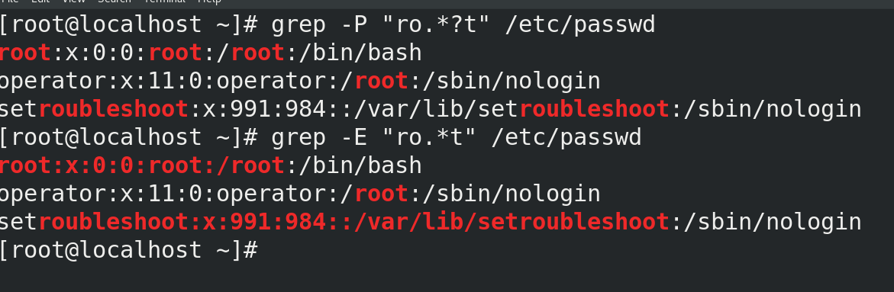

# 1. grep命令

## 1.1 正则表达式

正则表达式：由一类特殊字符及文本字符所编写的模式，其中有些字符不表示其字面也有，而是用于表示控制或通配的功能。

一般分为两类：

- 基本正则表达式：BRE
- 扩展正则表达式：ERE

## 1.2 正则表达式的意义

- 处理大量的字符串
- 处理文本

同通过特殊符号的辅助，可以让linux的使用用户快速过滤，替换，处理所需要的字符串、文本，让工作高效。

例如：

- 配置文件
- 程序代码
- 命令输出结果
- 日志文件

且此类字符串内容，我们常会找出符合工作需求的特定内容，因此就可以使用正则表达式。

- 在linux只有（sed,awk，grep）支持，其他命令一般不支持。

注意：通配符和正则表达式还是由区别的，大部分命令支持通配符但是不支持正则表达式。

- 通配符一般式shell在文件名匹配时用到，例如ls,cp，rm等

### 1.2.1 shell常见的通配符

| 通配符                | 含义                                       | 实例                                                         |
| --------------------- | ------------------------------------------ | ------------------------------------------------------------ |
| *                     | 匹配0或多个字符                            | a*b a与b之间可以有任意长度的任意字符，也可以一个也没有，如aabcb，axyzb,ab. |
| ?                     | 匹配任意一个字符                           | a?b a与b之间必须也只能有一个字符。可以任意字符，如aab,abb,a0b。 |
| [list]                | 匹配任意单一字符                           | a[xyz]b a与b之间必须也只能有一个字符，可以时任意字符,如aab，abb,acb，a0b。 |
| [!list]或\[^list]     | 匹配除list中的任意单一字符                 | a[!0-9]b a与b之间必须也有一个字符，但不能是阿拉伯数字，如axb,aab,a-b |
| [c1-c2]               | 匹配c1-c2中的任意单一字符，如：\[0-9][a-z] | a[0-9]b  a与b之间必须也只能有一个字符，且必须是阿拉伯数字    |
| [!c1-c2]或\[^c1-c2]   | 匹配不在c1-c2的任意字符                    | a[!0-9]b 如acb adb                                           |
| {string1,string2,...} | 匹配 sring1 或 string2 (或更多)其一字符串  | a{abc,xyz,123}b 列出aabcb,axyzb,a123b                        |


### 1.2.2 正则表达式

- 基本正则表达式

| 符号   | 作用                                                         |
| ------ | ------------------------------------------------------------ |
| ^      | 尖角号，用于模式的最左侧，如”^root",匹配root单词开头的行     |
| $      | 美元符，用于模式的最右侧，如“root$"，匹配以root单词结尾的行  |
| ^$     | 组合符，表示空行                                             |
| .      | 匹配任意一个且只有一个字符                                   |
| \      | 转义符，让特殊含义的字符，表示字符本义，例如\\.代表小数点    |
| *      | 匹配前一个字符（连续出现）0或1次以上，重复0次代表空（即*前面没有内容），即匹配所有内容 |
| .*     | 组合符，匹配所有内容                                         |
| ^.*    | 组合符，匹配任意多个字符开头的内容                           |
| .*$    | 组合符，匹配任意多个字符结尾的内容                           |
| [abc]  | 匹配[]集合内的任意一个字符，a或b或c，也可以[a-c]             |
| [^abc] | 匹配除了^后面的任意字符。                                    |


- 扩展正则表达式ERE集合

扩展正则表达式必须用grep  -E   才能生效

| 字符   | 作用                                |
| ------ | ----------------------------------- |
| +      | 匹配前一个字符1次或者多次           |
| [:/]+  | 匹配括号内的":"或者”/“字符1次或多次 |
| ？     | 匹配前一个字符0次或1次              |
| \|     | 表示或者，可以同时过滤多个字符串    |
| a{n,m} | 匹配前一个字符串最少n次，最多m次    |
| a{n，} | 匹配前一个字符最少n次               |
| a{n}   | 匹配前一个字符正好n次               |
| a{,m}  | 匹配前一个字符最多m次               |


# 1.3 grep的使用

grep  [选项]   [匹配模式]   文件数据

- 匹配模式中，即使要获取过滤的数据对象

- 常见选项：

  - -i :忽略大小写
  - -o: 仅显示匹配到的字符串本身
  - -v，反选
  - -E: 支持使用扩展正则表达式
  - -x：只匹配过滤的单词，必须和grep后面的内容一模一样。
  - -n: 显示行号
  - -c: 只统计匹配的行数
  - -P 选项是利用PERL的正则语法进行匹配（默认情况下，grep不支持非贪心匹配，使用-P支持非贪心匹配）

  

贪心匹配和非贪心匹配

- 量词后面如果加？代表非贪心匹配，默认式贪心匹配

  


具体案例

- -c

```bash
[root@localhost ~]# grep  -c "root" /etc/passwd
2
```


- 查找空白行

```bash
[root@localhost ~]# grep  -c "^$" /etc/containers/registries.conf
2

```

- 查找非空白行

```bash
[root@localhost ~]# grep  -c "^[^$]" /etc/containers/registries.conf
77
```


- 忽略大小写

```bash
[root@localhost ~]# grep   "[Rr][Oo][Oo][Tt]" /etc/passwd
root:x:0:0:root:/root:/bin/bash
operator:x:11:0:operator:/root:/sbin/nologin

```


- 匹配重复字符

可以搭配.和*来实现

```bash
[root@localhost ~]# grep   "r..t" /etc/passwd
root:x:0:0:root:/root:/bin/bash
operator:x:11:0:operator:/root:/sbin/nologin
ftp:x:14:50:FTP User:/var/ftp:/sbin/nologin
clevis:x:994:988:Clevis Decryption Framework unprivileged user:/var/cache/clevis:/sbin/nologin

```

- 或使用

  注意必须在扩展正则表达式的使用 | 

  ```bash
  [root@localhost ~]# grep -E   "root|bash" /etc/passwd
  root:x:0:0:root:/root:/bin/bash
  operator:x:11:0:operator:/root:/sbin/nologin
  student:x:1000:1000:student:/home/student:/bin/bash
  containers:x:1001:1001::/home/containers:/bin/bash
  student01:x:1002:1003::/home/student01:/bin/bash
  student02:x:1003:1004::/home/student02:/bin/bash
  
  ```

  
