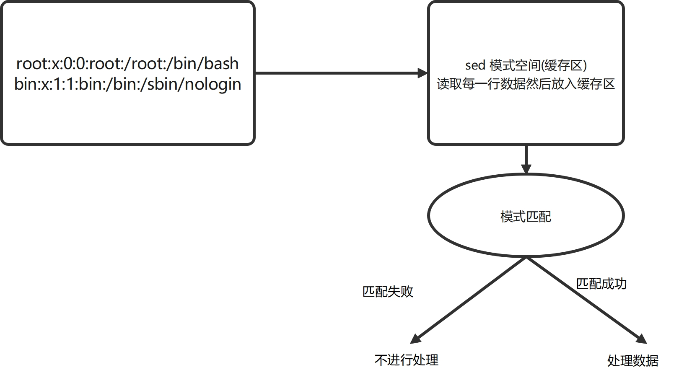

# 一、概述
sed是一款行处理器。

# 二、sed基本指令
sed会逐行扫描输入的数据，并将读取的数据内容复制到模式空间，然后拿模式空间中的数据与给定的条件进行匹配，如果匹配成功则执行特定的sed指定，否则跳过输入的数据行，继续读取后面的数据。

默认情况下sed会把最终的数据结果通过标准输出显示在屏幕上。

$$输入文件 -->   sed模式空间  --> 显示器$$




## 2.1 sed语法格式
命令 | sed[选项]  '匹配条件和操作指令'

sed [选项]  '匹配条件和操作指令'  输入文件

## 2.2 命令选项

| 命令选项  | 功能描述  |
| :----    | :--------|
| -n | 屏蔽默认输出功能，默认sed会把匹配到的数据显示在屏幕上 |
| -r  | 支持扩展正则  |
| -i[SUFFIX]  | 直接修改源文件，如果设置了SUFFIX后缀名，sed会将数据备份 |
| -e  | 指定需要执行的sed指令，支持使用多个-e参数 | 
| -f  |  指定需要执行的脚本文件 ，需要提前将sed指令写入文件中 |


## 2.3 基本操作指令
| 操作指令  |  功能描述  |
| :----   |  :------   |
| p       | 打印当前匹配的数据行  | 
| l | 小写的L,打印当前匹配的数据行（显示控制字符，如回车符等） | 
|=  | 打印当前读取的数据所在的行数  | 
| a text | 在匹配的数据行后追加文本内容  | 
| i text | 在匹配的数据行前插入文本内容  | 
| d      | 删除匹配的数据行整行内容（行删除）| 
| c text | 将匹配的数据行整行内容替换为特定的文本内容  | 
| r filename | 从文件中读取数据并追加到匹配的数据行后面 |
| w filename | 将当前匹配到的数据写入特定的文件中  | 
| q[exit code] | 立刻退出sed脚本  | 
| s/regrexp/replace/ | 使用正则匹配，将匹配的数据替换为特定的内容 | 


## 2.4 sed支持的数据定位方法

| 格式   |  功能描述| 
| :---   | :-------|
| number | 直接根据行号匹配数据  | 
| first~step  | 从fist开始，步长为step，匹配所有满足条件的数据行   | 
| $      | 匹配最后一行  | 
| /regexp/  | 使用正则表达式匹配数据行  | 
| \cregexpc | 使用正则表达式匹配数据行，c可以是任意字符 | 
| addr1,addr2 | 直接使用行号定位，匹配从addr1到add2行的所有行|
| addr1,+N | 使用行号定位，匹配从addr1开始及后面的N行  | 


## 2.5 示例
### p指令     
```bash
# 打印/etc/hosts文件至屏幕
[root@localhost ~]# sed p /etc/hosts 
127.0.0.1   localhost localhost.localdomain localhost4 localhost4.localdomain4
127.0.0.1   localhost localhost.localdomain localhost4 localhost4.localdomain4
::1         localhost localhost.localdomain localhost6 localhost6.localdomain6
::1         localhost localhost.localdomain localhost6 localhost6.localdomain6
```

没有指定条件时，默认匹配所有数据行   
sed读取文件的第一行执行p指定将该行内容显示在屏幕上，接着读取文件的第二行继续执行p指令将该行内容显示在屏幕上。但为什么每行数据会显示两次呢？

***因为即使没有P指令，sed也默认将读取到的所有数据显示在屏幕上***

可以使用-n选项屏蔽sed默认的输出功能。

```bash
[root@localhost ~]# sed -n p /etc/hosts 
127.0.0.1   localhost localhost.localdomain localhost4 localhost4.localdomain4
::1         localhost localhost.localdomain localhost6 localhost6.localdomain6

#  使用1p打印第一行的内容
[root@localhost ~]# sed -n '1p' /etc/hosts 
127.0.0.1   localhost localhost.localdomain localhost4 localhost4.localdomain4
# 使用2p打印第二行的内容。（支持管道）
[root@localhost ~]# df -h | sed -n '2p' 
devtmpfs         7.8G     0  7.8G   0% /dev

```

直接使用行号匹配
```bash 
# 将passwd的数据生成带有行号的数据
[root@localhost ~]# cat -n /etc/passwd > /tmp/passwd

# 输出1到3行的内容，没有带有行号
[root@localhost ~]# sed -n '1,3p' /etc/passwd
root:x:0:0:root:/root:/bin/bash
bin:x:1:1:bin:/bin:/sbin/nologin
daemon:x:2:2:daemon:/sbin:/sbin/nologin

# 输出1到3行的内容，带有行号。
[root@localhost ~]# sed -n '1,3p' /tmp/passwd 
     1	root:x:0:0:root:/root:/bin/bash
     2	bin:x:1:1:bin:/bin:/sbin/nologin
     3	daemon:x:2:2:daemon:/sbin:/sbin/nologin

# 输出46行到最后一行的内容。
[root@localhost ~]# sed -n '46,$p' /tmp/passwd
    46	student:x:1000:1000:student:/home/student:/bin/bash
    47	apache:x:48:48:Apache:/usr/share/httpd:/sbin/nologin
    48	libvirtdbus:x:975:974:Libvirt D-Bus bridge:/:/sbin/nologin

# 从第1行及后面3行进行内容输出。
[root@localhost ~]# sed -n '1,+3p' /tmp/passwd 
     1	root:x:0:0:root:/root:/bin/bash
     2	bin:x:1:1:bin:/bin:/sbin/nologin
     3	daemon:x:2:2:daemon:/sbin:/sbin/nologin
     4	adm:x:3:4:adm:/var/adm:/sbin/nologin


# 从第一行起，步长为5输出内容。
[root@localhost ~]# sed -n '1~5p' /tmp/passwd 
     1	root:x:0:0:root:/root:/bin/bash
     6	sync:x:5:0:sync:/sbin:/bin/sync
    11	games:x:12:100:games:/usr/games:/sbin/nologin
    16	systemd-resolve:x:193:193:systemd Resolver:/:/sbin/nologin
....

# 显示文件最后一行
[root@localhost ~]# sed -n '$p' /tmp/passwd 
    48	libvirtdbus:x:975:974:Libvirt D-Bus bridge:/:/sbin/nologin
```

### 使用正则表达式匹配
```bash
#  匹配包含root的行
[root@localhost ~]# sed -n '/root/p' /tmp/passwd 
     1	root:x:0:0:root:/root:/bin/bash
    10	operator:x:11:0:operator:/root:/sbin/nologin

# 匹配以bash结尾的行
[root@localhost ~]# sed -n '/bash$/p' /tmp/passwd 
     1	root:x:0:0:root:/root:/bin/bash
    46	student:x:1000:1000:student:/home/student:/bin/bash

# 匹配以s开头，以:x结尾，中间包含任意三个字符。
[root@localhost ~]# sed -n '/s...:x/p' /tmp/passwd 
     6	sync:x:5:0:sync:/sbin:/bin/sync
    28	gluster:x:992:986:GlusterFS daemons:/run/gluster:/sbin/nologin
    35	sssd:x:982:982:User for sssd:/:/sbin/nologin
    44	sshd:x:74:74:Privilege-separated SSH:/var/empty/sshd:/sbin/nologin

# 匹配包含数字的行 
[root@localhost ~]# sed -n '/[0-9]/p' /tmp/passwd  
     1	root:x:0:0:root:/root:/bin/bash
     2	bin:x:1:1:bin:/bin:/sbin/nologin
     3	daemon:x:2:2:daemon:/sbin:/sbin/nologin
     4	adm:x:3:4:adm:/var/adm:/sbin/nologin
     5	lp:x:4:7:lp:/var/spool/lpd:/sbin/nologin
    ...


# 匹配以root开头的行
[root@localhost ~]# sed -n '/^root/p' /etc/passwd  
root:x:0:0:root:/root:/bin/bash
```

默认sed不支持扩展正则，如果希望使用扩展正则匹配数据，可以使用-r参数。
```bash
# 匹配icmp开头或igmp开头的行。
[root@localhost ~]# sed -rn '/^(icmp|igmp)/p'  /etc/protocols 
icmp	1	ICMP		# internet control message protocol
igmp	2	IGMP		# internet group management protocol

# 匹配含有UID字符的行
[root@localhost ~]# sed -n '\cUIDcp' /etc/login.defs 
UID_MIN                  1000
UID_MAX                 60000
SYS_UID_MIN               201
SYS_UID_MAX               999

# 匹配含有bash字段的行，c可以时任意字符。
[root@localhost ~]# sed -n '\cbashcp' /etc/shells 
/bin/bash
/usr/bin/bash

#打印控制字符。
[root@localhost ~]# sed -n  'l' /etc/shells 
/bin/sh$
/bin/bash$
/usr/bin/sh$
/usr/bin/bash$

```

### 使用=指令显示行号
```bash
# 显示包含root字符串的行号
[root@localhost ~]# sed -n '/root/='  /etc/passwd
1
10
# 显示最后一行的行号。
[root@localhost ~]# sed -n "$="  /etc/passwd
48

```

### 使用感叹号(!)对匹配的条件取反
注意感叹号放在最后，p之前。
```bash
# 显示除了bash字段以外的行。
[root@localhost ~]# sed -n '\cbashc!p' /etc/shells
/bin/sh
/usr/bin/sh

#打印除了第一行以外的所有行。
[root@localhost ~]# sed -nr '1!p' /tmp/passwd
     2	bin:x:1:1:bin:/bin:/sbin/nologin
     3	daemon:x:2:2:daemon:/sbin:/sbin/nologin
     4	adm:x:3:4:adm:/var/adm:/sbin/nologin
     5	lp:x:4:7:lp:/var/spool/lpd:/sbin/nologin
```

## a指令和i指令

```bash
# 在第一行后添加一行数据。（行号a，在指定行号后面）
[root@localhost ~]# sed '1a hello world' /tmp/passwd 
     1	root:x:0:0:root:/root:/bin/bash
hello world
     2	bin:x:1:1:bin:/bin:/sbin/nologin
     3	daemon:x:2:2:daemon:/sbin:/sbin/nologin

# 在第一行开头添加一行数据（行号i，在指定行号前面）
[root@localhost ~]# sed  '1i hello world' /etc/hosts 
hello world
127.0.0.1   localhost localhost.localdomain localhost4 localhost4.localdomain4
::1         localhost localhost.localdomain localhost6 localhost6.localdomain6

# 对匹配到的行添加数据
[root@localhost ~]# sed    '/root/a hello' /tmp/passwd 
     1	root:x:0:0:root:/root:/bin/bash
hello
     2	bin:x:1:1:bin:/bin:/sbin/nologin
     3	daemon:x:2:2:daemon:/sbin:/sbin/nologin
     4	adm:x:3:4:adm:/var/adm:/sbin/nologin
     5	lp:x:4:7:lp:/var/spool/lpd:/sbin/nologin
     6	sync:x:5:0:sync:/sbin:/bin/sync
     7	shutdown:x:6:0:shutdown:/sbin:/sbin/shutdown
     8	halt:x:7:0:halt:/sbin:/sbin/halt
     9	mail:x:8:12:mail:/var/spool/mail:/sbin/nologin
    10	operator:x:11:0:operator:/root:/sbin/nologin
hello


```

## -i选项,对源文件进行修改
以上方法不会修改源文件，但是如果想修改源文件的话，那么可以私用-i选项，注意使用-i.后缀名，可以对源文件进行备份。
```bash
[root@localhost ~]# sed  -i  '1i hello world' /tmp/hosts 
[root@localhost ~]# cat /tmp/hosts 
hello world
127.0.0.1   localhost localhost.localdomain localhost4 localhost4.localdomain4
::1         localhost localhost.localdomain localhost6 localhost6.localdomain6

# 修改源文件并进行备份。
[root@localhost ~]# sed  -i.bak   '1i hello world test' /tmp/hosts 
[root@localhost ~]# ls /tmp/
hosts
hosts.bak
```


### c指令
替换指定行内容
```bash
[root@localhost ~]# sed    '1c hello' /tmp/passwd 
hello
     2	bin:x:1:1:bin:/bin:/sbin/nologin
     3	daemon:x:2:2:daemon:/sbin:/sbin/nologin
```


### d指令
删除指定行
```bash
# 删除全文
[root@localhost ~]# sed  -i 'd' /tmp/hosts
[root@localhost ~]# cat /tmp/hosts
[root@localhost ~]# 

# 删除最后一行
[root@localhost ~]# sed   '$d' /tmp/hosts.bak  
127.0.0.1   localhost localhost.localdomain localhost4 localhost4.localdomain4


# 删除空白行
[root@localhost ~]# sed '/^$/d' /tmp/profile 

# 删除以#号开头的行
[root@localhost ~]# sed '/^#/d' /tmp/profile 

```

### s指令，替换

```bash
[root@localhost ~]# cat /tmp/test.txt 
HELLO the word
gor susdfsd go
# 将每行的第一个the替换成hi
[root@localhost ~]# sed 's/the/hi/'  /tmp/test.txt HELLO hi word
gor susdfsd go
# 将每一行所有的hi替换成hi
[root@localhost ~]# sed 's/go/hi/g'  /tmp/test.txt  
HELLO the word
hir susdfsd hi

# 仅替换每行的第二个字符o
[root@localhost ~]# sed '2s/go/hi/'  /tmp/test.txt 
HELLO the word
hir susdfsd go
[root@localhost ~]# sed '2s/go/hi/g'  /tmp/test.txt 
HELLO the word
hir susdfsd hi

```

i忽略大小写
```bash
# 添加i标记可以忽略大小写
[root@localhost ~]# sed 's/hello/hello/ig'  /tmp/test.txt 
hello the word
gor susdfsd go
```

e标记，将替换后的内容当成shell命令在终端执行一次。

```bash
# 添加e标记
[root@localhost ~]# echo "/etc/hosts" | sed  's/^/ls -l /e ' 
-rw-r--r--. 1 root root 158 Sep 10  2018 /etc/hosts

# ls  /tmp/hosts
[root@localhost ~]# echo "hosts" | sed  's/^/ls  \/tmp\//e'
/tmp/hosts

# 将the 替换为空，即删除
[root@localhost ~]# cat /tmp/hosts 
hello
[root@localhost ~]# cat /tmp/hosts | sed 's/e//g'
hllo

# 多个双引号的问题。
# 删除以双引号开头和双引号结尾的数据
[root@localhost ~]# echo '"hello"  "world"' | sed 's/\".*\"//'

# 替换仅仅匹配由第一个引号开始，中间不包含引号的任意其他字符，最后是一个引号结束的数据 s/ \"(双引号开头)[^\"]（除了引号）*（任意字符） \" (引号结尾) 
[root@localhost ~]# echo '"hello"  "world"' | sed 's/\"[^\"]*\"//'
  "world"

```

保留功能
```bash
# 将每行的首尾字符对调。
[root@localhost ~]# cat /tmp/hosts
hello
[root@localhost ~]# sed -r 's/^(.)(.*)(.)$/\3\2\1/' /tmp/hosts
oellh
```

替换符号   
s指令默认使用斜线（/）作为替换符号，但是替换内容本身包含谢谢需要转义时，为了美观，可以使用其他字符作为替换。
```bash
[root@localhost ~]# sed -r 's#^(.)(.*)(.)$#\3\2\1#' /tmp/hosts
oellh
```

#### 常见用法
```bash
# 删除每一行前面的空格
[root@localhost ~]# sed -r 's/^ +//g' /tmp/profile 
# /etc/profile

# System wide environment and startup programs, for login setup
# Functions and aliases go in /etc/bashrc

# 替换每一行中第二个开始的unix
[root@localhost ~]# sed '2s/HELLO/hello/g' /tmp/hosts
hello
hello word

#删除第二行的第二个字符，与最后一个
[root@localhost ~]# sed  -r '2s/(.)./\1/;2s/.$//' /tmp/hosts
hello
HLLO wor

# 删除每一行最后的空白字符
[root@localhost ~]# sed -ri 's/ *$//g' /tmp/hosts

# 删除每一行最后的逗号
[root@localhost ~]# sed 's/,$//' /tmp/hosts

#删除匹配号到最后一行。参照格式1,nd
[root@localhost ~]# sed '/^unset/,$d' /tmp/profile 
# /etc/profile

# 只替换完整的unix,\b代表单词边界
[root@localhost ~]# sed '1,3/\bunix\b/linux/'  text.txt

# 将两位数的数字替换为number
[root@localhost ~]# sed  -n 's/\b[0-9]\{2\}\b/number/gp' test.txt

# 替换镜像为nginx:1.0
[root@localhost ~]# sed -i "s/image: .*/image: nginx:1.0/g"  web.yml

```

### r指令，从文件中读取数据

将r后面文件的内容放到指定文件中。
```bash
[root@localhost ~]# sed -n 'p' /tmp/hosts
hello
HELLO word
[root@localhost ~]# echo "new" > /tmp/hosts_test
[root@localhost ~]# sed  'r /tmp/hosts' /tmp/hosts_test 
new
hello
HELLO word

```
注意: /匹配对象/r 匹配的是在目标文件的哪一行。
```bash
[root@localhost ~]# cat /tmp/hosts_test 
new
[root@localhost ~]# cat /tmp/hosts
hello
HELLO word
[root@localhost ~]# sed -r '/HELL/r /tmp/hosts_test'  /tmp/hosts 
hello
HELLO word
new
[root@localhost ~]# sed -r '/hello/r /tmp/hosts_test'  /tmp/hosts 
hello
new
HELLO word
```

### w指令
将匹配的数据写入新文件中
```bash
[root@localhost ~]# sed -n '/HELLO/w /tmp/myhost' /tmp/hosts
[root@localhost ~]# cat /tmp/myhost 
HELLO word
```

### q指令
退出sed  
注意：避免与-i选项同时使用，否则会导致sed读取出来的数据覆盖源文件。
```bash
[root@localhost ~]# sed '2q' /etc/shells 
/bin/sh
/bin/bash
```

### 编写多条指令
使用以下三种方法可以同时编写多条sed指令   

使用-e选项
```bash
[root@localhost ~]# cat /tmp/hosts
hello
HELLO word
[root@localhost ~]# sed -e 's/hello/Hello/g'  -e 's/HELLO/Hello/g'  /tmp/hosts
Hello
Hello word
```

使用分号分隔
```bash
[root@localhost ~]# sed  's/hello/Hello/g;s/HELLO/Hello/g'  /tmp/hosts
Hello
Hello word
```

利用分行
```bash
[root@localhost ~]# cat /tmp/hosts
hello
HELLO word
[root@localhost ~]# sed 's/hello/Hello/ 
> s/HELLO/Hello/' /tmp/hosts
Hello
Hello word
```

### 指令分组
将分号放到花括号中可以实现对指令的分组
```bash
[root@localhost ~]# cat /tmp/hosts
hello  add
HELLO word
HELLo dd

# 不用分组的话，第一个和第二个匹配条件都是全局匹配
[root@localhost ~]# sed '/HELL/s/word/WORrd/;s/d//' /tmp/hosts
hello  ad
HELLO WORr
HELLo d

# 使用分组后，后续的匹配条件是在前一个匹配条件的基础上生效，例如: 先满足条件1，然后再匹配条件2
[root@localhost ~]# sed '/HELL/{s/word/WORrd/;s/d//}' /tmp/hosts
hello  add
HELLO WORr
HELLo d
```

### -f选项，读取指令文件
编辑指令文件   
vi script.sed

```bash
[root@localhost ~]# sed  -n -f script.sed /tmp/hosts
HELLO word
[root@localhost ~]# cat script.sed 
/word/p
[root@localhost ~]# 
```

## 三、sed高级指令

| 高级操作指令 | 功能描述  |
| :-----      | :--------|
| h | 将模式空间中的数据复制到保留空间  | 
| H | 将模式空间中的数据追加到保留空间  |
| g | 将保留空间中的数据复制到模式空间  | 
| G | 将保留空间中的数据追加到模式空间  | 
| x | 将模式空间和保留空间中的数据对调  | 
| n | 读取下一行数据到模式空间         | 
| N | 读取下一行数据追加到模式空间     |
| y/源/目标/ | 以字符为单位将源字符转为目标字符 | 
| :label    | 为t或b指令定义label标签  | 
| t label   | 有条件跳转到标签（label）,如果没有label则跳转到指令的结尾  |
| b label  | 跳转到标签（label）,如果没有label则跳转到指令的结尾  | 

sed在对数据进行编辑修改前需要先将读取的数据写入模式看空间中，sed还设计了一个保留空间，默认仅包含一个回车符。

```bash
[root@localhost ~]# cat /tmp/hosts
hello  add
HELLO word
HELLo dd
[root@localhost ~]# sed  '/hello/h;/dd/x'  /tmp/hosts
hello  add
HELLO word
hello  add
[root@localhost ~]# sed  '/hello/h;/dd/g'  /tmp/hosts
hello  add
HELLO word
hello  add
[root@localhost ~]# sed  '/hello/h;/dd/G'  /tmp/hosts
hello  add
hello  add
HELLO word
HELLo dd
hello  add
# 注意符合dd的有两行
[root@localhost ~]# sed  '/hello/H;/dd/G'  /tmp/hosts
hello  add

hello  add
HELLO word
HELLo dd

hello  add
```

 #### n指令
 sed遇到n指令会立刻输出当前模式空间的内容，直接读取文件的下一行数据的模式空间。
 ```bash
 # 删除偶数行
 [root@localhost ~]# sed 'n;d'  /tmp/hosts
hello  add
HELLo dd

# 每两行合并为一行。
[root@localhost ~]# sed 'N;s/\n//' /tmp/hosts
hello  addHELLO word
HELLo dd
 ```
#### y指令
以字符为单位进行替换，单个字符是sed中的最小处理单位。
```bash
# 将h替换为H，将E替换为e
[root@localhost ~]# sed 'y/hE/He/' /tmp/hosts
Hello  add
HeLLO word
HeLLo dd

```


