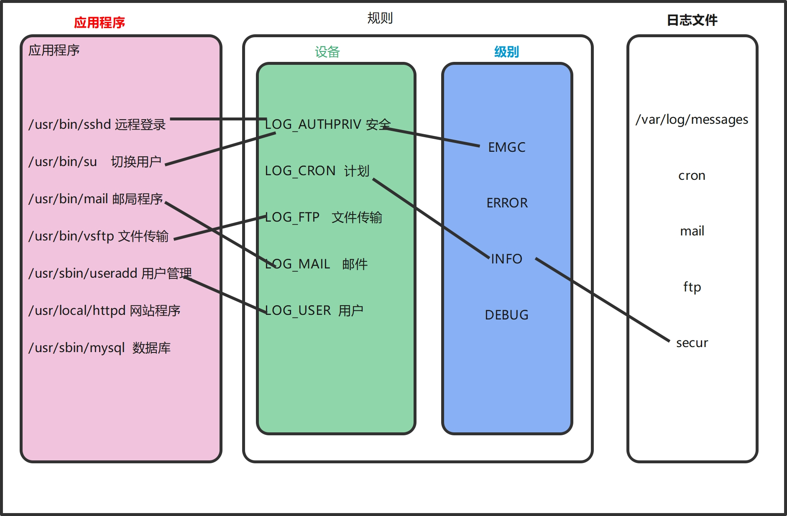

#  1. 日志管理

## 1.1 日志介绍

日志是由程序产生的文字类和数字类信息，目的就是通过日志统计信息和排查错误。

在系统中日志一般分为2类：

第一类：系统日志----->rsylogd负责

1. rsyslogd：系统专职日志程序

2. 处理绝大部分日志记

3. 系统操作有关的信息，如登录信息，程序启动关闭信息，错误信息。

第二类：各类应用软件----> httpd/mysql/nginx：各类应用程序，可以以自己的方式记录日志。

   ## 1.2  观察rsyslog程序

1. 查看日志进行

```bash
[root@localhost ~]# ps aux | grep rsyslogd
root        1496  0.0  0.0 209468  4504 ?        Ssl  10:09   0:00 /usr/sbin/rsyslogd -n
```

补充知识：一般进程名后带d的表示这个一个守护进程，也就是无特殊情况，它会一直在后台运行。


##  1.3 常见的日志文件

### 1.3.1 常见的日志文件

```shell
# 系统主日志文件
tail  -n 10 /var/log/messages   

# 认证安全
tail -f  /var/log/secure

# yum日志
tail -f /var/log/yum.log

# 跟邮件postfix相关
tail -f /var/log/maillog

# crond,at进程产生的日志
tail -f /var/log/cron

# 和系统启动相关
tail  -f /var/log/dmesg
```

- 日志结构

  ```BASH
  Jun 10 22:44:06 VM-4-8-centos systemd: Started Session 125927 of user root.
  
  # Jun 10 22:44:06  日期
  # VM-4-8-centos   主机名
  #systemd: Started Session 125927 of user root.  xiao'xi
  ```


注意： 以下是需要了解的日志

```bash
# 系统审计日志
tail /var/log/audit/audit.log

# MYSQL
tail  /var/log/mysqld.log

# 和访问ftp服务器相关
tail /var/log/xferlog

# 当前登录的用户（命令w）
tail /var/log/wtmp 

# 最近的登录的用户(命令last)
tail  /var/log/btmp

# 所有用户的登录情况(命令lastlog)
tail /var/log/lastlog

```

##  1.4 rsyslog配置

### 1.4.1 安装rsyslog日志

```bash
# 安装相关程序，一般情况下，默认已安装
yum install rsyslog logrotate
```


### 1.4.2 启动程序

```bash
# 启动相关程序,如果停止了的话，那么就不再记录日志
systemctl start rsyslog.service
```


###   1.4.3 相关文件

```bash
# 查询rsyslog相关的配置文件
[root@VM-4-8-centos ~]# rpm -qc rsyslog
/etc/logrotate.d/syslog
/etc/rsyslog.conf
/etc/sysconfig/rsyslog
```

- rpm -qc (-q 查询，-c 列出配置文件)

- 配置文件内容说明

  - 系统级别的配置文件一般默认都是在/etc目录下

  - 出现#号的代码时注释


1. **/etc/rsyslog.conf**

    rsyslog的主配置文件（关键）

   - 告诉rsyslogd进程什么日志，该存放到哪里

- rules基本信息如下

    ```bash
    # RULES
    # 即规则，是一套生成日志，以及存储日志的策略
    # 规则一般由设备（同一类软件应用的统称）+ 级别  + 存放位置组成
    # RULES由 FACILITY + LEVEL + FILE组成
    # -------------------------------------------------------------
    # The authpriv file has restricted access.（认证信息）
    authpriv.*                                              /var/log/secure
    
    # Log all the mail messages in one place.（发邮件）
    mail.*                                                  -/var/log/maillog
    
    
    # Log cron stuff （创建任务）
    cron.*                                                  /var/log/cron
    ```
    
    - -/var/log/maillog ：此处的-代表的是使用异步的方式记录，因为日志一般会比较大。
    - *.info

- facility

  - 是系统对某种类型APP事件的定义，如AUTHPRIV是安全事件，CRON是计划任务事件，用来收集同类程序日志。

  - facility设备类型

    - LOG_SYSLOG: syslogd自身产生的日志
    - LOG_AUTHPRIV: 安全认证
    - LOG_CROM: 调度程序（cron and at）
    - LOG_MAIL：邮件系统mail subsystem
    - LOG_USER(default)：用户相关
    - LOG_DAEMON：后台进程
    - LOG_FTP： ftp进程
    - LOG_KERN：kernel内核设备
    - LOG_LPR：打印机设备
    - **LOG_LOCAL0 through LOG_LOCAL7：用户自定义设备**

  - 程序类型示例

    关于程序和设备的联系问题，程序自身会决定将日志交给哪类设备，如SSH程序会选择安全类设备，这一点由开发这定义。

    ```bash
    [root@VM-4-8-centos ~]# grep facility /etc/ssh/sshd_config  -i
    #SyslogFacility AUTH
    SyslogFacility AUTHPRIV
    # 决定了该ssh软件是属于了AUTHPRIV,即认证认证设备
    ```


- level级别
  - LOG_EMERG：紧急，致命，服务无法继续运行，如配置文件丢失
  - LOG_ALERT：报警，需要立即处理，如果磁盘空间使用95%
  - LOG_CRIT：致命行为
  - LOG_ERR：错误行为
  - LOG_WARNING：警告行为
  - LOG_NOTICE：普通，重要的标准信息
  - **LOG_INFO：标准信息**
  - LOG_DEBUG: 调试信息，排错所需，一般不建议使用。

- 规则示意图




```bash
# 此处的分号;代表并列，其中.none不代表等级，而是代表过滤，即mail.none代表排除mail的消息。
# Log anything (except mail) of level info or higher.
# Don't log private authentication messages
*.info;mail.none;authpriv.none;cron.none                /var/log/messages

```


2.  /etc/rsysconfig/rsyslog

     rsyslogd相关文件，定义级别（了解）

3.  /etc/logrotate.d/syslog

     和日志轮转（切割）相关

       

## 1.5 logrotate日志轮转

### 1.5.1 简介

  日志记录了程序运行时的各种信息，通过日志可以分析用户的行为，记录运行轨迹，查找程序问题，但是磁盘的空间时有限的，日志轮转就像飞机里的黑匣子，记录的信息再重要也只能记录最后一段时间发生的事。所以为例节省空间和方便整理，日志文件经常按照时间或大小等维度分成多份，删除时间久远的日志文件。


### 1.5.2 工作原理

通过读取日志轮转的主文件和子文件夹内的配置文件进行轮转。

- 配置文件种类
  - 主文件：/etc/logrotate.conf（决定每个日志文件如何轮转）
  - 子文件夹：/etc/logrotate.d/*


- 主配置文件介绍

  ```BASH
  #############全局设置#############
  # 轮转的周期，一周轮转
  weekly
  # 保留4份
  rotate 4
  # 轮转后创建新文件
  create
  # 使用日期作为后缀
  dateext
  # 是否压缩
  #compress
  # 包含该目录下的子配置文件
  include /etc/logrotate.d
  
  # 对某日志文件设置轮转的方法
  /var/log/wtmp {
  # 一个月轮转一次
      monthly
  # 轮转后创建新文件，并设置文件的权限是0664
      create 0664 root utmp
  # 最小达到1M才轮转
  	minsize 1M
  # 保留一份
      rotate 1
  }
  /var/log/btmp {
  # 丢失不提示
      missingok
  
      monthly
      create 0600 root utmp
      rotate 1
  }
  
  ```

  


