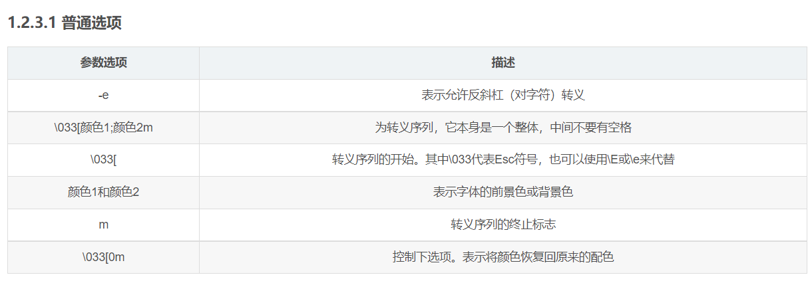

# 1. shell

## 1.1. shell概念

shell 是一种脚本语言
脚本：本质是一个文件，文件里面存放的是特定格式的指令，系统可以使用脚本解析器 翻译或解析指令并执行（它不需要编译）shell 既是应用程序又是一种脚本语言（应用程序解析脚本语言）

## 1.2 shell命令解释器

系统提供 shell命令解析器： sh ash bash
查看自己linux系统的默认解析：echo $SHELL


## 1.3 shell的基本元素

​	使用shell最主要的原因就是为了减少重复手动命令的麻烦，所以shell将一系列linux命令放在一个文件中

### 1.3.1 shell脚本格式

```shell
[root@VM-4-8-centos ~]# touch showDate.sh
[root@VM-4-8-centos ~]# vim showDate.sh 
[root@VM-4-8-centos ~]# cat showDate.sh 
#!/bin/bash
# date: 2022-07-15
# author: xxr

date
[root@VM-4-8-centos ~]# chmod a+x showDate.sh 
[root@VM-4-8-centos ~]# ./showDate.sh 
Fri Jul 15 19:43:03 CST 2022

```

- shell脚本的文件后缀一般是.sh
- shell脚本中第一行#!/bin/bash，其中#！为shell脚本的起始符号，作用就是告诉Linux系统这个文件的执行需要指定一个解释器。/bin/bash就是解释器的路径
- \# date: 2022-07-15,# author: xxrj就是注释内容（可以是整行，也可以是再某行后面）
- date：具体执行的命令

### 1.3.2 执行shell脚本

- 给脚本赋予执行权限： chmod u+x  脚本路径

- ./脚本路径

- 绝对路径脚本路径

  目的就是通过写明脚本路径的方式，告诉系统去哪执行该脚本。


# 2. 变量

变量可以分为三种：

- 本地变量：随着shell的执行而产生，也随着shell脚本的结束而消亡
- 环境变量：适用于所有由登录进程所产生的子进程（用户只要登录成功后，就可以使用环境变量）
- 位置变量：用于向shell脚本传递参数，是只读的。

而在变量赋值上面，本地变量和环境变量的格式是一样的。

## 2.1 变量赋值和取值

- 赋值：

  - 变量名=值
    - 等号两边不可以有空格
    - 如果值中有空格，必须用双引号括起来
    - 变量名只能是大小写字面，数据和下划线等符合，且不能以数字开头

- 清除变量值

  - unset  变量名

- 取值
  
  - $变量命
  - ${变量名} : 如果变量名和其他字符紧挨着，可以用花括号表明变量部分
  
  

## 2.2 环境变量

 环境变量不仅在shell编程方面，而且在linux系统管理方面起着特别重要的作用。

### 2.2.1 定义环境变量

```bash
#定义环境变量的基本格式
# 注意：环境变量名一般大写用于和普通变量区分
环境变量名=值
# 声明环境变量
export   环境变量名
```

使用**env**可以查看所有的环境变量

  

### 2.2.2 常见的环境变量

- PWD：记录当前的目录路径

- OLDPWD： 记录上一次的工作目录

- PATH：该环境变量极为重要，用于帮助shell找到用户所输入的命令，用户在终端输入的命令，实际上就是可执行文件，而这些文件保存在各种各样的目录中，PATH就记录了一系列可执行文件的保存路径，多个路径之间用:隔开。

- HOME：记录当前用户的家目录

- SHELL： 系统默认shell

- PS1和PS2 ：命令提示符，其中PS1为一级shell命令提示符，PS2为二级命令提示符

  ```bash
  \d ：代表日期，格式为weekday month date，例如："Mon Aug 1" 
  \H ：完整的主机名称。例如：我的机器名称为：fc4.linux，则这个名称就是fc4.linux 
  \h ：仅取主机的第一个名字，如上例，则为fc4，.linux则被省略 
  \t ：显示时间为24小时格式，如：HH：MM：SS 
  \T ：显示时间为12小时格式 
  \A ：显示时间为24小时格式：HH：MM 
  \u ：当前用户的账号名称 
  \v ：BASH的版本信息 
  \w ：完整的工作目录名称。家目录会以 ~代替 
  \W ：利用basename取得工作目录名称，所以只会列出最后一个目录 
  \# ：下达的第几个命令 
  \$ ：提示字符，如果是root时，提示符为：# ，普通用户则为：$
  ```

  

如果想要环境变量永久生效的话，可以将其写入环境变量配置文件

1. /home/用户名/.bash_profile是最重要的配置文件，当某linux用户登录时，shell会自动执行.bash_profile文件。
2. .bashrc 在执行.bash_profile时，会顺带加载.bash_profile
3.  .bash_logout 该文件在用户注销时执行

注意：执行加载配置文件时，要使用source，而是不使用bash来执行脚本，

区别如下

- source命令执行脚本代表在当前环境下执行命令，生效的变量，可以直接在当前终端使用，此方法也可以用在shell脚本中加载外部文件。
- 而使用bash或者 ./shell脚本这种方式，是在当前终端中启动一个子shell来执行命令，当前环境中没有生效，新环境才可以使用。

## 2.3 位置参数

位置参数是一种特殊的Shell变量，用于从命令行向Shell脚本传递参数，

- $0为脚本名

- $1为第一个参数

- $2 为第二个参数

  .....

- 从第${10}开始，参数数字需要用花括号括起来

- $*和$@一样，表示从$1开始的所有参数

- $#：传递到脚本的参数数量

- $?：命令的退出状态，0代表没有错误，非0代表有错误。

```bash
[root@localhost ~]# vim test.sh
[root@localhost ~]# chmod u+x test.sh 
[root@localhost ~]# ./test.sh  a b c d 
./test.sh
a
b
===============
a b c d

```


## 2.4 外部传参

read命令

- read 内部命令被用来从标准输入读取单行数据。这个命令可以用来读取键盘输入，当使用重定向的时候，可以读取文件中的一行数据

选项

- -a 后跟一个变量，该变量会被认为是个数组，然后给其赋值，默认是以空格为分割符。
- -d 后面跟一个标志符，其实只有其后的第一个字符有用，作为结束的标志。
- -p 后面跟提示信息，即在输入前打印提示信息。
- -e 在输入的时候可以使用命令补全功能。
- -n 后跟一个数字，定义输入文本的长度，很实用。
- -s 安静模式，在输入字符时不再屏幕上显示，例如login时输入密码。
- -t 后面跟秒数，定义输入字符的等待时间。


```bash
#!/bin/bash

#这里默认会换行  
echo "输入网站名: "  
#读取从键盘的输入  
read website  
echo "你输入的网站名是 $website"  
exit 0  #退出
```

- -p

```bash
#!/bin/bash

read -p "输入网站名:" website
echo "你输入的网站名是 $website" 
exit 0
```


- 读取文件

  每次调用 read 命令都会读取文件中的 "一行" 文本。当文件没有可读的行时，read 命令将以非零状态退出。

​		通过什么样的方法将文件中的数据传给 read 呢？使用 cat 命令并通过管道将结果直接传送给包含 read 命令的 while 命令。

测试文件 test.txt 内容如下：

```bash
#!/bin/bash
  
count=1    # 赋值语句，不加空格
cat test.txt | while read line      # cat 命令的输出作为read命令的输入,read读到>的值放在line中
do
   echo $line"
done
echo "finish"
exit 0
```


## 2.5 数组

数组中可以存放多个值。Bash Shell 只支持一维数组（不支持多维数组），初始化时不需要定义数组大小（与 PHP 类似）。

与大部分编程语言类似，数组元素的下标由 0 开始。

- Shell 数组用括号来表示，元素用"空格"符号分割开，语法格式如下：

```bash
array_name=(value1 value2 ... valuen)
```

- 使用数字下标来定义数组:

```bash
array_name[0]=value0
array_name[1]=value1
array_name[2]=value2
```

- 读取数组

```bash
${array_name[index]}
```

- 使用 **@** 或 ***** 可以获取数组中的所有元素

```bash
#!/bin/bash
# author:菜鸟教程
# url:www.runoob.com

my_array[0]=A
my_array[1]=B
my_array[2]=C
my_array[3]=D

echo "数组的元素为: ${my_array[*]}"
echo "数组的元素为: ${my_array[@]}"
```


# 3. 引用

常见的引用符合和作用

| 符号 | 作用                                                         |
| ---- | ------------------------------------------------------------ |
| " "  | 引用出美元符号，反引号和反斜线之外的所有字符                 |
| ' '  | 引用所有的字符                                               |
| \`\` | 反引号，shell会将反引号内的内容解释为系统命令，\`linux命令`=$(linux命令) |
| \    | 转义符，屏蔽下一个字符的特殊意义                             |

补充：转义符除了屏蔽特殊字符的特殊意义以外，在echo,sed和awk等命令中，转义符加上一些字母可以表达特殊含义。例如\n 新的一行，\t 表示tab键等


## 3.1 echo命令的详解

echo 命令用于将输入的[字符串](https://so.csdn.net/so/search?q=字符串&spm=1001.2101.3001.7020)送往标准输出，默认输出的字符间以空白字符隔开，并在最后加上换行号。

| 参数选项 | 描述                                       |
| -------- | ------------------------------------------ |
| -n       | 不输出行尾的换行符，不自动换行             |
| -e       | 允许对下面列出的加反斜线转义的字符进行解释 |


1. 特殊字符
   启用命令选项 -e，若字符串中出现以下字符，则特别加以处理，而不会将它当成一般文字输出。

| 特殊字符 | 描述                |
| -------- | ------------------- |
| \a       | 发出警告声          |
| \c       | 最后不加上换行符号  |
| \e       | escape，相当于 \033 |
| \n       | 换行且光标移至行首  |
| \t       | 插入 tab            |


### 3.1.1 自定义颜色

echo 是通过使用“[转义](https://so.csdn.net/so/search?q=转义&spm=1001.2101.3001.7020)序列”来为语句进行涂上颜色的。

1. 语法

```shell
echo -e "\033[颜色1;颜色2m 要展示的文字 \033[0m"
或
echo -e "\e[颜色1;颜色2m 要展示的文字 \e[0m"
```


​	



2. 常见颜色
   - 前景色

```bash
echo -e "\033[30m 黑色字 \033[0m"
echo -e "\033[31m 红色字 \033[0m"
echo -e "\033[32m 绿色字 \033[0m"
echo -e "\033[33m 黄色字 \033[0m"
echo -e "\033[34m 蓝色字 \033[0m" 
echo -e "\033[35m 紫色字 \033[0m" 
echo -e "\033[36m 天蓝字 \033[0m" 
echo -e "\033[37m 白色字 \033[0m"
```

- 背景色

  ```bash
  echo -e "\033[40;37m 黑底白字 \033[0m"
  echo -e "\033[41;37m 红底白字 \033[0m" 
  echo -e "\033[42;37m 绿底白字 \033[0m" 
  echo -e "\033[43;37m 黄底白字 \033[0m" 
  echo -e "\033[44;37m 蓝底白字 \033[0m" 
  echo -e "\033[45;37m 紫底白字 \033[0m" 
  echo -e "\033[46;37m 天蓝底白字 \033[0m" 
  echo -e "\033[47;30m 白底黑字 \033[0m"
  ```


## 3.2 算术运算

原生bash不支持简单的数学运算，但是可以通过其他命令来实现，例如 awk 和 expr，expr 最常用。

expr 是一款表达式计算工具，使用它能完成表达式的求值操作。

```bash
#!/bin/bash

val=`expr 2 + 2`
echo "两数之和为 : $val"
```

两点注意：

- 表达式和运算符之间要有空格，例如 2+2 是不对的，必须写成 2 + 2，这与我们熟悉的大多数编程语言不一样。
- 完整的表达式要被 **` `** 包含，注意这个字符不是常用的单引号，在 Esc 键下边。

| 运算符 | 说明                                          | 举例                          |
| :----- | :-------------------------------------------- | :---------------------------- |
| +      | 加法                                          | `expr $a + $b` 结果为 30。    |
| -      | 减法                                          | `expr $a - $b` 结果为 -10。   |
| *      | 乘法                                          | `expr $a \* $b` 结果为  200。 |
| /      | 除法                                          | `expr $b / $a` 结果为 2。     |
| %      | 取余                                          | `expr $b % $a` 结果为 0。     |
| =      | 赋值                                          | a=$b 把变量 b 的值赋给 a。    |
| ==     | 相等。用于比较两个数字，相同则返回 true。     | [ $a == $b ] 返回 false。     |
| !=     | 不相等。用于比较两个数字，不相同则返回 true。 | [ $a != $b ] 返回 true。      |

**注意：**条件表达式要放在方括号之间，并且要有空格，例如: **[$a==$b]** 是错误的，必须写成 **[ $a == $b ]**。

# 4. 命令退出状态

在Linux中，命令执行完毕后，系统会返回一个退出状态，而退出状态用整数值表示

| 状态值 | 含义                       |
| ------ | -------------------------- |
| 0      | 运行成功                   |
| 1~125  | 运行失败                   |
| 126    | 找到执行的命令，但无法运行 |
| 127    | 未找到命令                 |
| >128   | 命令被系统强制结束         |

在判断和循环语句中，可以使用exit命令来控制程序和表达式的流程

# 5. 判断

1.单支语句

```bash
if 条件测试;then
	命令1
	命令2

fi
```


## 5.1 条件测试

[ 测试内容 ]

注意："["是启动测试的命令，要求与"]"配对，但是注意"["前和"]"的空格是必不可少的

当前测试内容条件为真时就会执行then后面的语句

### 5.1.1 算术比较

```bash
[ $var -eq 0 ]  #当$var等于0时，返回真
[ $var -ne 0 ]  #当$var不等于0时，返回真
```

- -gt  大于
- -lt   小于
- -ge  大于等于
- -le   小于等于

### 5.1.2 文件相关测试

我们可以使用不同的条件标志测试各种文件系统相关的属性。

● [ -f $file_var ]：如果给定的变量包含正常的文件路径或文件名，则返回真。

● [ -x $var ]：如果给定的变量包含的文件可执行，则返回真。

● [ -d $var ]：如果给定的变量包含的是目录，则返回真。

● [ -e $var ]：如果给定的变量包含的文件存在，则返回真。

● [ -c $var ]：如果给定的变量包含的是一个字符设备文件的路径，则返回真。

● [ -b $var ]：如果给定的变量包含的是一个块设备文件的路径，则返回真。

● [ -w $var ]：如果给定的变量包含的文件可写，则返回真。

● [ -r $var ]：如果给定的变量包含的文件可读，则返回真。

● [ -L $var ]：如果给定的变量包含的是一个符号链接，则返回真。


### 5.1.3 字符串比较

进行字符串比较时，最好用双中括号，因为有时候采用单个中括号会产生错误。

 注意，双中括号是Bash的一个扩展特性。如果出于性能考虑，使用ash或dash来运行脚本，那么将无法使用该特性。

1. 测试两个字符串是否相同。

● [[ $str1 == $str2 ]]：这是检查字符串是否相同的另一种写法。

2. 测试两个字符串是否不同。

● [[ $str1 != $str2 ]]：如果str1和str2不相同，则返回真。

3. 找出在字母表中靠后的字符串。

字符串是依据字符的ASCII值进行比较的。例如，A的值是0x41，a的值是0x61。因此，A小于a，AAa小于Aaa。

● [[ $str1 > $str2 ]]：如果str1的字母序比str2大，则返回真。

● [[ $str1 < $str2 ]]：如果str1的字母序比str2小，则返回真。

4. 测试空串。

● [[ -z $str1 ]]：如果str1为空串，则返回真。

● [[ -n $str1 ]]：如果str1不为空串，则返回真。

使用逻辑运算符 && 和 || 能够很容易地将多个条件组合起来：


## 5.2 exit命令

在判断和循环中可以通过exit来设定退出状态的值，但是注意乱用退出值会产生误解

```bash
exit status
```


## 5.3 if/else结构

```bash
格式一：
if [条件1]; then
    执行第一段程序
else
    执行第二段程序
fi
格式二：
if [条件1]; then
    执行第一段程序
elif [条件2]；then
执行第二段程序
else
    执行第三段程序
fi
```


# 6. case结构

```bash
case 变量 in
条件 1)
      执行代码块1
      ;;
条件 2)
      执行代码块2
      ;;
条件 3)
      执行代码块3
      ;;
*)
      无匹配后命令序列
 esac
```

```bash
# 下面的脚本提示输入 1 到 4，与每一种模式进行匹配：
echo '输入 1 到 4 之间的数字:'
echo '你输入的数字为:'
read aNum
case $aNum in
    1)  echo '你选择了 1'
    ;;
    2)  echo '你选择了 2'
    ;;
    3)  echo '你选择了 3'
    ;;
    4)  echo '你选择了 4'
    ;;
    *)  echo '你没有输入 1 到 4 之间的数字'
    ;;
esac
```


# 7.for

```bash
#for循环语法                                     for循环示例(默认以空格做分隔)
for  变量名 in [ 取值列表 ]                       for var in file1 file2 file3
do                                              do
     循环体                                            echo the text is $var
done                                            done

# 简写的计数循环
for  变量名 in {1..8}                      
do                                              
     循环体                                          
done                                         

```

- seq命令的用法  seq 1 2 100


# 8.while循环

```bash
#当条件测试成立（条件测试为真），执行循环
while  条件测试
do
      循环体
done
```


```bash
[root@manage while]# cat while-11.sh 
#!/bin/bash
while read line
do
      id $line &>/dev/null
      if [ $? -eq 0 ];then
         echo $line用户已存在
         continue
      else
      useradd $line
         echo "$line用户已创建" 
      fi
done < user.txt


[root@manage while]# cat user.txt 
qqq
ttt
ddd


```


# 9. until

```bash
until expression
do
	statement1
	statement2
	...
done
```

```bash
# 将创建的user01-user30的用户删除
i=1
until [ $i -gt 30 ]
do
	if [ $i -le 9 ]
	then
	user=user0$i
	else
		user=user$i
	fi
	if id -u $user &>/dev/null
	then
		userdel -r $user
	else
		echo "$user is not exists..."
	fi
	let i++
done

```

以下实例我们使用 until 命令来输出 0 ~ 9 的数字：

```bash
#!/bin/bash

a=0

until [ ! $a -lt 10 ]
do
   echo $a
   a=`expr $a + 1`
done
```


# 10. break,continue

- break命令允许跳出所有循环（终止执行后面的所有循环）
- continue命令与break命令类似，只有一点差别，它不会跳出所有循环，仅仅跳出当前循环。

```bash
```


# 11. 函数

```bash
[ function ] funname [()]

{

    action;

    [return int;]

}
```

- 1、可以带function fun() 定义，也可以直接fun() 定义,不带任何参数。
- 2、参数返回，可以显示加：return 返回，如果不加，将以最后一条命令运行结果，作为返回值。 return后跟数值n(0-255


## 11.1 函数参数

在Shell中，调用函数时可以向其传递参数。在函数体内部，通过 $n 的形式来获取参数的值，例如，$1表示第一个参数，$2表示第二个参数...

带参数的函数示例：

```bash
#!/bin/bash
# author:菜鸟教程
# url:www.runoob.com

funWithParam(){
    echo "第一个参数为 $1 !"
    echo "第二个参数为 $2 !"
    echo "第十个参数为 $10 !"
    echo "第十个参数为 ${10} !"
    echo "第十一个参数为 ${11} !"
    echo "参数总数有 $# 个!"
    echo "作为一个字符串输出所有参数 $* !"
}
funWithParam 1 2 3 4 5 6 7 8 9 34 73
```

