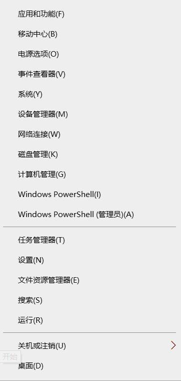
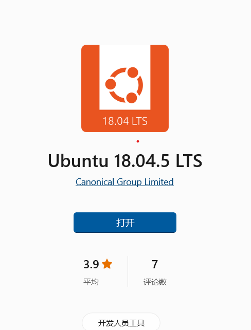
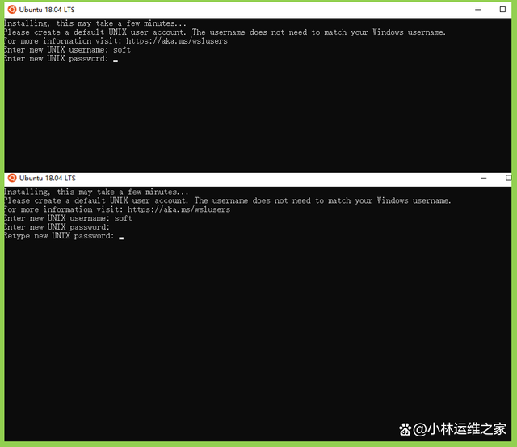

# 前期准备工作
- 注意：我们的操作系统由于涉及到实验，所以需要大家有一定的C语言编程能力。希望编程能力薄弱的同学，平时补足该方面的能力。
- 虽然大家平时用到最多的是windows系统，但是由于windows是一个闭源的操作系统，不便于我们学习和操作系统的知识，所以该课程，我们使用的是Linux系统。
## 1. 安装ubuntu系统
在windows中安装ubuntu的子系统   
- 环境准备：联网环境的windows10系统
- 安装步骤：  
### 1. 启用适用于Linux的windows子系统功能   
   （1）鼠标放在win图标上，右击，选择**应用和功能**
   

   (2)放大页面后，点击右侧的**程序和功能**
   

   (3)然后点击左侧的**启用或关闭Windows功能。**
   

   (4)勾选**使用于Linux的Windows子系统**，并点击确定。
   

### 2. 从windos10商店里安装Ubuntu系统
   （1）打开windows10自带的应用商店
   

   (2)在窗口搜索Ubuntu 18.04.5 LTS
   

   (3)点击后，初次安装选择**获取**进行安装即可
   

   (4)安装完毕后，就可以在软件应用一栏打开ubuntu的子系统
   

   (5)打开界面，等待初始化，然后第一次使用需要设置用户（例如soft）,并设置密码（密码建议不要太复杂，能记住就行）
   

# 操作系统引论
                            