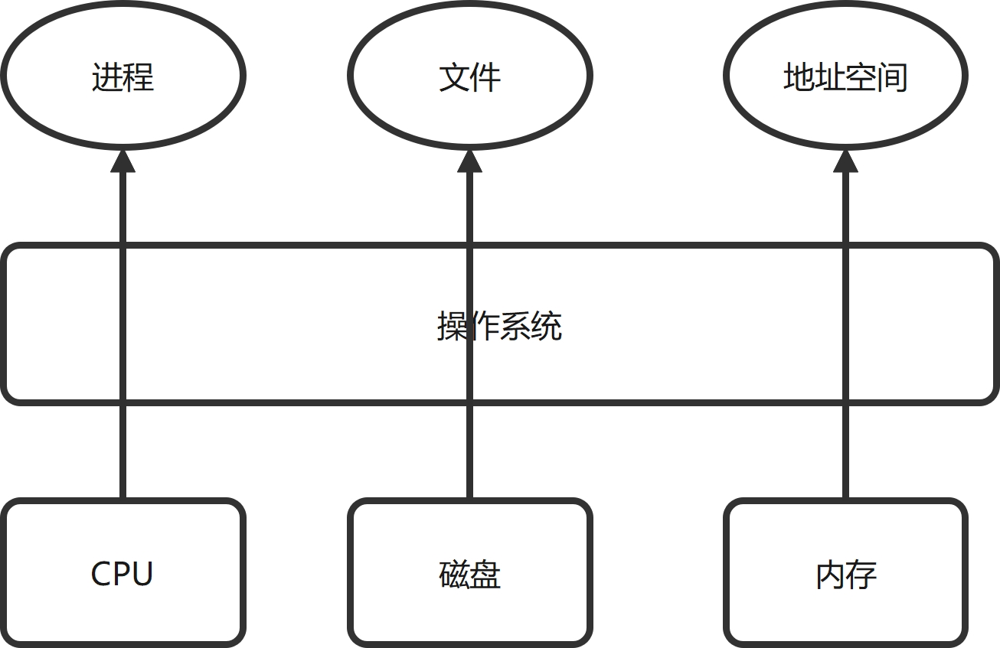
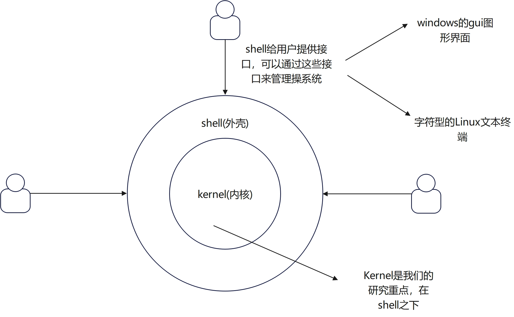
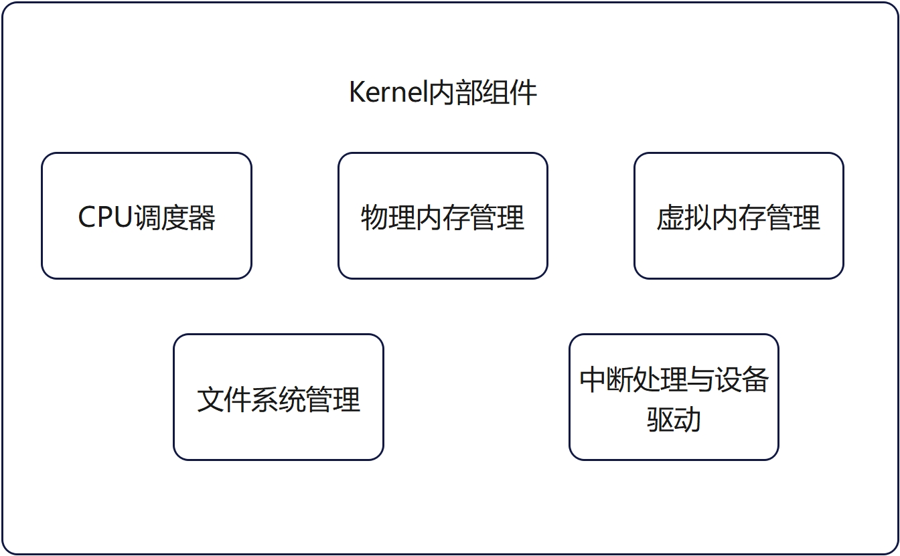

# 前期准备工作
- 注意：我们的操作系统由于涉及到实验，所以需要大家有一定的C语言编程能力。希望编程能力薄弱的同学，平时补足该方面的能力。
- 虽然大家平时用到最多的是windows系统，但是由于windows是一个闭源的操作系统，不便于我们学习和操作系统的知识，所以该课程，我们使用的是Linux系统。
## 1. 安装ubuntu系统
在windows中安装ubuntu的子系统   
- 环境准备：联网环境的windows10系统
- 安装步骤：  
### 1. 启用适用于Linux的windows子系统功能   
   （1）鼠标放在win图标上，右击，选择**应用和功能**   
   

   (2)放大页面后，点击右侧的**程序和功能** 

   

   (3)然后点击左侧的**启用或关闭Windows功能。**    

   

   (4)勾选**使用于Linux的Windows子系统**，并点击确定。
   

### 2. 从windos10商店里安装Ubuntu系统
   （1）打开windows10自带的应用商店
   

   (2)在窗口搜索Ubuntu 18.04.5 LTS
   

   (3)点击后，初次安装选择**获取**进行安装即可

   

   (4)安装完毕后，就可以在软件应用一栏打开ubuntu的子
系统    

   

   (5)打开界面，等待初始化，然后第一次使用需要设置用户（例如soft）,并设置密码（密码建议不要太复杂，能记住就行）      

   

# 1. 操作系统引论
## 1.1 操作系统的历史

- 早期计算机使用纸带传输程序和数据，操作系统只是起到加载作用。
- cpu等硬件快速发展，计算机速度得到提升，性能未得到重复利用。
- 内存的容量越来越大，cpu执行多个程序。
- 为了更好的利用计算机资源，并且更好的和用户交互，出现了分时系统。
- 网络的快速发展，处理了分布式的操作系统。用户使用的只是前端，数据的处理放在了数据中心。

## 1.2 什么是操作系统
从功能上而言, 操作系统的作用是管理下层硬件资源，为上层软件提供服务。
1. 管理硬件资源: 
- cpu，内存，硬盘等
- 管理外设，并分配资源。

 

1. 为软件提供服务:
-  管理运行在操作系统的软件，可以杀死应用软件。
-  为应用软件提供服务。

## 1.3 操作系统的层次架构 
- 操作系统架构

- Kernel-操作系统内部组件

**OS kernel的特征**

- 并发（一个时间段内可以有多个程序运行。注意和并行的区别：并行是指，一个时间点上可以有多个程序同时运行。）
   -  计算机系统中同时存在多个运行的程序，需要OS管理和调度。

- 共享
  - "同时"访问
  - 互斥共享

- 虚拟
  - 利用多道程序设计技术，让每个用户都觉得有一个计算机专门为他服务。

- 异步
   - 程序的执行不是一贯到底，而是走走停停，向前推进的速度不可预知。
   - 但只要运行环境相同，os需要保证程序运行的结果也要相同。

## 1.4 为什么学习操作系统
- 综合课程-结合许多不同的课程
  - 程序设计语言
  - 数据结构
  - 算法
  - 计算机系统结构
  - 操作系统的概念和原理，源代码
  - 操作系统的设计和实现
  
- 操作系统: 计算机科学研究的基石之一
  - 计算机系统的基本组成部分
  - 由硬件的发展和应用需求所驱动
  - 学术和工业的持续推进

## 1.4 常见的操作系统实例

目前市场上常见的操作系统家族。

- UNIX家族: iso等

- Linux家族: redhat，ubuntu, suse, 安卓，

- Winodws家族：

  

