授课老师姓名：徐鑫荣

QQ： 1627389570

# 第一章 操作系统引论

什么是操作系统？

操作系统本身也是个软件，叫做系统软件，操作系统是介于硬件和软件之间，用于管理硬件，并向软件或者用户提供接口（核心思想：管理下层硬件，并为上层软件提供资源。）

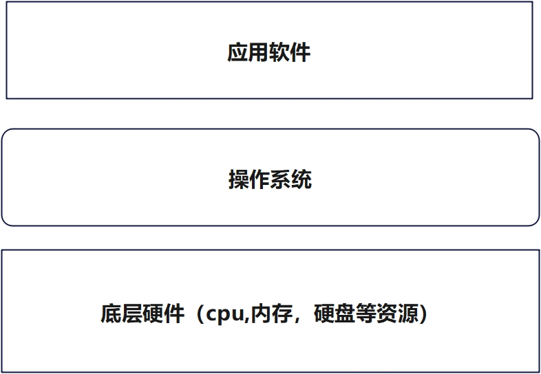

## 1.1 操作系统的目标和作用

###  1.1.1 操作系统的目标

1. 方便性: 没有操作系统之前，计算机的运行是通过纸带的打孔（0101001）,有了操作系统之后，用户只需要对操作系统进行操作，下发的指令是如何变成计算机能够执行的操作，都是由操作系统完成。
2. 有效性:  如何去有效的利用硬件资源，因为计算机上面硬件功能是很强大的，使用操作系统可以更好的去划分和使用硬件资源，同时也防止软件滥用硬件资源。
3. 可扩充性:  随时可以增加或者删除新的模块，比如更新操作系统或者安装某些硬件驱动，直接在现有的操作系统上完成即可。
4. 开放性： 只要按照指定的软件或者硬件的协议标准，开发出来的软件就可以实现互相的兼容，运行在同一类型的操作系统上。

### 1.1.2 操作系统的作用

1. **OS作为用户与计算机硬件系统之间的接口**    

   用户可以通过操作系统来使用计算机（控制计算机的硬件资源或者运行程序软件。)

   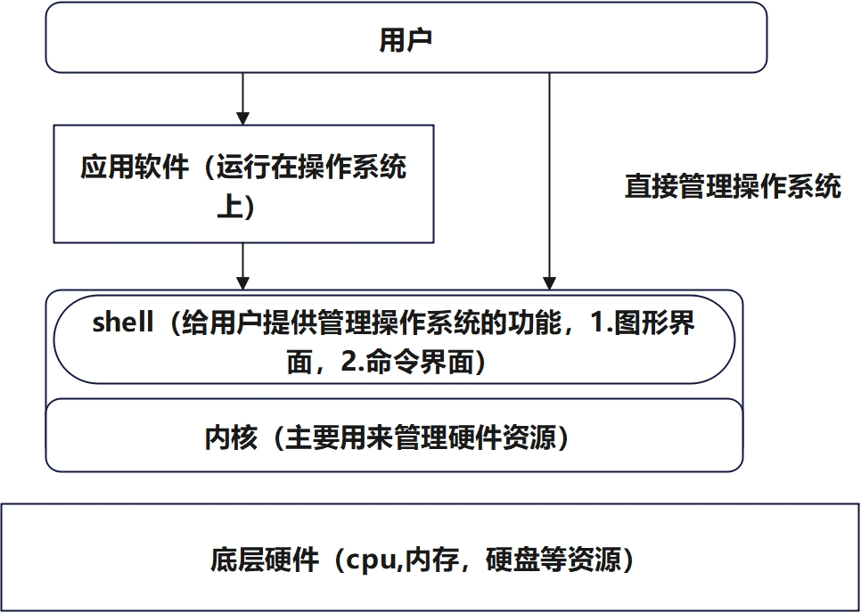

2. **OS作为计算机系统资源的管理者**

   只要安装了操作系统之后，所有硬件资源都是由操作系统进行管理和分配（cpu, 内存，I/O设备以及存储硬盘）

3. **OS实现了对计算机资源的抽象**

   （通过对资源的抽象，用户和开发人员，并不需要关心底层是如何实现的，只需要按照操作系统提供的标准执行即可。）

   - cpu被操作系统抽象成进程。

   - 内存被操作系统抽象成虚拟内存。

   - 硬盘被操作系统抽象成文件系统。

## 1.2 操作系统的发展过程

操作系统的发展其实只要围绕着2个方向来进行的（cpu和I/O设备的变化来思考）

1. 未配置操作系统的计算机系统 

   - 通过纸带的方式来运行计算机，都需要人工进行处理。
   - 通过磁带的方来运行计算机，虽然不需要人工，但是数据是存储在磁带上面，需要专门的设备进行管理。

   从纸带到磁带提升了(1)减少量cpu空间时间（2）提高了I/O速度。

2. 单道批处理系统（第二代晶体管的出现。）

​        批处理：代表可以处理多个任务。

​       单道： 指的是内存中一次存放一个任务。

- 内存的出现提高了I/O加载的速度，提高了cpu执行效率！

- 内存中每次加载一个任务，任务A执行任务B

3. 多道批处理系统

​     批处理：代表可以处理多个任务。

​     多道： 指的就是内存中可以加载多个任务。

​         计算机处理任务，首先将任务加载到内存，然后cpu处理内存中的数据。

​        所以当程序在运行中，发出I/O请求时，cpu便处于等待状态，那么就降低了cpu的使用率，因为多道批处理，内存中出现了多个进程，例如A进程，在进行I/O请求后，可以让cpu直接进行B任务的计算操作，这样就充分利用了用于I/O请求后，造成的cpu空闲时间。因为内存要加载多个任务，所以对于内存的要求就比较高，而且多个任务导致任务运行的周期变长。

4. 分时系统

​     上述的系统，都是将任务一次性的交给操作系统，然后让操作系统去执行（用户不能对任务进行中途的干预。）分时最主要的实现了人机的交互，对计算机的共享（多用户）。

- 分时的概念，可以简单的理解为：将cpu运行某一个时间段，分成若干部分，然后交给不同的任务去执行，任务越多，分到的cpu时间就越少，也就是为什么软件开多了，系统会越来越卡的原因之一。

5. 实时系统

​      实时的概念就是能够快速的响应用户的请求。

​     现有常见的操作系统，例如windows它既是分时系统，也是实时系统。 

## 1.3 操作系统的基本特性

1. 并发：

   - 并发指的是在某一个时间段内可以有多个任务运行。
   - 并行指的是在某一个时间点内可以有多个任务（进程）运行。

2. 共享：

   - 互斥共享： 例如：打印机可以给多个进程使用，但是进程A在使用时，进程B不能使用，只有A使用完毕后，B才能使用。
   - 同时访问：例如：磁盘设备，多个进程可以对磁盘同时写入或者读取。

3. 虚拟：

   虚拟技术的应用，本质来讲就是为了欺骗上层应用。

   - 时分复用技术：最典型的应用就是cpu，通过时分复用技术，让进程误以为是有多个cpu在执行任务。所以时分复用的技术，常常运用在一个设备虚拟出多个设备。

   - 空分复用技术： 最典型的应用就是内存，比如说一个程序100M，内存只有30M，先加载30M，明明实际的物理内存空间是小于程序所需的总空间，通过空分复用技术可以让程序误认为空间是足够的。

4. 异步：

   允许程序的运行是不连续的，前面的时分复用技术和并发概念的运用就是为了实现程序异步的运行。

   

1. 处理机管理功能

   处理机指的就是cpu，cpu经过操作系统的抽象过程之后，用户是通过进程来实现对cpu的管理。
   
2. 存储器管理功能

​        此处的存储器的管理，指的就是内存是如何被操作系统进行分配，回收以及内存地址映射等。

3. 设备管理功能

   指的就是I/O设备的管理，比如，内存，硬盘，鼠标，键盘都是属于I/O设备，

4. 文件管理功能

   指的就是硬盘存储设备的管理，通过文件管理功能，实现对硬盘等存储的设备的文件的管理，比如： 文件的复制，文件的删除以及查找等功能都是要依靠文件管理功能实现。


## 1.4 OS结构设计

### 1.4.1 传统结构操作系统

1. 无结构

   无结构的思想就是，只想如何高效的完成当前的功能， 很少考虑后期的维护管理，一旦操作系统代码量变大，后期的改变变多，会发现特别难以维护。

2. 模块化结构

   将操作系统的功能进行拆分，针对不同的功能来进行实现，便于后期的管理维护以及降低了不同功能之间的关联性，一旦出现问题，只需要对指定模块进行排查就行，但是注意：模块如果划分过多，就容易导致管理的混乱。    

3. 分层式结构

   分层架构是自下而上的，保证每一层的功能没有问题之后，在它的基础上进一步完成上层的功能，一旦出现了问题，只需要关心某一层的设计的功能，缺点: 每个层之间都会涉及到数据的交互，导致效率降低。

### 1.4.2 现代结构操作系统

1. 微内核

   传统的架构，所有的硬件都是由内核进行管理操作，也就是上面用户的进行的操作，如何转变成计算机可执行的指令，都是由内核完成的，而微内核的概念，就是进一步减少内核的负担，只保留最主要的功能,例如：进程管理，低级存储器的管理，中断陷入等处理。

   

# 第二章 进程的描述与控制

## 2.1 前趋图的概念

- 前趋图是一个有向无循环图，可记为DAG,其中每一个结点可用来表示一个进程，程序段或语句。

- 结点的有向边，即代表结点之间的前趋关系，注意前趋图中不能出现循环。

  

## 2.2 程序执行的2种方式

1. 顺序执行

   - 在计算机系统中只有一个程序在运行，这个程序独占系统中所有资源，其执行不受外界影响。一道程序执行完后另一道才能开始。

2. 并发执行

   - 若干个程序同时在系统中执行，这些程序的执行在**时间上是重叠的。**

   - 一个程序的执行尚未结束，另一个程序的执行已经开始。

     

## 2.2 进程的描述

1. 进程的定义

   - 为了能使程序并发执行，且更准确地描述和控制，引入进程。

   - 要使进程能独立运行，OS能控制和管理进程，必须为进程配置专门的数据结构——PCB。
   - 由程序段，数据段以及PCB三部分组成了进程实体（又称进程印象），简称进程。

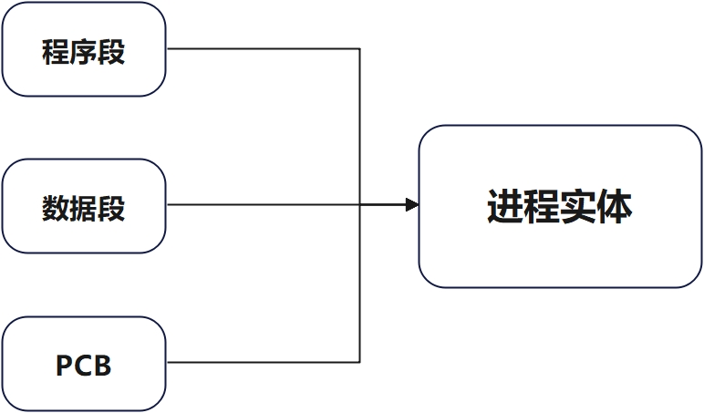


- **进程是程序在处理机上的一次执行过程。**
- **进程是一个程序及其数据在处理机上顺序执行时所发生的活动。**
- **进程是具有独立功能的程序在一个数据集合上运行的过程，是系统进行资源分配和调度的一个独立单位**。


## 2.3 进程的状态及转换

### 2.3.1 进程的三种基本状态

（1）**就绪（Ready）状态**： 进程以处于准备好运行的状态。

（2）**执行(Running)状态**： 进程以获得cpu，其正在执行状态

（3）**阻塞（Block）状态**：正在执行的进程由于发生某事（如I/O请求）暂时无法继续执行时的状态，即进程的执行受到阻塞。

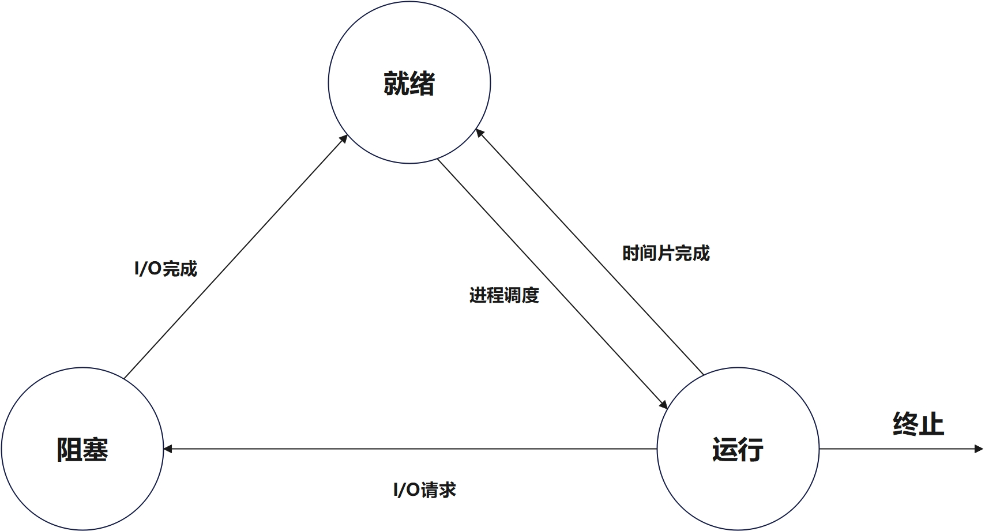

课内练习： 

- **1.**在进程状态转换时，下列（ ）转换是不可能发生的。

    **A)就绪态→运行态**    **B)运行态→就绪态**  

    **C)运行态→阻塞态**    **D)阻塞态→运行态**

  

- **2．**某进程在运行过程中需要等待从磁盘上读入数据，此时该进程的状态将（ ）。

   **A)从就绪变为运行**    **B)从运行变为就绪**

   **C)从运行变为阻塞**    **D)从阻塞变为就绪** 

  

- **3．思考题：假设单处理机系统中有N个进程，运行的进程最多几个，最少几个；就绪进程最多几个，最少几个？阻塞进程最多几个，最少几个？**


### 2.3.2 加入创建和终止

​	（1）**创建状态**： 进程是由创建产生的，在创建过程中，进程需要申请一个空白pcb，然后向pcb写入控制和管理进程的信息，并为进程分配运行所需的资源。

​	（2）**终止状态**： 进程的终止主要由2步：**I. 将进程的PCB清零**，**II.将PCB空间返还系统**。进入终止状态的进程以后不在运行，但会保留供其他进程调用的数据，直到数据提取完毕后，将PCB清零并返回空间给系统。

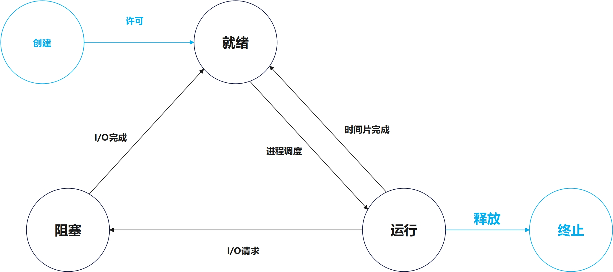

### 2.3.3 加入挂起和激活

​	（1）挂起状态：

​             暂时挂起一部分进程，把它们**从内存临时换出到外存**，释放其占有的资源，使它们暂时与系统脱离联系。 

   - 当进程处于挂起状态时，进程就会处于静止状态。
     - 如果进程正在执行，则会暂停执行。

     - 如果进程处于就绪，则进程暂不接收调度。

​	（2）激活状态：

​              与挂起状态相对应，将进程从外存调入内存，检查该进程的状态，改为相应的活动状态。

---

但是注意: 在原先基本状态下， 加入挂起和激活状态后，进程的状态的转化如下： 

- 活动就绪--->静止就绪：

  - 未被挂起前的就绪状态，即活动就绪，可接收调度执行。
  - 被挂起后，进程即为静止就绪状态，此时不在被调度执行。

- 活动阻塞--->静止阻塞：

  - 未被挂起前的阻塞状态，即活动阻塞。
  - 被挂起后，进程即为静止阻塞状态

- 静止就绪--->活动就绪

  - 即在静止状态被激活后就会进入活动就绪

- 静止阻塞--->活动阻塞

  - 处于静止阻塞状态的进程被激活后会进入活动阻塞。

  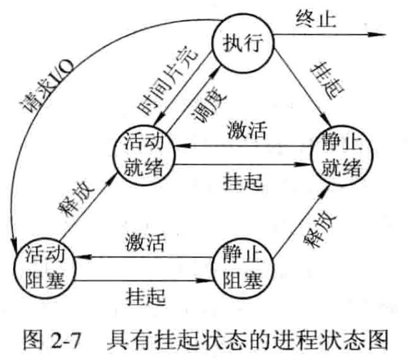

补充： 

- 创建--->活动就绪： 如果当前系统性能和内存容量允许的情况下，完成创建后，进程机会进入到活动就绪状态

- 创建--->静止就绪：如果当前系统性能和内存容量不允许的情况下，那么不会给该进程分配资源，而是将它置入外存，此时创建并未完成。

  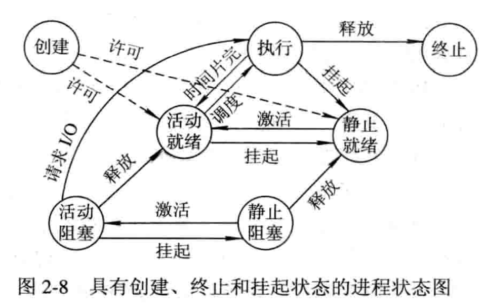


## 2.4 进程管理中的数据结构

- 在计算机系统中，对于每个资源和每个进程都设置了一个数据结构，用来表示实体，称为资源信息表或进程信息表，其中包含了资源或进程的标识、描述、状态等信息以及一批指针（一般分为4类：**内存表，设备表，文件表和进程表，其中进程表也就是前文提到过的PCB进程控制块**）。
- 通过这些指针，可以将同类资源或进程的信息表，或者同一进程所占用的资源信息表分类链接成不同的队列，便于操作系统进行查找。  

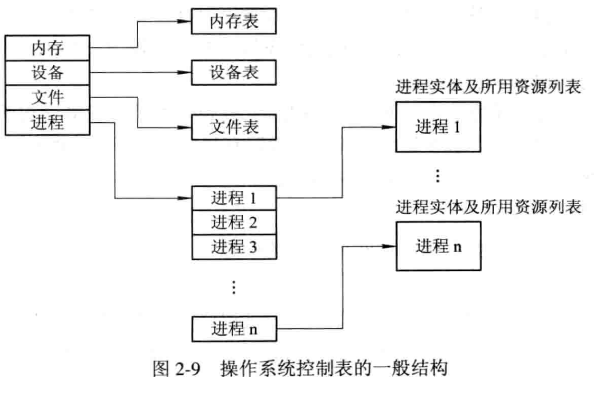 

### 2.4.1 进程控制块PCB的作用

- 作为独立运行基本单位的标志。

- 能实现间断性运行方式。 

- 提供进程管理所需要的信息。

- 提供进程调度所需要的信息。

- 实现与其它进程的同步与通信。

### 2.4.2 进程控制块PCB中的信息

- 进程标识符：外部（用户）、内部（系统）

- 处理机状态（上下文）：处理机中各寄存器内容

- 进程调度信息

  - 进程状态，优先级

  - 进程调度所需的其它信息（与所进程调度算法有关，如进程已等待CPU时间总和、进程已执行的时间总和）

  - 进程阻塞原因

- 进程控制信息：程序数据地址、同步通信机制等


### 2.4.3 PCB的组织方式

系统把所有PCB组织在一起

- 线性方式：线性表，首地址在内存专用区域，适合并发进程数不多的系统

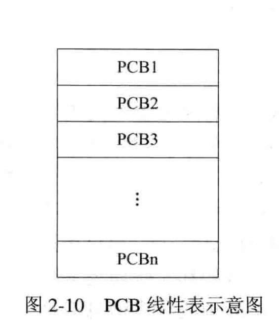

- 链接方式：按状态组织成多个队列

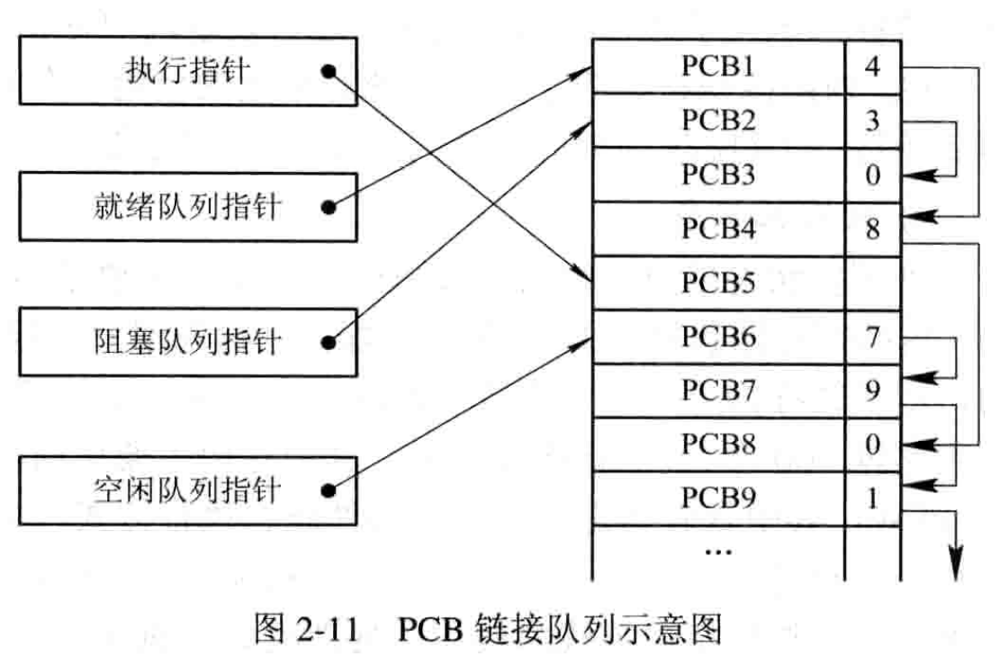

- 索引方式：按状态建多张索引表，表目中记录对应PCB在PCB表中的地址

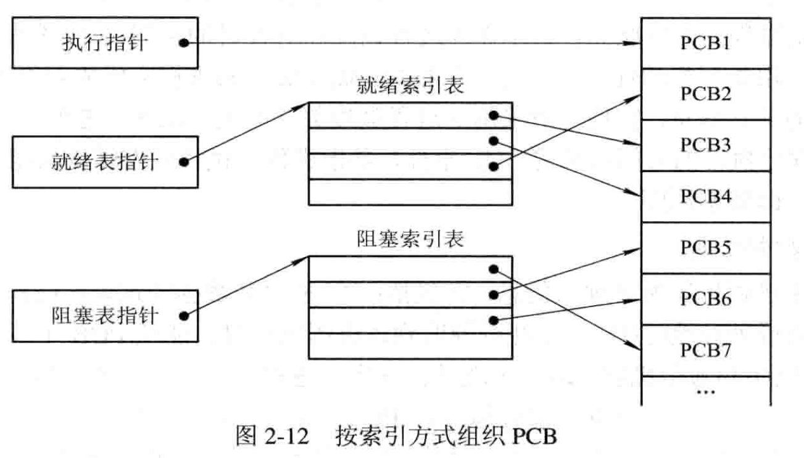

## 2.5 进程控制

- 进程控制是进程管理的基本功能。
- 通过进程管理可以创建一个新进程、终止一个已完成的进程，负责进程运行中的状态转换。
- 进程控制一般由OS**内核**中的**原语**来实现。
  - 原语是指由若干条机器指令构成的，并用以完成特定功能的一段程序，这段程序在执行期间是不可分割的（原子性）。

### 2.5.1 操作系统内核

- OS内核：通常将一些与硬件密切相关的模块、驱动程序、运行频率高的模块，安排在**紧靠硬件的软件层**中，常驻内存，以提高操作系统运行效率，并对它们加以特殊的保护。

- 一般情况下，为了避免用户程序错误地使用特权指令，保护操作系统不被用户程序破坏，在内核中将cpu的执行状态分为2种：

  - **系统态（管态、内核态）：**能执行包括特权指令在内的一切指令，可访问全部寄存器和存储区。传统操作系统都在此态运行。
  - **用户态（目态）：**程序只能执行非特权指令，访问有限的存储空间和指定的寄存器。应用程序通常都在此态下运行，不能执行OS指令、访问OS区域。

  

  补充： 由于操作系统的内核是和硬件挂钩的，所以不同的硬件之间操作系统也是存在一定的差异，但是大部分操作系统的内核都有以下2大方向的功能。

  1. **支撑功能**（支撑硬件相关的模块工作）

     - **中断处理**：内核最基本功能，是整个OS赖以活动的基础。内核在对中断进行“有限处理”后便转入相关进程完成后续处理。

     - **时钟管理**：内核基本功能。如时间片轮转调度，每当时间片用完，由时钟管理产生一个中断信号，促使调度程序重新调度。

     - **原语操作**：完成一定功能的一个过程，执行原子操作。

       - 由若干条指令组成，用于完成一定功能的一个过程。
       - 原语是在管态下执行、完成系统特定功能的过程。
       - 执行**原子操作**：要么全做，要不全不做，即该过程是一个不可分割的基本单位。
       - 原语的执行是顺序的而不可能是并发的。

       - 常见进程控制原语：创建Creat、终止Destroy、阻塞Block、唤醒Wakeup、挂起Suspend、激活原语Active

  2. **资源管理功能**

     - 进程管理                                                                                                                                                                                                                                                                                                                                                                                                                                                                                                                                                                                                                                                                                                                    
     - 存储器管理
     - 设备管理

  进程和存储都是高频率操作，所以一般通常把他们放在内核中，而设备管理是和硬件紧密相关的所以也是放在内核里。

### 2.5.2 进程的创建

1. 进程的层次结构

   -  在OS中，一个进程可以创建子进程。

   - 子进程可以继承父进程的所有资源，当子进程被撤消时，应将从父进程那里获得的资源归还给父进程。

   -  撤消父进程时也必须同时撤消其所有的子进程。

   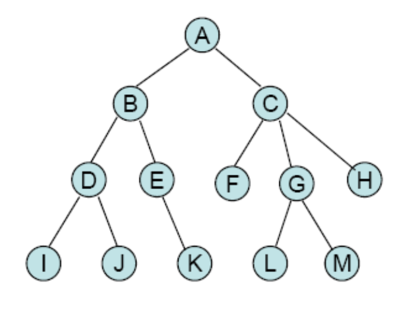

   注意：

   - UNIX中，进程与其子孙进程共同组成一个进程家族。

   - Windows中不存在层次结构，所以进程地位相同。一个进程创建另一个进程，获得一个句柄（可控制该进程），这个句柄可以传递，谁拿到句柄谁就可以控制该进程。进程间是控制与被控制的简单关系。

2. 引起创建进程的事件

   - **用户登录**：分时系统中，用户在终端键入登录命令后，若是合法用户，系统建立一个进程，并插入就绪队列。

   - **作业调度**：批处理系统中，作业调度程序调度到某个作业以后，就把这个作业装入内存，并分配必要的资源，创建进程，插入就绪队列。

   - **提供服务**：运行中的用户向系统提出请求后，系统专门建立一个进程为用户服务。（打印请求）**由操作系统内核（系统程序模块）创建**

   - **应用请求**：应用进程的需要，由它自己创建一个新进程，使新进程以并发运行方式完成特定任务。（输入数据并将处理结果输出到表格上）**由父进程创建**

3. 进程的创建

   (1) 申请空白PCB，为新进程申请获得唯一的数字标识符，并从PCB集合中索取一个空白PCB。

   (2) 为新进程分配其运行所需的资源，包括各种物理和逻辑资源，如内存、文件、I/O设备和CPU时间等。

   (3) 初始化进程控制块(PCB)。

   (4) 如果进程就绪队列能够接纳新进程，便将新进程插入就绪队列。

### 2.5.3 进程的终止

1. 引起进程终止的事件

- **正常结束**
  - 计算机系统中，都有一个表示进程已经运行完成的指示，如holt指令。

- **异常结束**
  - 越界错误、保护错、特权指令错、非法指令错、运行超时、等待超时、算术运算错、I/O故障

- **外界干预** 

  - 操作员或操作系统干预、父进程请求、父进程终止

    

2. 进程终止的过程

   - 根据当前被终止的进程标识符，从PCB集合中找到该进程，并检索进程当前的状态，结束并置调度标志，撤销其所有的子进程，归还资源，移出队列。

     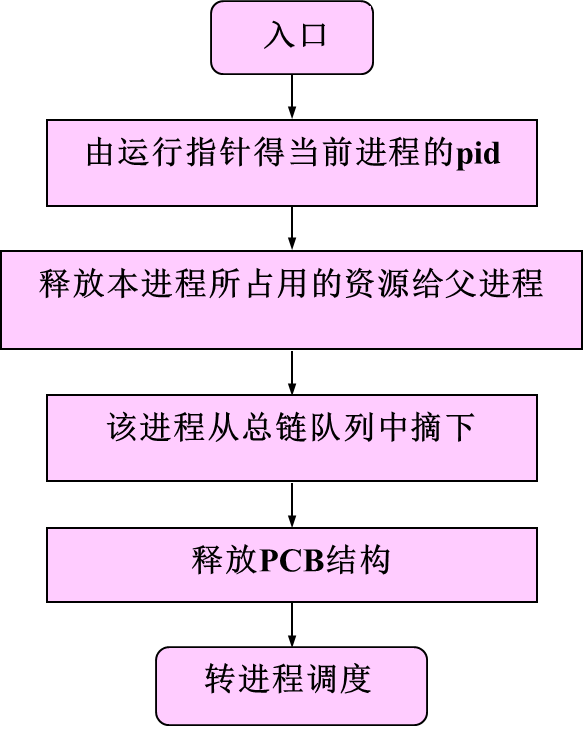

   

### 2.5.4 进程的阻塞与唤醒

1. 引起进程阻塞和唤醒的事件

   - **向系统请求共享资源失败**：正在执行的程序请求操作系统服务，但是由于某种原因操作系统没有立即满足该进程的要求，该进程只能转变为阻塞状态来等待。例如互斥共享的打印机。

   - **等待某种操作的完成**：当进程启动某种操作后，如果该进程必须在该操作完成之后才能继续执行，所以必须先使进程阻塞。例如：I/O操作

   - **新数据尚未到达**: 对于合作关系的进程而言，可能进程B的后续运行，需要进程A的运行数据。

   - **无新工作可做**：系统往往设置一些具有某特定功能的系统进程，每当这种进程完成任务以后便把自己阻塞起来等待新任务的到来。例如： 发送数据包。

2. 进程阻塞过程

   - 发现阻塞事件，调用阻塞原语把自己阻塞，停止进程的执行，修改PCB的状态信息，将其插入到自己的阻塞队列。最后转调度程序，将处理机分配给另一个就绪进程。

     注意: 进程的阻塞是自身的主动行为。

3. 进程唤醒过程

   - **引起进程唤醒的事件：**

     - 当被阻塞进程所期待的事件出现时，或者所期待的数据已经到达。

     - 由该有关进程调用进程唤醒原语wakeup，将等待该资源而阻塞的一个进程唤醒

   - **具体唤醒过程如下：** 
- 把被阻塞进程从等待该事件的阻塞队列中移出，修改其PCB的现行状态，由阻塞改为就绪，再将该进程插入到PCB就绪队列中。

### 2.5.5 进程的挂起与激活

1. **进程的挂起**

​		当出现了引起挂起的事件时，如为了暂时缓和内存的紧张状态，用户进程请求将自己挂起或者当父进程请求将自己的某个子进程挂起时，系统将利用挂起原语suspend()将指定的进程或处于阻塞状态的进程挂起。 

2. **进程的激活过程**

   将进程从外存调入内存，检查该进程的状态，改为相应的活动状态。


## 2.6 进程的同步 

​      系统引入进程的概念后，虽然可以实现了多道程序的并发执行，但是给操作系统也变得更为复杂。所以为了保证程序能够有序的并发执行，所以引入了进程同步的概念

### 2.6.1 进程同步的基本概念

1. 两种形式的制约关系
   - 间接相互制约关系：进程之间因为竞争资源所导致的间接制约关系（互斥）
   - 直接相互制约关系：进程为完成同一项任务而相互合作，产生的直接制约关系（同步）

2.  临界资源: 

     多道程序系统中存在许多进程，它们共享各种资源，然而有很多资源一次只能供一个进程使用。一次仅允许一个进程使用的资源称为临界资源。许多物理设备都属于临界资源，如输入机、打印机、磁带机等,当然除去物理设备,各进程采取互斥的方式，其他实现共享的资源也可以称作临界资源,例如：变量，缓冲区，数组等资源。

   **补充：** 由于临界资源的特殊性，在多个进程对资源的交叉访问中，容易产生与时间有关的错误。

```c
// 例如，有两个进程P1和P2共享一个变量count，P1或P2的功能是，每执行完某些操作后，将count的值取出加1，R1和R2是工作寄存器。当两个进程按下述顺序执行时：
P1：操作序列；
Rl=count;
R1=R1+1；
count=R1;
P2：操作序列；
R2=count;
R2=R2+1;
count=R2;
// 其结果使count的值增加了2;倘若P1和P2按另一种顺序执行，例如：
P1:R1=count;
P2:R2=count;
P1:Rl=Rl+1;count=Rl;
P2:R2=R2+1;count=R2;
// 按此执行序列，虽使P1和P2都各自对count做了加1操作，但最后的count值却只增加了1，即出现了结果不确定的错误。显然这种错误与执行顺序有关，又叫与时间相关的错误。
```

为了避免出现这样的错误，多进程在对临界资源访问时，要保证互斥，即仅当进程P1对count进行修改并退出后，才允许进程P2访问和修改，而进程中用于实现进程互斥的那段代码称为临界区。


3. 临界区：

​     进程中用于实现进程互斥的那段代码称为临界区。

```C
// 为了保证临界资源的正确使用，可以将临界资源的访问分为4个部分
do {
  entry section;    // 进入区（提出申请，检查进程是否可以进入临界区）
  critical section; // 临界区（访问临界资源）
  exit section;     // 退出区（恢复为未访问标志(访问之前的标志)）
  remainder section;// 剩余区（进程中的剩余代码）
} while(true)

```

4.  同步机制应遵循的原则：

- 空闲让进：当无进程处于临界区时，可让要求进入临界区的进程进入临界区。
- 忙则等待：当已有进程处于临界区时，其他进程则等待。
- 有限等待：进程进入临界区只能停留有限的时间，以免死等。
- 让权等待：不能进入临界区时，应立即释放处理机，进入“等待队列”，以免陷入“忙等”

  

### 2.6.2 硬件同步机制

​     由于软件实现进程的互斥进入临界问题，存在一定的局限性，所以已很少使用，现在基本都是由计算机提供一些特殊的硬件指令来实现解决临界问题。本质上就是对某一个标志内容进行判断和修改，从而决定进程是否可以访问临界资源。换个方式，可以将标志理解成一个锁，**锁开**进入访问，**锁关**等待不能访问，当然为了实时获取锁的状态，那么还要进行锁测试。

1. 关中断： 

   实现互斥**最简单的方法**。 进入锁测试之前关闭[中断](https://so.csdn.net/so/search?q=中断&spm=1001.2101.3001.7020)，直到完成锁测试并且关上锁以后再打开中断。进程进入临界区执行期间，计算机系统不会响应中断，也不会引发调度，就不会引起线程或者进程的切换。
    **缺点：**影响系统效率、不适合多CPU。


2. 利用Test-and-Set指令实现互斥

   **注意：** Test-and-Set指令是一句原语，3条指令必须一次执行完毕

```C
boolean TS(boolean *lock){  //lock为资源的状态（指令的执行过程不可分割，即为一条原语）
   boolean old;
    old=*lock;     
   *lock=TRUE;    //lock的初始值为false，即临界区空闲，进程进入临界区，将TRUE赋予lock，临界区正被访问
   return old;
}
do{
   while TS(&lock);   //进入区
   //当lock一直为TRUE时继续while循环测试，
   //当lock为false（即进程执行结束，临界区空闲），下一个进程可以进入
   critical section;  //临界区
   lock=FALSE;        //退出区
   remainder section; //剩余区
}while(TRUE);

```


3. 利用Swap指令实现进程互斥

该指令又称为对换指令，在Intel80x86中又称为XCHG指令，用于交换两个字的内容。

方法是为每个临界资源设置一个全局的布尔变量lock，初值为false，在每个进程中再利用一个局部变量key，利用swap指令实现进程互斥的循环进程。

```C
void swap(boolean *a,boolean *b)
{
    boolean temp=*a;
    *a=*b;
    *b=temp;
}
do{
 
    key=true;
 
    do{
    swap(&lock,&key);
    }while(key)
    //上面初值为false
 
    cirtical section//临界区，访问临界资源的代码
 
    lock=false;
}while(true)

```


### 2.6.3 信号量机制

1965年,荷兰学者 Dijkstra提出了一种卓有成效的实现进程互斥、同步的方法：**信号量机制**

----

**信号量机制概念介绍：**

- 用户进程可以通过使用操作系统提供的**一对原语(P,V)**来对**信号量(S)**进行操作,从而很方便的实现了进程互斥、进程同步。

- **信号量S**其实就是一个变量(可以是一个整数,也可以是更复杂的记录型变量),可以用一个信号量来表示**系统中某种资源的数量**,比如:系统中只有一台打印机,就可以设置一个初值为1的信号量**(S=1)**。

- 一对原语: wait(S)原语和signal(S)原语,可以把原语理解为我们自己写的函数,函数名分别为wait和 signal,括号里的信号量S其实就是函数调用时传入的一个参数
- wait、 signal原语常简称为P、Ⅴ操作(来自荷兰语 proberen和 verhogen)。因此常把wait(S)、signal(S)两个操作分别写为 P(S)、V(S)

```C
# 信号量的物理含义：
S>0  //表示有S个资源可用
S=0  //表示无资源可用
S<0  //表示等待队列中的进程个数为|S|
P(S) //表示申请一个资源
V(S) //表示释放一个资源 
```

1. **整型信号量**

​     整型[信号量](https://so.csdn.net/so/search?q=信号量&spm=1001.2101.3001.7020)定义一个用于表示资源数目的整型量数目S ，但是仅能通过两个原子操作wait（s）和sigal （s）来访问。

```C
wait(S)
{
	while（S<=0 ）;//如果未申请到资源则一直循环等待资源。
	s--;	//一旦有资源则执行S--
}

singal(S)
{
	S++;   //释放资源
}
```

**注意：**while(S)与singal(s)是原子操作，执行是不可中断的。
**整型信号量缺点：**

- 在整型信号量中，只要信号量是是s<=0 就会不断的测试，并未遵循“让权等待原则”，而使进程处于忙等状态。

2. **记录型信号量**

```C
// 定义一个记录型数据结构变量，变量名为semaphore
// value用来表示资源数目。
// 进程链表指针list，用于链接上述所有等待的进程
typedef struct{
	int value;
	struct process_control_block *list;//阻塞队列
}semaphore;

wait(semaphore *S){
	    S->value--;//申请资源
	    if(S->value<0)//表示该类资源已分配完毕，应调用block原语进行自我阻塞。
		block(S->list);
}
signal(semaphore *S){
	S->value++;//释放资源
	if(S->value<=0) //表表示该信号量链表中仍有等待的进程被阻塞,应调用wakeup原语。
		wakeup(S->list);
}		
```

S->value的初值表示系统中某类资源的数目， 可称为资源信号量。
**注意：**

- S>0时：表示可供并发进程使用的资源数。
- S<=0时：|S|表示因缺少该资源而自我阻塞的进程数。

---

补充说明： 在有些应用场合，是一个进程需要先获得两个或更多的共享资源后方能执行其任务。 

- 假定现有两个进程A和B，他们都要求访问共享数据D和E。为此，可为这两个数据分别设置用于互斥的信号量Dmutex和Emutex，并令它们的初值都是1。

```C
process A:　　　　process B:
wait(Dmutex)；　　wait(Emutex)；
wait(Emutex)；　　wait(Dmutex)； 
```

那么这种情况下，进程A和进程B是否能正常执行？


3. **AND型信号量**
   - 适用情况： 多个进程要共享多个临界资源
   - 将进程在整个运行过程中的所有资源，一次性全部分配给进程，进程使用完后再一次性释放，只要一个进程尚未分配成功，其他所有为之分配的资源也不分配给它。（要么把它所请求的资源全部分配给进程，要么一个也不分配），可避免死锁现象。
   - 在wait操作中，增加了一个“AND”条件，故称为AND同步。

```C
Swait(S1,S2,...,Sn)
{
	while(true)
	{
		if(Si>=1&&...&&Sn>=1)
		{
			for(i=1;i<n;i++)
				Si--;
			break;
		}
		else
		{
			place the process in the waiting queue associated with.....
			//如果没有申请到资源的话就挂到相应的阻塞队列里去
		}
	}
}
Ssignal(S1,S2,...Sn)
{
	while(true)
	{
		for(i=1;i<=n;i++)
		{
			Si++;
			remove all the process waiting in the queue associated with Si into the ready queue;//将所有在与Si相关的队列中等待的进程移到就绪队列中;
			//去后备队列里唤醒或移除因Si资源阻塞的进程
		}
	}
}
```

4. **信号量集**

在AND型信号量的基础上对原有的value和list阻塞队列保留，新增属性t和d。

- d表示进程需要的某类资源的数量，
- t表示进程能执行需要某类资源数量的最小值，
- value表示当前某类资源个数。

```C
typedef  struct{
    int value;
    int d;
    int t;
    struct process_control_block * list;
} semaphore;
```

这里的dt必须满足关系t>=d才能保证进程可以执行。

- 解释一下：假设d=5，也就是进程本身需要5个A资源；t=7，也就是进程最小需要7个A类资源才能执行，多出来的两个是分给操作系统使用的，因为控制进程执行的指令也需要操作系统分配资源。当然当前i资源数S也必须大于7才能保证进程整体可以执行。

信号量集的PV操作：

```C
Swait(S1, t1, d1; …; Sn, tn, dn);
Ssignal(S1, d1, …, Sn, dn);
```

- wait的参数是一个个的s，t，d，分别代表一种资源。和AND型信号量是类似的，每类资源都达到要求才能继续执行，否则进程被放入资源Si的阻塞队列。signal也是将阻塞队列中的进程拿出。和AND型信号量的工作机制很相似。

- 信号量集是由整形信号量一步步演变而来，每次演变都继承了上次的工作机制并且进行了缺点的改造。信号量集的已经可以适用较多的情景了。
- 如果Swait(S,d,d)。此时在信号量集中只有一个信号量S，但允许它每次申请d个资源，当现有资源数少于d时，不允分配。
- 如果Swait(S,1,1)：S>1时就退化成了记录型信号量；如果S=1就退化成了互斥信号量（整型信号量）。
- Swait(S,1,0)相当于可控开关，当S>=1时，允许多个进程进入某临界区。S=0时，任何进程都无法进入临界区。

### 2.6.4 信号量的应用

1. 利用信号量实现进程互斥

   - 为临界资源设置一互斥信号量mutex，初值为1，将临界区CS置于wait(mutex)和signal(mutex)之间。

     - 用信号量机制实现进程互斥时，只需在相关进程的临界区的前后分别施以P.V操作，即由P.V操作原语紧夹着临界区，就能保证进程互斥地进入各自的临界区。

   - 示例： 2个进程的互斥可以使用如下描述： 

       （1）对于两个并发进程，互斥信号量的值仅能取到1，0和-1三个值
       
       - mutex=-1: 表示没有进程进入临界区。
       - mutex=0：表示有一个进程进入临界区。
       - mutex=-1: 表示一个进程进入临界区，另一个进程等待进入。
       - 由于mutex为整型变量，所以取值范围为：[-1,1]
       
        （2）代码描述： 
       
       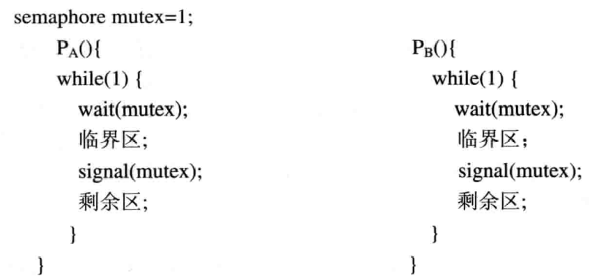

2. 利用信号量实现前趋关系


假设有2个进程：第一个进程p1,执行语句为S1，第二个进程为p2,执行语句为S2;

如果想完成s1--->s2的前趋关系，那么可以定义一个公用信号量为a,且初始值为0，

```C
// p1
S1； 
signal(a)； 
```

```C
// p2
wait(a)；
S2；
```

因为当a的值为0，P2如果先执行，必会发生阻塞，所以只有P1执行完（即先执行S1），才会执行P2(执行S2)。


- 书本示例： 

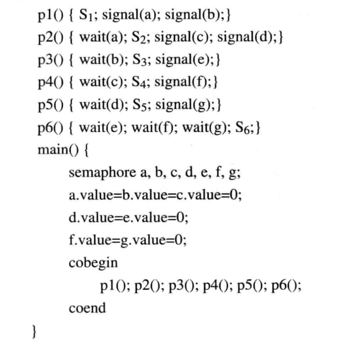

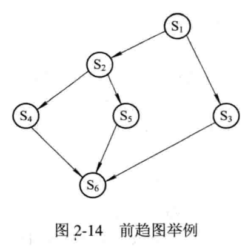


### 2.6.5 管程机制

- 信号量机制可实现进程间的同步与互斥，但信号量控制分散在整个程序中，其正确性分析困难，且易导致死锁。
- 1973年，Hanson和Hoare提出了管程的概念。为每个共享资源设立一个“秘书”来管理对它的访问（每次仅允许一个进程访问共享资源）。

1. **管程定义**

​      管程定义了一个数据结构和能为并发进程所执行的一组操作，这组操作能同步进程和改变管程中的数据。

2. 条件变量

