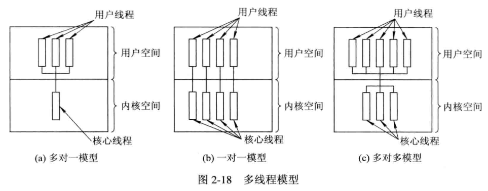
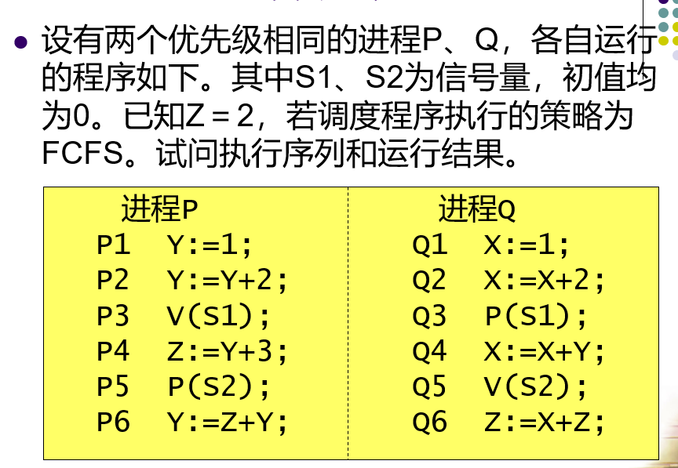

授课老师姓名：徐鑫荣

QQ： 1627389570

# 第一章 操作系统引论

什么是操作系统？

操作系统本身也是个软件，叫做系统软件，操作系统是介于硬件和软件之间，用于管理硬件，并向软件或者用户提供接口（核心思想：管理下层硬件，并为上层软件提供资源。）


## 1.1 操作系统的目标和作用

###  1.1.1 操作系统的目标

1. 方便性: 没有操作系统之前，计算机的运行是通过纸带的打孔（0101001）,有了操作系统之后，用户只需要对操作系统进行操作，下发的指令是如何变成计算机能够执行的操作，都是由操作系统完成。
2. 有效性:  如何去有效的利用硬件资源，因为计算机上面硬件功能是很强大的，使用操作系统可以更好的去划分和使用硬件资源，同时也防止软件滥用硬件资源。
3. 可扩充性:  随时可以增加或者删除新的模块，比如更新操作系统或者安装某些硬件驱动，直接在现有的操作系统上完成即可。
4. 开放性： 只要按照指定的软件或者硬件的协议标准，开发出来的软件就可以实现互相的兼容，运行在同一类型的操作系统上。

### 1.1.2 操作系统的作用

1. **OS作为用户与计算机硬件系统之间的接口**    

   用户可以通过操作系统来使用计算机（控制计算机的硬件资源或者运行程序软件。)

   

2. **OS作为计算机系统资源的管理者**

   只要安装了操作系统之后，所有硬件资源都是由操作系统进行管理和分配（cpu, 内存，I/O设备以及存储硬盘）

3. **OS实现了对计算机资源的抽象**

   （通过对资源的抽象，用户和开发人员，并不需要关心底层是如何实现的，只需要按照操作系统提供的标准执行即可。）

   - cpu被操作系统抽象成进程。

   - 内存被操作系统抽象成虚拟内存。

   - 硬盘被操作系统抽象成文件系统。

## 1.2 操作系统的发展过程

操作系统的发展其实只要围绕着2个方向来进行的（cpu和I/O设备的变化来思考）

1. 未配置操作系统的计算机系统 

   - 通过纸带的方式来运行计算机，都需要人工进行处理。
   - 通过磁带的方来运行计算机，虽然不需要人工，但是数据是存储在磁带上面，需要专门的设备进行管理。

   从纸带到磁带提升了(1)减少量cpu空间时间（2）提高了I/O速度。

2. 单道批处理系统（第二代晶体管的出现。）

​        批处理：代表可以处理多个任务。

​       单道： 指的是内存中一次存放一个任务。

- 内存的出现提高了I/O加载的速度，提高了cpu执行效率！

- 内存中每次加载一个任务，任务A执行任务B

3. 多道批处理系统

​     批处理：代表可以处理多个任务。

​     多道： 指的就是内存中可以加载多个任务。

​         计算机处理任务，首先将任务加载到内存，然后cpu处理内存中的数据。

​        所以当程序在运行中，发出I/O请求时，cpu便处于等待状态，那么就降低了cpu的使用率，因为多道批处理，内存中出现了多个进程，例如A进程，在进行I/O请求后，可以让cpu直接进行B任务的计算操作，这样就充分利用了用于I/O请求后，造成的cpu空闲时间。因为内存要加载多个任务，所以对于内存的要求就比较高，而且多个任务导致任务运行的周期变长。

4. 分时系统

​     上述的系统，都是将任务一次性的交给操作系统，然后让操作系统去执行（用户不能对任务进行中途的干预。）分时最主要的实现了人机的交互，对计算机的共享（多用户）。

- 分时的概念，可以简单的理解为：将cpu运行某一个时间段，分成若干部分，然后交给不同的任务去执行，任务越多，分到的cpu时间就越少，也就是为什么软件开多了，系统会越来越卡的原因之一。

5. 实时系统

​      实时的概念就是能够快速的响应用户的请求。

​     现有常见的操作系统，例如windows它既是分时系统，也是实时系统。 

## 1.3 操作系统的基本特性

1. 并发：

   - 并发指的是在某一个时间段内可以有多个任务运行。
   - 并行指的是在某一个时间点内可以有多个任务（进程）运行。

2. 共享：

   - 互斥共享： 例如：打印机可以给多个进程使用，但是进程A在使用时，进程B不能使用，只有A使用完毕后，B才能使用。
   - 同时访问：例如：磁盘设备，多个进程可以对磁盘同时写入或者读取。

3. 虚拟：

   虚拟技术的应用，本质来讲就是为了欺骗上层应用。

   - 时分复用技术：最典型的应用就是cpu，通过时分复用技术，让进程误以为是有多个cpu在执行任务。所以时分复用的技术，常常运用在一个设备虚拟出多个设备。

   - 空分复用技术： 最典型的应用就是内存，比如说一个程序100M，内存只有30M，先加载30M，明明实际的物理内存空间是小于程序所需的总空间，通过空分复用技术可以让程序误认为空间是足够的。

4. 异步：

   允许程序的运行是不连续的，前面的时分复用技术和并发概念的运用就是为了实现程序异步的运行。

   

1. 处理机管理功能

   处理机指的就是cpu，cpu经过操作系统的抽象过程之后，用户是通过进程来实现对cpu的管理。
   
2. 存储器管理功能

​        此处的存储器的管理，指的就是内存是如何被操作系统进行分配，回收以及内存地址映射等。

3. 设备管理功能

   指的就是I/O设备的管理，比如，内存，硬盘，鼠标，键盘都是属于I/O设备，

4. 文件管理功能

   指的就是硬盘存储设备的管理，通过文件管理功能，实现对硬盘等存储的设备的文件的管理，比如： 文件的复制，文件的删除以及查找等功能都是要依靠文件管理功能实现。


## 1.4 OS结构设计

### 1.4.1 传统结构操作系统

1. 无结构

   无结构的思想就是，只想如何高效的完成当前的功能， 很少考虑后期的维护管理，一旦操作系统代码量变大，后期的改变变多，会发现特别难以维护。

2. 模块化结构

   将操作系统的功能进行拆分，针对不同的功能来进行实现，便于后期的管理维护以及降低了不同功能之间的关联性，一旦出现问题，只需要对指定模块进行排查就行，但是注意：模块如果划分过多，就容易导致管理的混乱。    

3. 分层式结构

   分层架构是自下而上的，保证每一层的功能没有问题之后，在它的基础上进一步完成上层的功能，一旦出现了问题，只需要关心某一层的设计的功能，缺点: 每个层之间都会涉及到数据的交互，导致效率降低。

### 1.4.2 现代结构操作系统

1. 微内核

   传统的架构，所有的硬件都是由内核进行管理操作，也就是上面用户的进行的操作，如何转变成计算机可执行的指令，都是由内核完成的，而微内核的概念，就是进一步减少内核的负担，只保留最主要的功能,例如：进程管理，低级存储器的管理，中断陷入等处理。

   

# 第二章 进程的描述与控制

## 2.1 前趋图的概念

- 前趋图是一个有向无循环图，可记为DAG,其中每一个结点可用来表示一个进程，程序段或语句。

- 结点的有向边，即代表结点之间的前趋关系，注意前趋图中不能出现循环（死锁）。

  

### 2.1.1  程序执行的2种方式

1. 顺序执行

   - 在计算机系统中只有一个程序在运行，这个程序独占系统中所有资源，其执行不受外界影响。一道程序执行完后另一道才能开始。

   ```C
   S1:   a=x+y
   S2:   b=a-5
   S3:   c=b+1
   ```

   

2. 并发执行

   - 若干个程序同时在系统中执行，这些程序的执行在**时间上是重叠的。**

   - 一个程序的执行尚未结束，另一个程序的执行已经开始。


```C
S1： a=x+2
S2:  b=y+5
S3:  c=a+b
S4:  d=c+6
```


### 2.1.2 **程序的并发执行时的特征**

- **间断性**：“走走停停” ，一个程序可能走到中途停下来，失去原有的时序关系。

- **失去封闭性**：多个程序共享系统中的资源，这些资源的状态将由多个程序来改变。如：一个程序写到存储器中的数据可能被另一个程序修改，失去原有的不变特征。

```C
int a=1
a=a+1
a=a+1
```


- **不可再现性**：失去封闭性，失去可再现性；外界环境在程序的两次执行期间发生变化，失去原有的可重复特征。


## 2.2 进程的描述

1. 进程的定义

   - 为了能使程序并发执行，且更准确地描述和控制，引入进程。

   - 要使进程能独立运行，OS能控制和管理进程，必须为进程配置专门的数据结构——PCB。
   - 由程序段，数据段以及PCB三部分组成了进程实体（又称进程映象），简称进程。


- **进程是程序在处理机上的一次执行过程。**
- **进程是一个程序及其数据在处理机上顺序执行时所发生的活动。**
- **进程是具有独立功能的程序在一个数据集合上运行的过程，是系统进行资源分配和调度的一个独立单位**。


## 2.3 进程的状态及转换

### 2.3.1 进程的三种基本状态

（1）**就绪（Ready）状态**： 进程已处于准备好运行的状态。

（2）**执行(Running)状态**： 进程已获得cpu，其正在执行状态

（3）**阻塞（Block）状态**：正在执行的进程由于发生某事（如I/O请求）暂时无法继续执行时的状态，即进程的执行受到阻塞。


课内练习： 

- **1.**在进程状态转换时，下列（ ）转换是不可能发生的。

    **A)就绪态→运行态**    **B)运行态→就绪态**  

    **C)运行态→阻塞态**    **D)阻塞态→运行态**


- **2．**某进程在运行过程中需要等待从磁盘上读入数据，此时该进程的状态将（ ）。

   **A)从就绪变为运行**    **B)从运行变为就绪**

   **C)从运行变为阻塞**    **D)从阻塞变为就绪** 

  

- **3．思考题：假设单处理机系统中有N个进程，运行的进程最多几个，最少几个；就绪进程最多几个，最少几个？阻塞进程最多几个，最少几个？**


### 2.3.2 加入创建和终止

​	（1）**创建状态**： 进程是由创建产生的，在创建过程中，进程需要申请一个空白pcb，然后向pcb写入控制和管理进程的信息，并为进程分配运行所需的资源。

​	（2）**终止状态**： 进程的终止主要由2步：**I. 将进程的PCB清零**，**II.将PCB空间返还系统**。进入终止状态的进程以后不在运行，但会保留供其他进程调用的数据，直到数据提取完毕后，将PCB清零并返回空间给系统。


### 2.3.3 加入挂起和激活

​	（1）挂起状态：

​             暂时挂起一部分进程，把它们**从内存临时换出到外存**，释放其占有的资源，使它们暂时与系统脱离联系。 

   - 当进程处于挂起状态时，进程就会处于静止状态。
     - 如果进程正在执行，则会暂停执行。

     - 如果进程处于就绪，则进程暂不接收调度。

​	（2）激活状态：

​              与挂起状态相对应，将进程从外存调入内存，检查该进程的状态，改为相应的活动状态。

---

但是注意: 在原先基本状态下， 加入挂起和激活状态后，进程的状态的转化如下： 

- 活动就绪--->静止就绪：

  - 未被挂起前的就绪状态，即活动就绪，可接收调度执行。
  - 被挂起后，进程即为静止就绪状态，此时不在被调度执行。

- 活动阻塞--->静止阻塞：

  - 未被挂起前的阻塞状态，即活动阻塞。
  - 被挂起后，进程即为静止阻塞状态

- 静止就绪--->活动就绪

  - 即在静止状态被激活后就会进入活动就绪

- 静止阻塞--->活动阻塞

  - 处于静止阻塞状态的进程被激活后会进入活动阻塞。

  

补充： 

- 创建--->活动就绪： 如果当前系统性能和内存容量允许的情况下，完成创建后，进程就会进入到活动就绪状态

- 创建--->静止就绪：如果当前系统性能和内存容量不允许的情况下，那么不会给该进程分配资源，而是将它置入外存，此时创建并未完成。

  


## 2.4 进程管理中的数据结构

- 在计算机系统中，对于每个资源和每个进程都设置了一个数据结构，用来表示实体，称为资源信息表或进程信息表，其中包含了资源或进程的标识、描述、状态等信息以及一批指针（一般分为4类：**内存表，设备表，文件表和进程表，其中进程表也就是前文提到过的PCB进程控制块**）。

- 通过这些指针，可以将同类资源或进程的信息表，或者同一进程所占用的资源信息表分类链接成不同的队列，便于操作系统进行查找。  

 

### 2.4.1 进程控制块PCB的作用

- 作为独立运行基本单位的标志。

- 能实现间断性运行方式。 

- 提供进程管理所需要的信息。

- 提供进程调度所需要的信息。

- 实现与其它进程的同步与通信。

### 2.4.2 进程控制块PCB中的信息

- 进程标识符：外部（用户）、内部（系统）

- 处理机状态（上下文）：处理机中各寄存器内容

- 进程调度信息

  - 进程状态，优先级

  - 进程调度所需的其它信息（与所进程调度算法有关，如进程已等待CPU时间总和、进程已执行的时间总和）

  - 进程阻塞原因

- 进程控制信息：程序数据地址、同步通信机制等

```C
struct PCB//声明一个名称为PCB的数据类型，并没有分配空间
{
   int 进程标识符
   int 处理机状态（上下文）：处理机中各寄存器内容
   char[10] 进程调度信息
   int  优先级
}
```


​		

### 2.4.3 PCB的组织方式

系统把所有PCB组织在一起

- 线性方式：线性表，首地址在内存专用区域，适合并发进程数不多的系统


- 链接方式：按状态组织成多个队列


- 索引方式：按状态建多张索引表，表目中记录对应PCB在PCB表中的地址


## 2.5 进程控制

- 进程控制是进程管理的基本功能。

- 通过进程管理可以创建一个新进程、终止一个已完成的进程，负责进程运行中的状态转换。

- 进程控制一般由OS**内核**中的**原语**来实现。
  - 原语是指由若干条机器指令构成的，并用以完成特定功能的一段程序，这段程序在执行期间是不可分割的（原子性）。
  
    

### 2.5.1 操作系统内核

- OS内核：通常将一些与硬件密切相关的模块、驱动程序、运行频率高的模块，安排在**紧靠硬件的软件层**中，常驻内存，以提高操作系统运行效率，并对它们加以特殊的保护。

- 一般情况下，为了避免用户程序错误地使用特权指令，保护操作系统不被用户程序破坏，在内核中将cpu的执行状态分为2种：

  - **系统态（管态、内核态）：**能执行包括特权指令在内的一切指令，可访问全部寄存器和存储区。传统操作系统都在此态运行。
  - **用户态（目态）：**程序只能执行非特权指令，访问有限的存储空间和指定的寄存器。应用程序通常都在此态下运行，不能执行OS指令、访问OS区域。

  

  补充： 由于操作系统的内核是和硬件挂钩的，所以不同的硬件之间操作系统也是存在一定的差异，但是大部分操作系统的内核都有以下2大方向的功能。

  1. **支撑功能**（支撑硬件相关的模块工作）
  - **中断处理**：内核最基本功能，是整个OS赖以活动的基础。内核在对中断进行“有限处理”后便转入相关进程完成后续处理。
    
  - **时钟管理**：内核基本功能。如时间片轮转调度，每当时间片用完，由时钟管理产生一个中断信号，促使调度程序重新调度。
    
  - **原语操作**：完成一定功能的一个过程，执行原子操作。
     - 由若干条指令组成，用于完成一定功能的一个过程。
    - 原语是在管态下执行、完成系统特定功能的过程。
       - 执行**原子操作**：要么全做，要么全不做，即该过程是一个不可分割的基本单位。
       - 原语的执行是顺序的而不可能是并发的。
       
     - 常见进程控制原语：创建Create、终止Destroy、阻塞Block、唤醒Wakeup、挂起Suspend、激活原语Active

  2. **资源管理功能**

     - 进程管理                                                                                                                                                                                                                                                                                                                                                                                                                                                                                                                                                                                                                                                                                                                    
     - 存储器管理  
     - 设备管理
  
  进程和存储都是高频率操作，所以一般通常把他们放在内核中，而设备管理是和硬件紧密相关的所以也是放在内核里。

### 2.5.2 进程的创建

1. 进程的层次结构

   -  在OS中，一个进程可以创建子进程。

   - 子进程可以继承父进程的所有资源，当子进程被撤消时，应将从父进程那里获得的资源归还给父进程。

   -  撤消父进程时也必须同时撤消其所有的子进程。

   

   注意：

   - UNIX中，进程与其子孙进程共同组成一个进程家族。

   - Windows中不存在层次结构，所以进程地位相同。一个进程创建另一个进程，获得一个句柄（可控制该进程），这个句柄可以传递，谁拿到句柄谁就可以控制该进程。进程间是控制与被控制的简单关系。

2. 引起创建进程的事件

   - **用户登录**：分时系统中，用户在终端键入登录命令后，若是合法用户，系统建立一个进程，并插入就绪队列。

   - **作业调度**：批处理系统中，作业调度程序调度到某个作业以后，就把这个作业装入内存，并分配必要的资源，创建进程，插入就绪队列。

   - **提供服务**：运行中的用户向系统提出请求后，系统专门建立一个进程为用户服务。（打印请求）**由操作系统内核（系统程序模块）创建**

   - **应用请求**：应用进程的需要，由它自己创建一个新进程，使新进程以并发运行方式完成特定任务。（输入数据并将处理结果输出到表格上）**由父进程创建**

3. 进程的创建

   (1) 申请空白PCB，为新进程申请获得唯一的数字标识符，并从PCB集合中索取一个空白PCB。

   (2) 为新进程分配其运行所需的资源，包括各种物理和逻辑资源，如内存、文件、I/O设备和CPU时间等。

   (3) 初始化进程控制块(PCB)。

   (4) 如果进程就绪队列能够接纳新进程，便将新进程插入就绪队列。

### 2.5.3 进程的终止

1. 引起进程终止的事件

- **正常结束**
  - 计算机系统中，都有一个表示进程已经运行完成的指示，如holt指令。

- **异常结束**
  
  - 越界错误、保护错、特权指令错、非法指令错、运行超时、等待超时、算术运算错、I/O故障
  
- **外界干预** 

  - 操作员或操作系统干预、父进程请求、父进程终止

    

2. 进程终止的过程

   - 根据当前被终止的进程标识符，从PCB集合中找到该进程，并检索进程当前的状态，结束并置调度标志，撤销其所有的子进程，归还资源，移出队列。

     

   

### 2.5.4 进程的阻塞与唤醒

1. 引起进程阻塞和唤醒的事件

   - **向系统请求共享资源失败**：正在执行的程序请求操作系统服务，但是由于某种原因操作系统没有立即满足该进程的要求，该进程只能转变为阻塞状态来等待。例如互斥共享的打印机。

   - **等待某种操作的完成**：当进程启动某种操作后，如果该进程必须在该操作完成之后才能继续执行，所以必须先使进程阻塞。例如：I/O操作

   - **新数据尚未到达**: 对于合作关系的进程而言，可能进程B的后续运行，需要进程A的运行数据。

   - **无新工作可做**：系统往往设置一些具有某特定功能的系统进程，每当这种进程完成任务以后便把自己阻塞起来等待新任务的到来。例如： 发送数据包。

2. 进程阻塞过程

   - 发现阻塞事件，调用阻塞原语把自己阻塞，停止进程的执行，修改PCB的状态信息，将其插入到自己的阻塞队列。最后转调度程序，将处理机分配给另一个就绪进程。

     注意: 进程的阻塞是自身的主动行为。

3. 进程唤醒过程

   - **引起进程唤醒的事件：**

     - 当被阻塞进程所期待的事件出现时，或者所期待的数据已经到达。

     - 由该有关进程调用进程唤醒原语wakeup，将等待该资源而阻塞的一个进程唤醒

   - **具体唤醒过程如下：** 
- 把被阻塞进程从等待该事件的阻塞队列中移出，修改其PCB的现行状态，由阻塞改为就绪，再将该进程插入到PCB就绪队列中。

### 2.5.5 进程的挂起与激活

1. **进程的挂起**

​		当出现了引起挂起的事件时，如为了暂时缓和内存的紧张状态，用户进程请求将自己挂起或者当父进程请求将自己的某个子进程挂起时，系统将利用挂起原语suspend()将指定的进程或处于阻塞状态的进程挂起。 

2. **进程的激活过程**

   将进程从外存调入内存，检查该进程的状态，改为相应的活动状态。


## 2.6 进程的同步 

​      系统引入进程的概念后，虽然可以实现了多道程序的并发执行，但是给操作系统也变得更为复杂。所以为了保证程序能够有序的并发执行，所以引入了进程同步的概念

### 2.6.1 进程同步的基本概念

1. 两种形式的制约关系
   - 间接相互制约关系：进程之间因为竞争资源所导致的间接制约关系（互斥）
   - 直接相互制约关系：进程为完成同一项任务而相互合作，产生的直接制约关系（同步）

2.  临界资源: 

     多道程序系统中存在许多进程，它们共享各种资源，然而有很多资源一次只能供一个进程使用。一次仅允许一个进程使用的资源称为临界资源。许多物理设备都属于临界资源，如输入机、打印机、磁带机等,当然除去物理设备,各进程采取互斥的方式，其他实现共享的资源也可以称作临界资源,例如：变量，缓冲区，数组等资源。

   **补充：** 由于临界资源的特殊性，在多个进程对资源的交叉访问中，容易产生与时间有关的错误。

```c
// 例如，有两个进程P1和P2共享一个变量count，P1或P2的功能是，每执行完某些操作后，将count的值取出加1，R1和R2是工作寄存器。当两个进程按下述顺序执行时：
P1：操作序列；
Rl=count;
R1=R1+1；
count=R1;
P2：操作序列；
R2=count;
R2=R2+1;
count=R2;
// 其结果使count的值增加了2;倘若P1和P2按另一种顺序执行，例如：
P1:R1=count;
P2:R2=count;
P1:Rl=Rl+1;count=Rl;
P2:R2=R2+1;count=R2;
// 按此执行序列，虽使P1和P2都各自对count做了加1操作，但最后的count值却只增加了1，即出现了结果不确定的错误。显然这种错误与执行顺序有关，又叫与时间相关的错误。
```

为了避免出现这样的错误，多进程在对临界资源访问时，要保证互斥，即仅当进程P1对count进行修改并退出后，才允许进程P2访问和修改，而进程中用于实现进程互斥的那段代码称为临界区。


3. 临界区：

​     进程中用于实现进程互斥的那段代码称为临界区。

```C
// 为了保证临界资源的正确使用，可以将临界资源的访问分为4个部分
do {
  entry section;    // 进入区（提出申请，检查进程是否可以进入临界区）
  critical section; // 临界区（访问临界资源）
  exit section;     // 退出区（恢复为未访问标志(访问之前的标志)）
  remainder section;// 剩余区（进程中的剩余代码）
} while(true)

```

4.  同步机制应遵循的原则：

- 空闲让进：当无进程处于临界区时，可让要求进入临界区的进程进入临界区。
- 忙则等待：当已有进程处于临界区时，其他进程则等待。
- 有限等待：进程进入临界区只能停留有限的时间，以免死等。
- 让权等待：不能进入临界区时，应立即释放处理机，进入“等待队列”，以免陷入“忙等”

  

### 2.6.2 硬件同步机制

​     由于软件实现进程的互斥进入临界问题，存在一定的局限性，所以已很少使用，现在基本都是由计算机提供一些特殊的硬件指令来实现解决临界问题。本质上就是对某一个标志内容进行判断和修改，从而决定进程是否可以访问临界资源。换个方式，可以将标志理解成一个锁，**锁开**进入访问，**锁关**等待不能访问，当然为了实时获取锁的状态，那么还要进行锁测试。

1. 关中断： 

   实现互斥**最简单的方法**。 进入锁测试之前关闭[中断](https://so.csdn.net/so/search?q=中断&spm=1001.2101.3001.7020)，直到完成锁测试并且关上锁以后再打开中断。进程进入临界区执行期间，计算机系统不会响应中断，也不会引发调度，就不会引起线程或者进程的切换。
    **缺点：**影响系统效率、不适合多CPU。


2. 利用Test-and-Set指令实现互斥

   **注意：** Test-and-Set指令是一句原语，必须一次执行完毕

```C
boolean TS(boolean *lock){  //lock为资源的状态（指令的执行过程不可分割，即为一条原语）
   boolean old;
    old=*lock;     
   *lock=TRUE;    //lock的初始值为false，即临界区空闲，进程进入临界区，将TRUE赋予lock，临界区正被访问
   return old;
}

do{
   while TS(&lock);   //进入区
   //当lock一直为TRUE时继续while循环测试，
   //当lock为false（即进程执行结束，临界区空闲），下一个进程可以进入
   critical section;  //临界区
   lock=FALSE;        //退出区
   remainder section; //剩余区
}while(TRUE);

```


3. 利用Swap指令实现进程互斥

该指令又称为对换指令，在Intel80x86中又称为XCHG指令，用于交换两个字的内容。

方法是为每个临界资源设置一个全局的布尔变量lock，初值为false，在每个进程中再利用一个局部变量key，利用swap指令实现进程互斥的循环进程。

```C
void swap(boolean *a,boolean *b)
{
    boolean temp=*a;
    *a=*b;
    *b=temp;
}
do{
	// lock=false
    key=true;
 
    do{
    swap(&lock,&key);
    }while(key)
    //上面初值为false
 
    cirtical section//临界区，访问临界资源的代码
 
    lock=false;
}while(true)

```


### 2.6.3 信号量机制

1965年,荷兰学者 Dijkstra提出了一种卓有成效的实现进程互斥、同步的方法：**信号量机制**

----

**信号量机制概念介绍：**

- 用户进程可以通过使用操作系统提供的**一对原语(P,V)**来对**信号量(S)**进行操作,从而很方便的实现了进程互斥、进程同步。

- **信号量S**其实就是一个变量(可以是一个整数,也可以是更复杂的记录型变量),可以用一个信号量来表示**系统中某种资源的数量**,比如:系统中只有一台打印机,就可以设置一个初值为1的信号量**(S=1)**。

- 一对原语: wait(S)原语和signal(S)原语,可以把原语理解为我们自己写的函数,函数名分别为wait和 signal,括号里的信号量S其实就是函数调用时传入的一个参数
- wait、 signal原语常简称为P、Ⅴ操作(来自荷兰语 proberen和 verhogen)。因此常把wait(S)、signal(S)两个操作分别写为 P(S)、V(S)

```C
# 信号量的物理含义：
S>0  //表示有S个资源可用
S=0  //表示无资源可用
S<0  //表示等待队列中的进程个数为|S|
P(S) //表示申请一个资源
V(S) //表示释放一个资源 
```

1. **整型信号量**

​     整型[信号量](https://so.csdn.net/so/search?q=信号量&spm=1001.2101.3001.7020)定义一个用于表示资源数目的整型量数目S ，但是仅能通过两个原子操作wait（s）和sigal （s）来访问。

```C
wait(S)
{
	while（S<=0 ）;//如果未申请到资源则一直循环等待资源。
	s--;	//一旦有资源则执行S--
}

singal(S)
{
	S++;   //释放资源
}
```

**注意：**wait(S)与singal(s)是原子操作，执行是不可中断的。
**整型信号量缺点：**

- 在整型信号量中，只要信号量是是s<=0 就会不断的测试，并未遵循“让权等待原则”，而使进程处于忙等状态。

2. **记录型信号量**

```C
// 定义一个记录型数据结构变量，变量名为semaphore
// value用来表示资源数目。
// 进程链表指针list，用于链接上述所有等待的进程
typedef struct{
	int value;
	struct process_control_block *list;//阻塞队列
}semaphore;

wait(semaphore *S){
	    S->value--;//申请资源
	    if(S->value<0)//表示该类资源已分配完毕，应调用block原语进行自我阻塞。
		block(S->list);
}
signal(semaphore *S){
	S->value++;//释放资源
	if(S->value<=0) //表表示该信号量链表中仍有等待的进程被阻塞,应调用wakeup原语。
		wakeup(S->list);
}		
```

S->value的初值表示系统中某类资源的数目， 可称为资源信号量。
**注意：**

- S>0时：表示可供并发进程使用的资源数。
- S<=0时：|S|表示因缺少该资源而自我阻塞的进程数。

---

补充说明： 在有些应用场合，是一个进程需要先获得两个或更多的共享资源后方能执行其任务。 

- 假定现有两个进程A和B，他们都要求访问共享数据D和E。为此，可为这两个数据分别设置用于互斥的信号量Dmutex和Emutex，并令它们的初值都是1。

```C
process A:　　　　process B:
wait(Dmutex)；　　wait(Emutex)；
wait(Emutex)；　　wait(Dmutex)； 
    
Swait(S1,S2,...,Sn)
```

那么这种情况下，进程A和进程B是否能正常执行？


3. **AND型信号量**
   - 适用情况： 多个进程要共享多个临界资源
   - 将进程在整个运行过程中的所有资源，一次性全部分配给进程，进程使用完后再一次性释放，只要一个进程尚未分配成功，其他所有为之分配的资源也不分配给它。（要么把它所请求的资源全部分配给进程，要么一个也不分配），可避免死锁现象。
   - 在wait操作中，增加了一个“AND”条件，故称为AND同步。

```C
Swait(S1,S2,...,Sn)
{
	while(true)
	{
		if(S1>=1&&...&&Sn>=1)
		{
			for(i=1;i<n;i++)
				W
			break;
		}
		else
		{
			place the process in the waiting queue associated with.....
			//如果没有申请到资源的话就挂到相应的阻塞队列里去
		}
	}
}
Ssignal(S1,S2,...Sn)
{
	while(true)
	{
		for(i=1;i<=n;i++)
		{
			Si++;
			remove all the process waiting in the queue associated with Si into the ready queue;//将所有在与Si相关的队列中等待的进程移到就绪队列中;
			//去后备队列里唤醒或移除因Si资源阻塞的进程
		}
	}
}
```

4. **信号量集**

在AND型信号量的基础上对原有的value和list阻塞队列保留，新增属性t和d。

- d表示进程需要的某类资源的数量，
- t表示进程能执行需要某类资源数量的最小值，
- value表示当前某类资源个数。

```C
typedef  struct{
    int value;
    int d;
    int t;
    struct process_control_block * list;
} semaphore;
```

这里的dt必须满足关系**t>=d**才能保证进程可以执行。

- 解释一下：假设d=5，也就是进程本身需要5个A资源；t=7，也就是进程最小需要7个A类资源才能执行，多出来的两个是分给操作系统使用的，因为控制进程执行的指令也需要操作系统分配资源。当然当前i资源数S也必须大于7才能保证进程整体可以执行。

信号量集的PV操作：

```C
Swait(S1, t1, d1; …; Sn, tn, dn);
Ssignal(S1, d1, …, Sn, dn);
```

- wait的参数是一个个的s，t，d，分别代表一种资源。和AND型信号量是类似的，每类资源都达到要求才能继续执行，否则进程被放入资源Si的阻塞队列。signal也是将阻塞队列中的进程拿出。和AND型信号量的工作机制很相似。

- 信号量集是由整形信号量一步步演变而来，每次演变都继承了上次的工作机制并且进行了缺点的改造。信号量集的已经可以适用较多的情景了。
- 如果Swait(S,d,d)。此时在信号量集中只有一个信号量S，但允许它每次申请d个资源，当现有资源数少于d时，不允分配。
- 如果Swait(S,1,1)：S>1时就退化成了记录型信号量；如果S=1就退化成了互斥信号量（整型信号量）。
- Swait(S,1,0)相当于可控开关，当S>=1时，允许多个进程进入某临界区。S=0时，任何进程都无法进入临界区。

### 2.6.4 信号量的应用

1. 利用信号量实现进程互斥

   - 为临界资源设置一互斥信号量mutex，初值为1，将临界区CS置于wait(mutex)和signal(mutex)之间。

     - 用信号量机制实现进程互斥时，只需在相关进程的临界区的前后分别施以P.V操作，即由P.V操作原语紧夹着临界区，就能保证进程互斥地进入各自的临界区。

   - 示例： 2个进程的互斥可以使用如下描述： 

       （1）对于两个并发进程，互斥信号量的值仅能取到1，0和-1三个值
       
       - mutex=1: 表示没有进程进入临界区。
       - mutex=0：表示有一个进程进入临界区。
       - mutex=-1: 表示一个进程进入临界区，另一个进程等待进入。
       - 由于mutex为整型变量，所以取值范围为：[-1,1]
       
        （2）代码描述： 
       
       

2. 利用信号量实现前趋关系


假设有2个进程：第一个进程p1,执行语句为S1，第二个进程为p2,执行语句为S2;

如果想完成s1--->s2的前趋关系，那么可以定义一个公用信号量为a,且初始值为0，

```C
// p1
S1； 
signal(a)； 
```

```C
// p2
wait(a)；
S2；
```

因为当a的值为0，P2如果先执行，必会发生阻塞，所以只有P1执行完（即先执行S1），才会执行P2(执行S2)。


- 书本示例： 


### 2.6.5 管程机制

- 信号量机制可实现进程间的同步与互斥，但信号量控制分散在整个程序中，其正确性分析困难，且易导致死锁。
- 1973年，Hanson和Hoare提出了管程的概念。为每个共享资源设立一个“秘书”来管理对它的访问（每次仅允许一个进程访问共享资源）。

1. **管程定义**

   - 由于系统中的硬件资源均可以使用数据结构抽象的描述其资源特性，所以管程定义了一个数据结构和能为并发进程所执行的一组操作，这组操作能同步进程和改变管程中的数据。

   - 管程由四部分组成：

     - 管程的名称
     - 局部于管程的共享数据结构说明
     - 对该数据结构进行操作的一组过程
     - 对局部于管程的共享数据设置初始值的语句
     - 示意图如下：
       - 补充说明：条件队列指的是一组在等待某个条件变成真的进程，队列中的元素是进程

     

     - 一次只允许一个进程调用管程内的**过程(可以理解成编程中的函数)**

     - 由管程内的过程去访问内部共享变量

   ```C
   Monitor monitor_name  {         // 管程名
     share variable declarations;  // 共享变量说明
     cond  declarations;           // 条件变量说明
   public:                         // 能被进程调用的过程 
    void P1(…);  {  …  };          // 对数据结构操作的过程
    void P2(…);  {  …  };
      …
   {                               // 管程主体
           initialization code;    // 初始化代码
     } 
   }
   ```

   

2. 条件变量

   - 原先对进程使用pv原语来实现进程的阻塞和激活，但是如果在管程中执行使用该方式，那么会导致此进程阻塞后后续的进程也无法使用管程，被迫长时间等待。

   - 为解决该问题，引入了条件变量的概念： 

     - 局限于管程并仅能从管程内部进行访问的若干条件变量，用于区别各种不同的等待原因。

       ```C
       Var x:condition
       ```

     - 在条件变量上进行操作的两个原语：

       - **x.wait** 将调用此原语的进程阻塞在x条件队列中，并允许其他进程进入管程。

       - **x.signal** 唤醒x条件队列中队首进程，若队列空，则什么也不做。

       换句话说，如果没有条件变量，那么产生阻塞后，就会导致进程队列后续的进程也发生等待，但是有了条件变量后，由x条件产生的阻塞，会加入到x条件的等待队列上，不会影响到其他进程，直到x条件发生改变。

   

## 2.7 经典进程的同步问题

### 2.7.1 生产者-消费者问题

   这是一个著名的进程同步问题，它的描述是:  有一群生产者进程在生产产品，并将这些产品提供给消费者进程去消费。为使生产者进程与消费者进程能够并发执行，在两者之间设置了一个具有**N**个缓冲区的环形缓冲池，生产者进程将它所生产的产品放入一个缓冲区中，消费者进程可以从缓冲区中取走产品去消费。

​      不允许消费者进程到一个空缓冲区去取产品；也不允许生产者进程向一个已装满产品且尚未被取走的缓冲区中投放产品。

- 需要满足以下同步条件
  - 不能向满缓冲区存产品。
  - 不能向空缓冲区取产品。
  - 每个时刻仅允许一个生产者或消费者存或取1个产品。


- 设缓冲区的编号为0~N-1,in和out分别是生产者进程和消费者进程使用的指针，指向下面可用的缓冲区，初值都是0;
- 设置三个信号量：
  - full： 表示放有产品的缓冲区数，其初值为0。
  - empty: 表示可供使用的缓冲区数，其初值为N。
  - mutex: 互斥信号量，初值为1，表示各进程互斥进入临界区，保证任何时候只有一个进程使用缓冲区。

```C
int in=0,out=0;
semaphore mutex=1,empty=n,full=0;

// 生产者进程
void producer(){
  do{
      produce an item nextp;
      ……
    wait(empty);
    wait(mutex); 0
      
    buffer[in]=nextp;
    in=(in+1)%n;
      
    signal(mutex);
    signal(full);
      
}while (True);
    
    // 消费者进程
void consumer(){
  do{
      produce an item nextp;
      ……
    wait(full);
    wait(mutex);
      
    buffer[in]=nextp;
    in=(in+1)%n;
      
    signal(mutex);
    signal(empty);
      
}while (True);

```


注意： 

- 每个程序中用于实现互斥的p(mutex)和v(mutex)必须成对地出现，**在同一个进程中**；

- 对资源信号量empty和full的p和v操作，同样需要成对地出现，但它们分别处于**不同**的程序中(**实现同步）**。

- 在每个程序中的多个p操作顺序不能颠倒。应先执行对**资源信号量**的p操作，然后再执行对**互斥信号量**的p操作，否则可能引起进程死锁。


### 2.7.2 哲学家进餐问题

​     由Dijkstra提出并解决的哲学家进餐问题是典型的同步问题。

问题描述：有五个哲学家共用一张圆桌，分别坐在周围的五张椅子上，在圆桌上有5个碗和**五支**筷子，他们的生活方式是交替地进行思考和进餐。平时，一个哲学家进行思考，饥饿时便试图取用其左右最靠近他的快子，只有在他拿到两只筷子时，才能进餐，进餐毕，放下筷子继续思考。


- 关系分析：系统中有5个哲学家进程，筷子就是临界资源，5位哲学家与左右邻居对其中间筷子的访问是互斥关系。
- 整理思路：这个问题中只有互斥关系，但与之前遇到的问题不同的事，每个哲学家进程需要同时持有两个临界资源才能开始吃饭。如何避免临界资源分配不当造成的死锁现象，是哲学家问题的精髓。
- 信号量设置：定义互斥信号量数组 chopstick[5]={1,1,1,1,1} 用于实现对5个筷子的互斥访问。并对哲学家按0~4编号，哲学家 i 左边的筷子编号为i，右边的筷子编号为 (i+1)%5。

```C
semaphore chopstick[5]={1,1,1,1,1}
// 所有的信号量均被初始化为1，第i位哲学家的活动可描述为：
do{   
       wait(chopstick[i]);
       wait(chopstick[(i+1)%n]);

       //吃饭
       signal(chopstick[i]);
       signal(chopstick[(i+1)%n]);
	     ...
		// 思考
}

```

此方法会不会发生死锁？（考试考）


### 2.7.3 读者－写者问题

   此问题类似文件读写的逻辑，一个数据文件或记录可被多个进程共享，只读文件的进程为”reader进程“，可写的进程为”writer进程“。

典型例子：订票系统，（购买时，同时只有一个人可以买票，但是可以有多个人进行查询）

- 要求： 

  - 允许多个reader进程同时操作（因为读操作不会使数据文件混乱）
  - 不允许writer进程、reader进程同时操作
  - 不允许多个writer进程同时操作

  


- 信号量设置
  - wmutex:  互斥量，写者与其他读者/写者互斥访问，初值为1（写者—读者的互斥）
  - rmutex:  互斥量，互斥访问临界资源readcount。初值为1（读者—读者的互斥）
  - readcount: 读者计数，初值为0

```C
semaphore  mutex=1,wmutex=1'
int readcount=0；  //用于记录当前有几个进程在读文件

// 读进程
void reader(){
    do {
        wait(rmutex);
        if(readcount == 0)
            wait(wmutex);
        readcount++;
        signal(rmutex);
        ...
        perform read operation;
        ...
        wait(rmutex);
        readcount--;
        if(readcount == 0)
            signal(wmutex);
        signal(rmutex);
    }while(TURE)
}

void Writer(){
    do{
        wait(wmutex);
        perform write operation;
        signal(wmutex);
    }while(TRUE)
}

void main(){
    // 并行开始
    cobegin
        Reader(); Writer();
    coend
}
```


## 2.8 进程通信

进程通是指进程之间的信息交换。例如之前涉及的进程的互斥和同步，也涉及到进程通信。但是此通信方式效率低，通信对用户不透明，所以被称为低级通信。

- 进程通信：进程之间的信息交换。

  - 低级通讯（信息量少且效率低）

    - 进程互斥

    - 进程同步

  - 高级通讯（大宗信息，通信过程对用户透明）

    - 共享存储器系统

    - 消息传递系统

    - 管道通信方式 

### 2.8.1 进程通信的类型

1. **共享存储器系统**

   根据共享的对象不同可以分为2类：

   - 基于共享数据结构的通讯方式：利用进程公用的数据结构，实现进程间数的交换
   
   - 基于共享存储区的通讯方式：在内存中画出一块共享存储区，数据的形式，存放位置都是由进程控制，而不是操作系统。（高级通信）
   
2. **管道(pipe)通信系统**

​		所谓“管道”，是指用于连接一个读进程和一个写进程以实现它们之间通信的一个共享文件，即pipe文件。即pipe文件类似第三方的缓存文件，前一个进程写入，后一个进程读取。


3. **客户机-服务器系统**

   - 套接字

     一个套接字就是一个通信标识类型的数据结构，包含了通信的目的地址，通信使用的端口号。通信网络的传输层协议，进程所在的网络地址等，可以分为2类型

     - 基于文件型： 基于本地环境进行数据的传输，类似之前的管道文件。
     - 基于网络型：基于网络环境下的不同主机进行传输数据，例如：http://192.168.182.100:80就是很典型的基于网络型套接字。

   - 远程过程调用和远程方法调用

     远程过程(方法)调用都使用了RPC通信协议，简单地说，RPC 就是像调用本机器上的函数或方法一样，去执行远程机器上的函数或方法，并返回结果。在整个过程中，不感知底层具体的通信细节。
     
     
### 2.8.2 消息传递通信的实现方式

   1. 直接消息传递系统 ---利用OS所提供的发送命令（原语）

- 直接通信原语
     1）对称寻址方式 —— 要求发送进程和接收进程都必须以显式方式提供对方的标识符。
     系统提供以下两条通信命令：
     send(receiver,message);
     receive(sender,message);

   不足：一旦改变进程的名称，则可能需要检查所有其他进程的定义，有关对该进程旧名称的所有引用都必须查找到，以便将其修改为新名称，显然，这样的方式不利于实现进程定义的模块化。

   

   2）非对称寻址方式 —— 接收进程可能需要与多个发送进程通信，无法事先指定发送进程。因此，在接受进程的原语中，不需要命名发送进程，只填写表示源进程的参数，即完成通信后的返回值，而发送进程仍需要命名接收进程。
   send(receiver,message);
   receive(id,message); 接收来自任何进程的消息，id变量可设置为进行通信的发送方进程id或名字。

   - 消息格式
     比较短的定长消息格式 —— 减少对消息的处理和存储开销
     变长的消息格式 —— 处理、存储方面付出更多的开销，方便用户
   
   - 进程的同步方式
     在完成消息的发送或接收后，存在三种情况：
     1）发送进程阻塞，接收进程阻塞 —— 这种情况主要用于进程之间紧密同步，发送进程和接收进程之间无缓冲时。
     2）发送进程不阻塞，接收进程阻塞 —— 发送进程不阻塞，因而它可以尽快地把一个或多个消息发送给多个目标；而接收进程平时处于阻塞状态，直到发送进程发来消息时才被唤醒
     3）发送进程不阻塞，接收进程不阻塞 —— 发送进程和接收进程都在忙于自己的事情，仅当发生某事件使它无法继续运行时，才把自己阻塞起来等待
   
   - 通信链路
     通信双方建立链路，两种方式：

   1）由发送进程在通信之前用显式的“建立连接”命令（原语）请求系统为之建立一条通信链路，在链路使用完成后拆除链路 —— 主要用于计算机网络

   2）发送进程无须明确提出建立链路的请求，只须利用系统提供的发送命令（原语），系统会自动地为之建立一条链路 —— 主要用于单机系统中

   根据通信方式的不同，把链路分成两种：
   1）单向通信链路
   2）双向通信链路


2.  **间接通信方式 —— 信箱通信**
      进程之间的通信，需要通过某种中间实体来完成，该实体建立在随机存储器的公用缓冲区上，用来暂存发送进程发送给目标进程的消息；接收进程可以从该实体中取出发送进程发送给自己的消息，通常把这种中间实体称为邮箱，每个邮箱都有唯一的标识符。消息在邮箱中可以安全地保存，只允许核准的目标用户随时读取。既可实现实时通信，又可实现非实时通信。

   信箱的结构 —— 一种数据结构，两个部分
   1）信箱头，用以存放有关信箱的描述信息 —— 信箱标识符、信箱的拥有者、信箱口令、信箱的空格数等
   2）信箱体 —— 由若干个可以存放消息的信箱格组成，信箱格的数目以及每格的大小是在创建信箱时确定的

   信箱通信原语
   1）邮箱的创建和撤销
   进程可利用邮箱创建原语来建立一个新邮箱，创建者进程应给出邮箱名字、邮箱属性（公用、私用或共享）；对于共享邮箱，还应给出共享者的名字，当进程不再需要读邮箱时，可用邮箱撤销原语将之撤销。
   2）消息的发送和接收。当进程之间要利用邮箱进行通信时，必须使用共享邮箱，并利用系统提供的通信原语进行通信。
   Send（mailbox，message）;
   Receive（mailbox，message）;

   信箱的类型
   1）私用邮箱。用户进程可为自己建立一个新邮箱，并作为该进程的一部分。邮箱的拥有者有权从邮箱中读取消息，其他用户则只能将自己构成的消息发送到该邮箱中，可采用单向通信链路的邮箱来实现。当拥有该邮箱的进程结束时，邮箱也随之消失。

   2）公用邮箱。由操作系统创建，并提供给系统中的所有核准进程使用。核准用户既可把消息发到该邮箱，也可从邮箱读取给自己的消息，应采用双向通信链路的邮箱来实现。在系统运行期间始终存在。

   3）共享邮箱。由某进程创建，在创建时或创建后指明它是可共享的，同时须指出共享进程的名字。邮箱的拥有者和共享者都有权从邮箱中取走发送给自己的消息。

   发送进程和接收进程存在以下四种关系：
   1）一对一
   2）多对一
   3）一对多
   4）多对多

   

 


## 2.9  线程的基本概念

### 2.9.1 线程的引入

OS引入进程是为了更好的并发执行，而引入线程，则是为了提高OS并发执行的效率，减少执行时所付出的时空开销，使得并发粒度更细，并发性更好

1. 进程的两个基本属性

- 可拥有资源的独立单位
  - 包括用于存放程序正文、数据的磁盘和内存地址空间，以及它在运行时所需要的I/O设备、已打开的文件、信号量等；

- 可独立调度和分派的基本单位
  - 系统根据PCB感知进程的存在，根据PCB中信息，对进程进行调度，保存断点信息、恢复进程运行的现场。

2. 进程在创建，撤销和切换的过程中都会占用到cpu资源，而将进程进一步细分之后，那么创建，撤销和切换的对象就不再是整个进程，而是更细化的线程。


### 2.9.2 线程和进程的比较

- 调度的基本单位
- 并发性
- 拥有资源
- 独立性
- 系统开销
- 支持多处理机系统


### 2.9.3 线程的状态和线程控制块

**1.线程运行的三个状态**

1. 执行状态：表示线程已获得处理机而正在运行。
2. 就绪状态：线程已经具备各种执行条件，只需获得CPU便可立即执行。
3. 阻塞状态：线程在执行中因某事件受阻而处于暂停状态。
   线程状态之间的转换与进程之间的转换一样。


**2.线程控制块TCB**
	如同每个进程有一个进程控制块一样，系统也为每个线程配置了一个线程控制块TCB，将所有用于控制和管理线程的信息记录在线程控制块中。
线程控制块包含的信息有：

- 线程标识符：具有唯一性，是线程的 ’ 身份证 ’ 。

- 一组寄存器：包含计数器PC，状态寄存器和通用寄存器的内容。

- 线程运行状态。

- 优先级。

- 线程专有存储区：用于线程切换时，存放现场的保护信息和与该线程相关的统计信息等。

- 信号屏蔽：对某些信号加以屏蔽。

- 堆栈指针：线程相互调用时的切换通常出现多重嵌套，使用堆栈将每次过程调用所使用的局部变量以及返回地址保存起来。

  


3. **多线程OS中的进程属性**

     多线程OS中的进程具有以下属性：

- 进程是一个可拥有资源的基本单位。
- 多个线程可并发执行。
- 进程不是可执行的实体，线程才是执行的实体


## 2.10 线程的实现

### 2.10.1 线程的实现方式

线程的实现方式在不同的操作系统中有不同的方式，可分为三种：内核支持线程，用户级线程，组合方式（前两种的结合）。

**1.内核支持线程KST(Kernel Supported Threads)**

　　内核支持线程KST在内核的支持下运行，在内核空间内完成创建，阻塞，撤销，切换。每一个内核线程设置了一个线程控制块TCB，可通过TCB来感知内核线程的存在，进而加以控制。

- 优点：

　　　　1.在多处理器系统中，内核能够同时调用同一进程的多个线程并行（真正的同时执行）执行。

　　　　2.一个进程中的线程被阻塞了，内核可以调度该进程中的其他线程或者其他进程中的线程占用处理器运行。

　　　　3.线程切换较快，切换开销小。

　　　　4.内核本身也可采用多线程技术，可以提高系统的执行速度和效率。

- 缺点：

　　　　1.对于用户的线程的切换，需要从用户态转到内核态中进行，切换的开销较大。

**2.用户级线程ULT(User Level Threads)**

　　用户级线程在用户空间中实现，对线程的创建，撤销，同步，通信都无需内核的支持，一个系统中用户级线程可以达到数百个至数千个。注意，用户级线程的调度是以进程为单位的，采用轮转调度算法时对于大小线程数目较少的进程来说是有利的。

- 优点：

　　　　1.线程的切换不需要转换到内存空间，因此节省了模式切换的开销

　　　　2.调度算法是专用的，不同的进程可以有不同的调度算法

　　　　3.用户级线程的实现与OS平台无关，因此用户级线程可以在不支持线程机制的操作系统平台上运行

- 缺点：

　　　　1.一个线程执行系统调用会阻塞该进程的所有线程

　　　　2.单纯的用户级线程实现方式中，内核每次只分配一个CPU给进程，因此每次只能有一个线程获得CPU执行，其他线程在该线程放弃CPU之前只能等待

**3.组合方式**

 　　组合方式是内核支持线程和用户级线程的组合。根据用户级线程和内核支持线程连接方式的不同可划分出三种模型，多对一模型，一对多模型，多对多模型

　　1.多对一模型：用户级线程对内核支持线程进行多路复用，一次只允许一个用户级线程映射到内核支持线程对内核进行访问，当一个线程阻塞时，其他线程也必须阻塞

　　2.一对一模型：一个用户级线程映射一个内核支持线程，一个线程阻塞时，允许另一个线程调度运行。每创建一个用户级线程都需要创建一个内核支持线程与之对应，开销较大

　　3.多对多模型：相同数量的用户级线程可以映射到相同数量或者更少的内核支持线程，综合了上述两种模型的优点。




### 2.10.2 线程的实现

无论是进程还是线程，都必须直接或间接地取得内核的支持。

1. 内核支持线程的实现

2. 用户级线程的实现

内核支持线程的实现是直接调用了内核为其服务，而用户级别必须借助中间系统的帮助才能使用内核。


# 第三章 处理机调度与死锁

## 3.1 处理级调度的层次和调度算法的目标

在多道程序环境下，进程的数目往往多于处理器的数目，多个进程共享处理机资源就必然引起对处理机的竞争，这就要求操作系统采取一定的策略（调度算法），动态地将处理机分配给各个进程使之能够执行。
分配处理机的任务由处理机调度程序完成。

### 3.1.1 处理机调度的层次

一个作业从提交到获得处理机执行，直至作业运行完毕，需要经历多级调度。

1. 高级调度（作业调度）

   决定把外存上处于后备队列中的哪些作业调入内存，并为它们创建进程、分配必要的资源，准备执行。

2. 低级调度（进程调度）

   决定就绪队列中的哪个进程应获得处理机，然后再由分派程序执行把处理机分配给该进程的具体操作。

3. 中级调度（挂起进程的激活）

   决定把又具备运行条件的挂起进程重新调入内存，挂到就绪队列上，准备执行。


### 3.1.2 处理机调度算法的目标

注意：不同的操作系统类型对于处理机调度算法的目标也是不一样的。

1. 处理机调度算法的共同目标
   - **资源利用率**
   - **公平性**：防止进程饥饿现象
   - **平衡性**：计算型、I/O型作业，让CPU和各种外设能常处于忙碌状态，尽可能保持系统资源使用的平衡性
   - **策略强制执行**：特定策略（如安全策略），只要需要，必须予以准确地执行
2. 批处理系统的目标
   - **平均周转时间短**：周转时间 = 作业从提交――>完成的时间间隔
   - **系统吞吐量高**：吞吐量 = 在单位时间内系统所完成的作业数
   - **处理机利用率高**：处理机价格昂贵，因而其利用率成为衡量系统性能的十分重要的指标；调度方式和算法又对处理机的利用率起着十分重要的作用。
3. 分时系统的目标
   - 响应时间快
   - 均衡性
4. 实时系统
   - 截止时间保证
   - 可预测性

## 3.2 作业与作用调度

### 3.2.1 批处理系统中的作业

1. 作业和作业步

- **作业**：请求计算机完成的一个完整的处理任务称为作业，它可以包括几个程序的相继执行，由下面三部分组成
  - 程序
  - 数据
  - 作业说明书： 系统根据此来对程序运行进行控制
- **作业步**：一个复杂的作业可由多个加工步骤组成，如编译、运行、打印一个程序的全部工作是一个作业，其中相对独立的每一部分称为作业步

2. 作业控制块

- 作业在系统中存在的标志。
- 保存了系统对作业进行管理和调度所需的全部信息。
- JCB中包含：作业标识、用户名称、用户账号、作业类型(CPU 繁忙型、I/O 繁忙型、批量型、终端型)、作业状态、调度信息(优先级、作业运行时间)、资源需求(预计运行时间、要求内存大小等)、资源使用情况等


3. 作业运行的三个阶段和三种状态

- 收容阶段：提交的作业通过输入方式或SPOOLing系统输入到硬盘上，建立JCB，放入后备队列中(后备状态)
- 运行阶段：被作业调度程序选中，送入主存，分配资源建立进程，投入运行。（运行状态）
- 完成阶段：作业运行完毕或提前结束，系统回收它所占用的资源，将作业运行结果输出。（完成状态）


### 3.2.2 作业调度的主要任务

 作业调度的主要认识是根据JCB信息，检查系统能否满足用户作业的资源需求，按一定调度算法对外存后备队列中作业进行选择调入内存，并为之创建进程、分配必要的资源，再将新创建的进程排在就绪队列上，准备执行。在每次执行作业调度时，需要考虑以下两个决定。

1.接纳多少个作业（取决多道程序度）

2.接纳哪些作业（取决调度算法）

### 3.2.3 先来先服务（FCFS）和短作业优先调度（SJF）

1. 先来先服务（FCFS）

按照进程就绪的先后次序来调度进程，为之分配处理机。当前进程占用CPU，直到执行完或阻塞，才出让CPU。

**特点**

- 比较有利于长作业，而不利于短作业。
- 有利于CPU繁忙的作业，而不利于I/O繁忙的作业。


2. **短作业优先调度（SJF）**

- 对预计执行时间短的作业（进程）优先分派处理机。
- 对FCFS算法的改进，其目标是减少平均周转时间，提高系统吞吐量。
- 通常后来的短作业不抢先正在执行的作业。

**优点：**

- 比**FCFS**改善平均周转时间和平均带权周转时间，缩短作业的等待时间；

- 提高系统的吞吐量；

**缺点：**

- 对长作业非常不利，可能长时间得不到执行；

- 未能依据作业的紧迫程度来划分执行的优先级；

- 难以准确估计作业（进程）的执行时间，从而影响调度性能。


### 3.2.4 优先级调度算法和高响应比优先算法

1.  **优先级调度算法**

PSA中，基于作业紧迫程度，额外赋予作业优先级，根据优先级调度，保证了紧迫性作业优先运行。
PSA可运用于作业调度和进程调度。


2. **高响应比优先调度（HRRN）**

HRRN是介于FCFS（先来先服务算法）与SJF（短作业优先算法）之间的折中算法，既考虑作业等待时间又考虑作业运行时间，既照顾短作业又不使长作业等待时间过长，改进了调度性能。

此算法引入了一个动态的优先级，它随着等待时间的延长而增加。
$$
优先级=(等待时间+要求服务时间)/要求服务时间
$$
而等待时间+要求服务时间也称为响应时间。

- 如作业等待时间相同，则执行时间越短，响应比越高，有利于短作业。
- 如执行时间相同，等待时间越长，响应比越高，实现的是FCFS。
- 对于长作业，随等待时间增加，响应比增高，最后同样可获得处理机。


## 3.3 进程调度

### 3.3.1 进程调度的任务，机制和方式

进程调度**——**用来决定就绪队列中的哪个进程应获得处理机，再由分派程序**（Dispatcher）**执行把处理机分配给该进程的具体操作。

1. 进程调度的任务有三

   - 保存处理机现场信息

   - 按调度算法选取进程

   - 把处理器分配给进程

2. 进程调度机制


- 排队器：将就绪进程加入相应队列中。
- 分派器： 依据进程调度程序确定要运行的程序
- 上下文切换器：进程进行切换时，保留和加载进程的上下文信息。


3. **进程调度方式**

1. 非抢占式调度(不适用于实时系统)

- 正在执行的进程执行完毕，或因发生某事件而不能再继续执行；
- 执行中的进程因提出I/O请求而暂停执行；
- 在进程通信或同步过程中执行了某种原语操作，如wait、block、wakeup原语等

2. 抢占式调度(防止长进程长期占用处理机)
   - **抢占原则：**
     - 优先权原则
     - 短作业(进程)优先原则
     - 时间片原则


### 3.3.2 轮转调度算法

1. **轮转调度算法的基本原理**
   - 系统根据FCFS策略将就绪进程排成队列。
   - 系统设置每隔一定时间(如30 ms)便产生一次中断，激活进程调度程序进行调度，把CPU分配给队首进程，并令其执行一个时间片。
   - 当该进程时间片耗尽或运行完毕时，系统再次将处机分配给就绪队列中新队首进程。
   - 这样，就可以保证就绪队列中的所有进程在确定的时间段内，都能获得一个时间片的处理机时间。
2. **进程切换时机**

- 若一个时间片尚未用完，正在运行的进程便已经完成，就立即激活调度程序，将它从就绪队列中删除，再调度就绪队列中队首的进程运行，并启动一个新的时间片

- 在一个时间片用完时，计时器中断处理程序被激活。如果进程尚未运行完毕，调度程序将把它送往就绪队列的末尾。

3. **时间片大小的确定**
- 时间片的大小对系统性能有很大的影响


### 3.3.3 优先级调度算法

- 选择具有**最高优先级**的进程首先使用处理机。

**1. 非抢占式优先权算法**

- 系统一旦把处理机分配给就绪队列中优先权最高的进程后，等该进程执行完或因发生某事件而放弃处理机时，系统方可再调度。

- 主要用于批处理系统。

**2. 抢占式优先权算法**

- 系统把处理机分配给优先权最高的进程，但若执行期间出现另一优先权更高的进程，进程调度程序就立即停止当前进程执行，重新将处理机分配给新到的优先权最高的进程。

- 能较好满足紧迫作业的要求，常用于要求比较严格的实时系统，和性能要求较高的分时和批处理系统。


### 3.3.4 **多级反馈队列调度算法** 

- **首先**：系统按进程优先级设置了多级就绪进程队列，从第一级队列到最后一级队列，优先级越来越低。

- **其次**：每一级就绪队列对应一个不同的时间片。优先权越高的队列，进程的时间片越小。

- **再次**：当一个新进程进入内存后，首先被放到第一级队列的队尾。按照FCFS原则排队等待调度。当轮到该进程执行时，如能在时间片内完成，便可准备撤离系统；如果在时间片内未完成，调度程序便将该进程转入第二队列的末尾，再依次按照FCFS原则等待调度。

- **最后**：仅当第一级队列为空时，才调度第二级队列中的进程；如此下去，仅当前面的n-1级队列全部为空时，才去调度最后第n级队列中的进程。

  如果处理机正在第i队列中为某进程服务时，又有新的进程进入优先权高的队列（第1～i-1中任何一队列），则系统抢占正在运行的进程的处理机，由调度程序把正在运行的进程放回到刚才所在第i队列的队尾，重新进行处理机调度。


**多级反馈队列调度算法性能**

- 多级反馈队列调度算法的性能能较好满足各种类型用户的需要。

- 终端型用户：短作业，通常在第1级队列可以执行完成

- 短批处理作业用户：较短作业，通常在第1、2和3级队列就可以执行完成

- 长批处理作业用户：会依队列而执行，不会导致长作业等死

**补充：保证调度算法,公平分享调度算法课后自行学习**




​                                                                                                                                                                                                      

## 3.5 死锁概念

### 3.5.1 死锁的定义

如果一组进程中的每一个进程都在等待仅由该组进程中的其他进程才能引发的事件，那么该组进程是死锁（deadlock）的。（**互相等待**）

### 3.5.2 引起死锁的主要原因

1. 竞争不可抢占性资源(例如:打印机，磁带机)
2. 竞争可消耗资源引起死锁（例如：进程间的通信）
3. 进程推进顺序不当引起死锁


### 3.5.3 产生死锁的必要条件（同时具备）

1. 互斥条件：涉及的资源要求排他性使用（**资源独占**）
2. 请求和保持条件：进程在等待一新资源时继续占有已分配的资源(**部分分配，占有申请**)
3. 不可抢占条件：不能强行剥夺进程拥有的资源（**不可抢占**）
4. 循环等待条件：存在一种进程循环链，链中每一个进程已获得的资源同时被链中的下一个进程所请求


### 3.5.4 处理死锁

1. 预防死锁

2. 避免死锁
3. 检测死锁
4. 解除死锁

- 对死锁的防范程度逐渐减弱，资源利用率逐渐提高，进程因资源而阻塞的频度下降


## 3.6 预防死锁

核心思想：破坏产生死锁的四个必要条件，但是互斥条件是非共享设备必须的，不可改变，所以重点在于后三个条件。

### 3.6.1 破坏“请求和保持”条件

1. 第一种协议

​       系统要求任一进程必须预先申请它所需的全部资源，而且仅当该进程的全部资源要求能得到满足时，系统才能给予**一次性分配**，然后启动该进程运行

- 资源严重浪费
- 进程延迟进行发生饥饿现象

2. 第二种协议

   允许一个进程只获得运行初期所需的资源后，便开始运行。运行过程中，再逐步释放已使用完的资源，再请求新资源。 

   - 案例：一个进程，先将数据从磁带上复制到磁盘，然后对磁盘文件排序，最后打印结果。


### 3.6.2 破坏“不可抢占”条件

1. 进程逐个地提出对资源的请求；
2. 已获得资源的进程，再申请资源若不能得到时，则要求它必须释放其已占有的资源；
3. 以后需要该资源时再重新申请。

不足：实现起来比较复杂且要付出很大的代价


### 3.6.3  破坏”循环等待“条件

1. 把系统中所有资源类型线性排队，并按递增规则赋予每类资源以唯一的编号。
2. 进程申请资源时，必须严格按资源编号的递增顺序进行，否则系统不予分配。


## 3.7 避免死锁

- 死锁的避免是这样一种对付死锁的办法：系统在运行过程中采取动态的资源分配策略，保证系统不进入可能导致系统陷入死锁状态的所谓不安全状态，以避免死锁发生。
- 死锁的避免与死锁防止策略不同，它不对进程申请资源加任何限制，而是对进程提出的每一次资源请求进行动态检查，并根据检查结果决定是否分配资源以满足进程的请求。由于采用了动态的资源分配策略，所以资源利用率比预防死锁办法高。


1. 安全状态

   在避免死锁的方法中，允许进程动态地申请资源，但系统在进行资源分配之前，应先计算此次资源分配的安全性。若此次分配不会导致系统进入不安全状态，则将资源分配给进程；否则，令进程等待。

   所谓安全状态，是指系统能按某种进程顺序(P1，P2，…，Pn)(称〈P1，P2，…，Pn〉序列为安全序列)，来为每个进程 Pi分配其所需资源，直至满足每个进程对资源的最大需求，使每个进程都可顺利地完成。如果系统无法找到这样一个安全序列，则称系统处于不安全状态。

   虽然并非所有的不安全状态都必然会转为死锁状态，但当系统进入不安全状态后，便有可能进而进入死锁状态；反之，只要系统处于安全状态，系统便可避免进入死锁状态。因此，避免死锁的实质在于：系统在进行资源分配时，如何使系统不进入不安全状态。


### 3.7.2 利用银行家算法避免死锁

银行家算法是最有代表性的避免死锁算法，是由Dijkstra提出的。

该算法原本是为银行系统设计的，以确保银行在发放现金贷款时，不会发生不能满足所有客户需要的情况。
秘诀：不可能所有客户同时都需要最大的贷款额。
