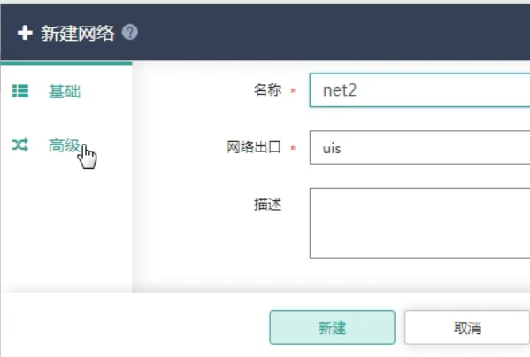
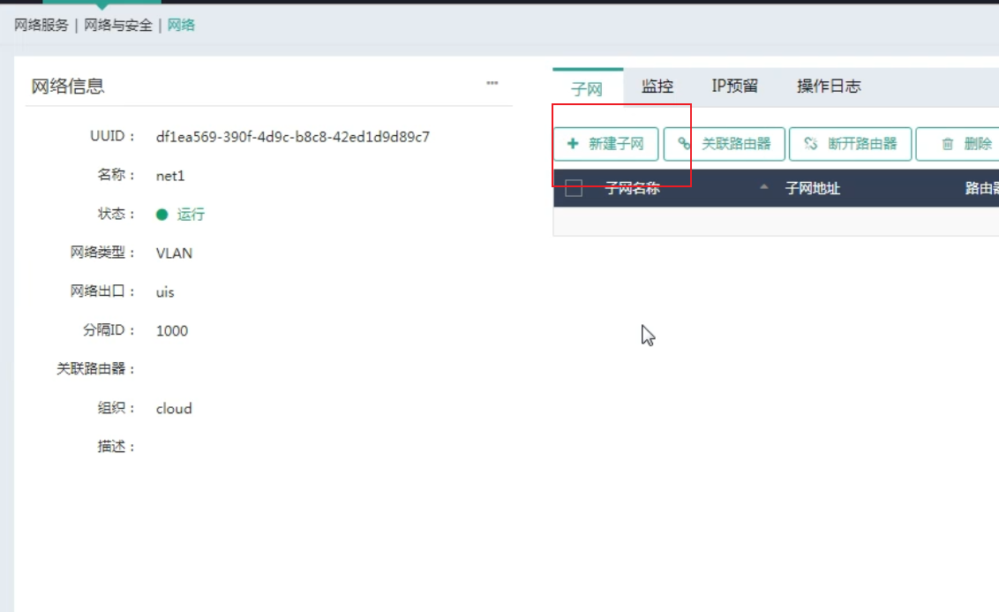

# USI-Sec 部署介绍

## 1.1 开局注意

1. UIS-Sec支持USI Cloud部署以及独立部署，即：
   - 如果已经部署了UIS_Cloud情况下，那么无需部署UIS-Sec管理组件，部署UIS-Sec网关组件即可
   - 而未部署UIS Cloud情况下，需部署UIS-Sec管理组件和UIS-Sec网关组件。

2. UIS-Sec授权
   - 购买基础版授权具有三层访问，四层防火墙，公网ip这些基础功能的授权
   - 但是如果要使用NGFW， 应用交付， web防火墙，数据库审计，应用网关控制网关等功能，需要获取安全增强版授权

## 1.2 部署步骤

 UIS-Sec分为UIS-Sec管理组件、UIS-Sec网关组件和UIS-Sec安全组件

其中**必须先保证UIS-Sec管理组件部署完毕**，然后再部署UIS-Sec网关组件和UIS-Sec安全组件。

- **组网示意图如下**

| **管理网段为 **          | 10.99.221.0/24    |
| ------------------------ | ----------------- |
| **网关地址为**           | **10.99.221.1**   |
| 超融合平台IP地址为：**** | **10.99.221.120** |
| 服务器edge1地址          | 10.99.221.121     |
| 服务器edge2地址          | 10.99.221.122     |
| 服务器edge3地址          | 10.99.221.123     |
|                          |                   |

**目前本手册中，在USI-Sec部署阶段，只涉及到管理网段的使用**

### 1.2.1 上传管理组件包

1. 首先将组件 **UIS-SEC-MANAGEER-版本号**和**UIS_SEC_GETEWAY-版本号**上传至组件仓库

### 1.2.2 部署管理组件

1. 管理（导航栏）-----> 组件管理（侧面栏）----->组件--->组件列表中选择UIS-Sec管理组件---->部署

2. 进入部署组件后------> 下一步

3. 在选择主机步骤中，确定部署组件的主机，此例以edge2为部署管理组件的主机

   

4. 网络信息，确定部署管理组件主机的网络和存储信息。
   - **管理网ip：**不能冲突。
   - **网关：**保证可以访问。
   - **选择系统存储池：**该存储池应该预先部署完毕（**存储池要求参考1.2.2.2小结**），且要保证管理节点独占一个存储池，可参考下图。
     - 
   - **管理网络模板策略（若无需求，则不修改）**：此处可以用来修改管理组件主机所处的vlan，可参考下图。
     - 

#### 1.2.2.2 独立存储池要求

1. 点击存储（导航栏）----->存储管理下拉菜单中------->硬盘池管理
2. 要求UIS-Sec管理组件节点的存储池（以全HDD为例）：
   - 硬盘个数大于等于3
   - 必须独占，不可部署其他业务。
3. 添加存储时，共享存储池参考另外章节

-  配置完成后效果截图

### 1.2.3 初始化管理节点

1. 点击进入H3Cloud部署监控 ，用户名和密码默认为admin
2. 进入后点击左上加号------->单机模式安装------->下一步

3. 继续下一步，如果出现异常，查看ip地址是否冲突，没有异常后开始部署。

   

4. 正在部署界面

   

### 1.2.4 上传网关组件包

(1)    登陆待部署UIS-Sec网关组件的UIS标准版页面，单击顶部“管理”页签，选择左侧[组件管理/组件仓库]菜单项，进入组件仓库管理页面。

(1)    单击<上传>按钮，弹出上传文件对话框，选择需要上传的UIS-Sec网关组件，单击<开始上传>按钮，开始上传组件。

3. 上传完成后可在组件仓库列表中查看已上传的UIS-Sec网关组件。

### 1.2.5 网关组件部署预配置

   1. 点击主机（导航栏）------> 选择主机管理-------->选择虚拟交换机

      **注意：如果在部署组件时选择集群模式，那么需要在2台主机上都创建vs_gateway**!

      

   2.  创建虚拟机，注意添加的名字是vs_gateway

        

   3.   下一步选择对应网口------>下一步

      

4. 一般情况下，链路选择动态，负载分担模式选择高级

   

   

### 1.2.6 部署网关组件

1. 点击步骤六部署网关组件后，点击管理(导航栏)----->组件管理/组件（侧面栏）----->在组件列表中的UIS-Sec网关组件选择 ------->部署

2. 进入部署组件界面（该界面部署时一定要保证管理组件已成功部署）

   - 基本信息（无需选择，下一步即可）

     

   - 选择主机（一般情况下，推荐使用2台做集群模式，然后选择下一步）

     

   - 网络信息 (编写完成后，点击完成即可)

     

     

- **网络集群vip:** 集群的虚拟机地址，属于管理网段，ip不可冲突

- **网络集群vip掩码：**属于管理网的掩码地址

- **已部署UIScloud或管理组件ip**: 写入管理组件主机地址即可

- **管理网ip：** 即需要给UIS-Sec网关组件虚拟机的管理网ip地址

- **网关：**管理网的网关地址

- **选择系统存储池：**选择非管理主机使用的共享存储池，或者使用业务存储池都可以。

- **选择业务网虚拟交换机：** 默认使用vs_gateway,现在支持虚拟机的复用，所以也可以选择vs_business

- **管理网网络模板策略：** 需要指定管理网vlan时可以使用

    

### 1.2.7 配置管理节点

1. 点击配置管理节点后

2. 登入到超融合管理平台，默认用户和密码都为admin，进入之后需要修改密码，然后重新登录。

3. 点击添加站点------>添加配置------>检测通过后点击确定即可

   

   - 站点ip：就是超融合管理平台ip

     

   - 管理用户名和管理用户密码一样都是之前标准版管理平台的用户名和密码。

     ​          

4. 规划网络

   - 

     

   - 规划业务网vlan

     i.选择新建

     

     ii.规划业务网vlan范围，确定后有提示，点击确定即可

     

5. 新建私有云

   - 运维（导航栏）--->资源配合--->总体规划---->新建

   

   - 新增ip地址网段

      

6. 完成效果图

   

7. 物理交换机的配置

   - 注意在物理交换机上也要保证对下方三个网络的vlan放行

   

8.  查看虚拟主机所处的ip地址和端口地址，然后在对应交换机上进行相应的vlan配置

   

端口地址：

- 手册配置vlan放行参考

### 1.2.8 切换高级网络模式  

注意：如果想要使用高级网络模式，那么必须先新建配置网络

#### 1.2.8.1 前期准备新建网络

1. 网络服务------> 网络与安全------> 网络------>新建

2. 填入网络名称，注意网络出口一定时uis
   - **不需配置vlan**

- **需要配置vlan** 

 1. 打开vlan功能

    系统------> 高级设置------>高级特性

2. 新建网络net1，并设置vlanID为1000
   - 创建网络

- 设置vlanID 为1000

  

3.  新建网络net2，并设置vlanID为1001

 

4. 在net1中创建子网

   - 点击net1--->进入网络信息后---->新建子网

     

   - 设置net1网络的子网名和子网地址

     

5. 在net2中创建子网

#### 1.2.8.2  切换网络高级模式

- 进入之后----->切换网络模式为高级网络

- 然后输入UIS-Sec的IP地址和用户名与密码

- 配置完毕后，在新建或修改虚拟机时，网络模式就可以选择高级模式

#### 1.2.8.3 高级网络下不同子网的互通

- 假设有2台主机test10 和test11

- test10( 确定主机后---->选择修改---->点击网络)

- 选择高级网络，并设置子网，点击应用后，**ip地址默认会自动生成**

- test11操作参考上方test10，最终配置如下

  

- 注意：此模式下，默认不同子网是无法互通数据的。  

**如果想要保证不同子网数据的互通，可以配置在管理平台上路由器**

- 网络服务-----> 网络与安全----> 路由器

- 如果前面步骤没有问题，那么在新建路由界面的高级中可以查看到uis-net-gw网络设备

  

- 创建路由器router1

- 新建完毕后，将子网加入其中

  - 点击链接

  

  - 连接子网

- 绑定成功后，即可test10和test11可以互相访问

