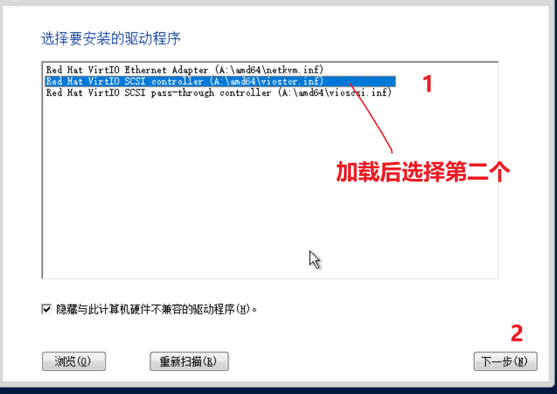
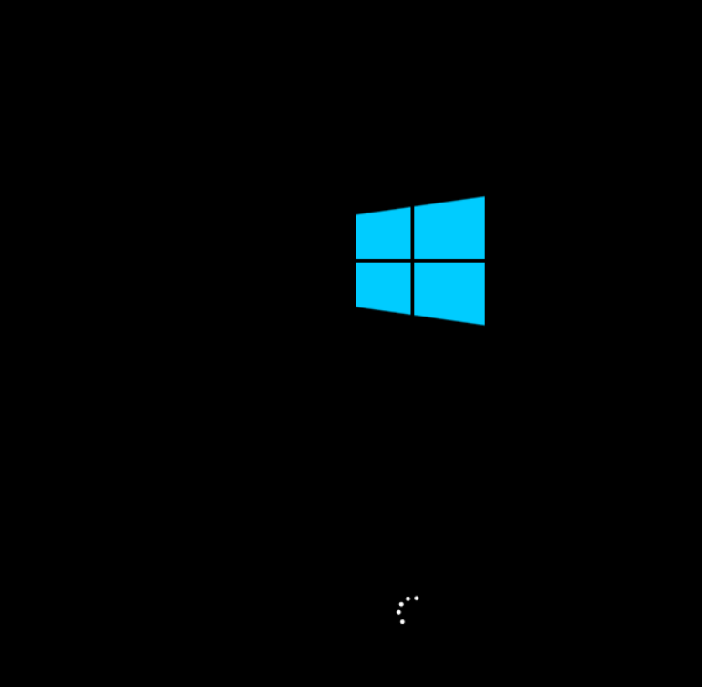
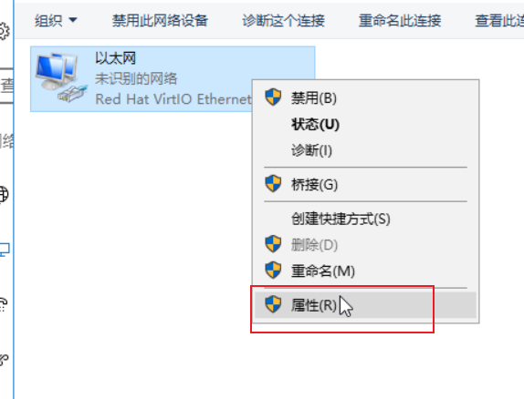
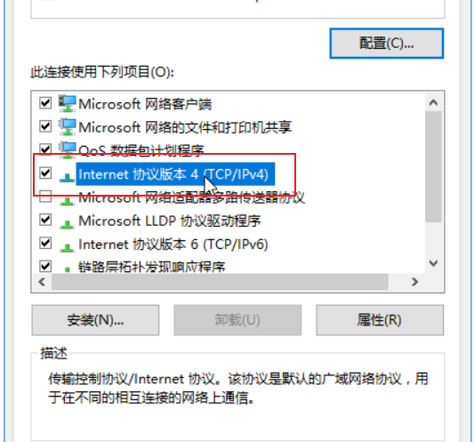

# 1. 创建虚拟机步骤

## 1.1 创建虚拟机

1. 在虚拟机页面选择增加

   

2. 在基本配置中设置虚拟机 硬件信息

3.  然后点击高级配置，主要修改网络和其他硬件信息

   - 修改网络

     1. 点击网络前面的三角图标，然后设置使用的虚拟机为vs_business(即业务虚拟机)，在网络策略模板中选择对应的valn即可

        

   - 首次使用虚拟机需要安装系统，那么就要使用光驱挂载镜像文件。

     1. 点击光驱

        

     				 2.  	选择需要挂载的镜像文件，并选择确定

3. 确定已经挂载上去

   

4. 补充说明，如果需要添加硬件，点击下方的增加硬件即可。

   

   - 以新建磁盘为例，确定增加磁盘后，点击确定

     

   - 设置新磁盘的大小，此处为300G,并选择完成

5. 等待虚拟机创建完成

   

## 1.2 启动虚拟机安装系统

 1. 点击启动。

2. 点击弹窗确定后，打开控制台，开始部署安装系统

   

3. 首次安装，初始化较慢，请耐心等待

**注意: 此处默认是无法查看磁盘需要点击下方的加载驱动程序，进行驱动安装**

驱动安装完毕后，即可看到对应的磁盘空间

开始安装，安装完毕后会自动重启

自动重启中

## 1.3  系统设置

1. 设置管理员密码（首次登录需设置密码，此处密码为ad@h3c.com）

   

2. 解锁界面可以利用上方控制台发送快捷键命令

解锁后输入密码

## 1.4 网络设置

注意：网络需要安装castool工具包进行优化，安装驱动才能使用！！！

- 回到管理平台，然后选择修改，重新挂载castool工具包

- 选择光驱--->断开连接

- 点击连接

- 选择安装castools镜像工具

  - 类型下拉菜单中选择CAStools
  - 
  - 选择确定

  

- 完成后关闭，重新进入操作系统的控制台，点击下方文件管理器

- 
- 

- 点开cd驱动器，选择CAS_tool_setup，进行安装

  

  安装过程有弹窗，点击确定即可。

- 

- 安装完毕，关闭即可

  

### 1.4.1 然后可以设置网络

根据需求的网段配置IP地址

参考网段如下

- 点击确定后，即可连接网络
- 

打开命令控制台后，放心可以拼通网关，即代表环境无问题

