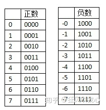
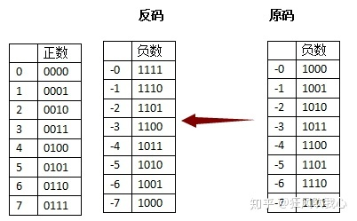
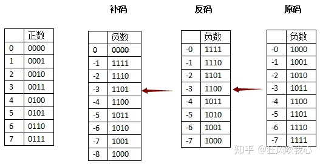
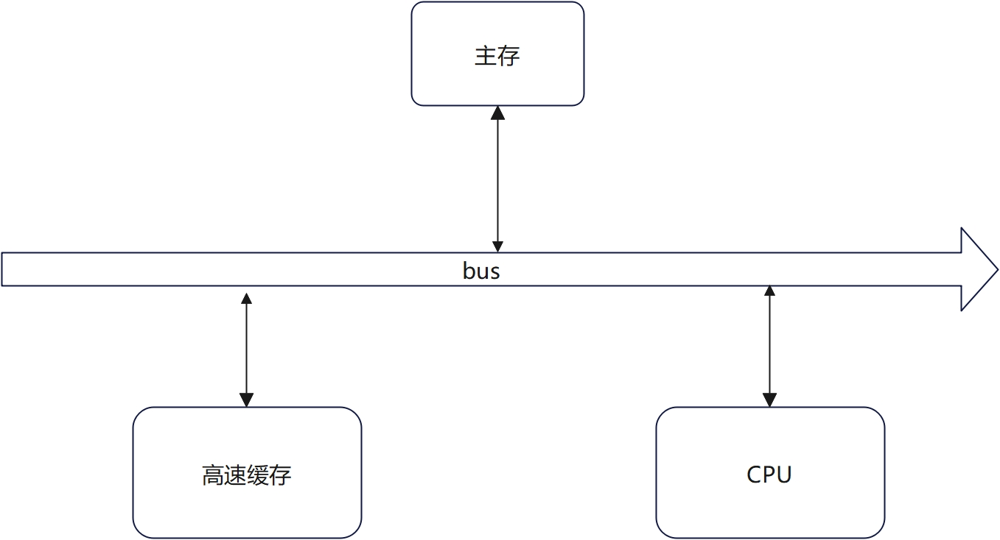

# 1. 计算机系统知识

## 1.1 计算机系统基础知识

### 1.1.1 硬件组成和cpu

1. 计算机的基本硬件系统由**运算器，控制器，存储器，输入设备和输出设备**组成

2. cpu的的功能：**程序控制，操作控制，时间控制，数据控制，中断处理**。

3. cpu的组成：

   - 运算器： **由算术逻辑单元(ALU), 累加寄存器(AC), 数据缓冲寄存器(DR)，状态条件寄存器(PSW)**等组成
   - 控制器：一般由**指令控制逻辑 (指令寄存器,程序计数器,地址寄存器,指令译码器), 时序控制逻辑，总线控制逻辑和中断控制逻辑**等几个部分。
   - 寄存器组：**专用寄存器和通用寄存器**

4. 多核cpu: 多核即在一个单芯片上集成两个或者多个处理器内核。

   - Intel：是将不同核心上的两个内核进行封装，称为双芯，利用超线程技术，单核可以视为双核，但不如独立的双核性能
   - AMD：将2个内核通过直连架构连接，称为双核。

### 1.1.2 数据表示

1. 数值在计算机中用二进制来表示，称为机器码，其中用符号位表示正(最高位为0)负(最高位为1)。

2. 为了方便运算，机器码可以用原码，反码，补码和移码等方式。

   > **一、十进制与二进制的相互转换**
   >
   > \1. 十进制转换为二进制，分为整数部分和小数部分。
   >
   > > **整数部分采用除2倒取余法**，具体做法：用2去除十进制整数，可以得到一个商和余数；在用2去除商，又会得到一个商和余数，如此进行，知道商为0时为止，然后把先的到的余数作为二进制的低位有效位，后得到的余数作为二进制数的高位有效位，依次排列起来。
   > > **小数部分采用乘2取整法**，具体做法：用2乘十进制小数，可以得到积，将积中的整数部分取出，在用2乘余下的小数部分，又得到一个积，在将积中的整数部分取出，如此进行，直到积中的小数部分为0，此时0或1为二进制的最后一位，或者达到所要求的精度为止，然后把取出的整数部分按顺序排列起来，先取得整数作为二进制小数的最高位有效位，后取的整数作为低位有效位。
   >
   > \2. 二进制转换为十进制，方法：**按权相加法**，即将二进制每位上的数乘以权，然后相加之和即是十进制数。
   >
   > ------
   >
   > **二、预备知识**
   >
   > 由于计算机的硬件决定，**任何存储于计算机中的数据，其本质都是以二进制码存储**。
   >
   > 根据冯·诺依曼提出的经典计算机体系结构框架，一台计算机由运算器、控制器、存储器、输入和输出设备组成。其中运算器**只有加法运算器**，没有减法运算器（据说一开始是有的，后来由于减法运算器硬件开销太大，被废了）。
   >
   > 所以计算机中没办法直接做减法的，它的减法是通过加法实现的。现实世界中所有的减法也可以当成加法的，减去一个数可以看作加上这个数的相反数，但前提是要先有负数的概念，这就是为什么不得不引入一个符号位。**符号位在内存中存放的最左边一位，如果该位位0，则说明该数为正；若为1，则说明该数为负。**
   >
   > 而且从硬件的角度上看，只有正数加负数才算减法，正数与正数相加，负数与负数相加，其实都可以通过加法器直接相加。
   >
   > 原码、反码、补码的产生过程就是为了解决计算机做减法和引入符号位的问题。
   >
   > ------
   >
   > **三、原码**
   >
   > 原码：**是最简单的机器数表示法，用最高位表示符号位，其他位存放该数的二进制的绝对值**。
   >
   > 以带符号位的四位二进制数为例：1010，最高位为1表示这是一个负数，其它三位010，即0*2^2+1*2^1+0*2^0=2，所以1010表示十进制数-2。
   >
   > 部分正负数的二进制原码表示
   >
   > 原码的表示法很简单，虽然出现了+0和-0，但是直观易懂。于是开始运算——
   >
   > > 0001+0010=0011，1+2=3；
   > > 0000+1000=1000，+0+(-0)=-0；
   > > 0001+1001=1010，1+(-1)=-2。
   >
   > 于是可以看到其实正数之间的加法通常是不会出错的，因为它就是一个很简单的二进制加法，而正数与负数相加，或负数与负数相加，就要引起莫名其妙的结果，这都是符号位引起的。0分为+0和-0也是因它而起。
   >
   > **原码的特点：**
   >
   > \1. 原码表示直观、易懂，与真值转换容易。
   >
   > \2. 原码中0有两种不同的表示形式，给使用带来了不便。
   >
   > > 通常0的原码用+0表示，若在计算过程中出现了-0，则需要用硬件将-0变成+0。
   >
   > \3. 原码表示加减运算复杂。
   >
   > > 利用原码进行两数相加运算时，首先要判别两数符号，若同号则做加法，若异号则做减法。在利用原码进行两数相减运算时，不仅要判别两数符号，使得同号相减，异号相加；还要判别两数绝对值的大小，用绝对值大的数减去绝对值小的数，取绝对值大的数的符号为结果的符号。可见，原码表示不便于实现加减运算。
   >
   > ------
   >
   > **四、反码**
   >
   > 原码最大的问题就在于一个数加上它的相反数不等于0，于是反码的设计思想就是冲着解决这一点，既然一个负数是一个正数的相反数，那干脆用一个正数按位取反来表示负数。
   >
   > 反码：**正数的反码还是等于原码；负数的反码就是它的原码除符号位外，按位取反**。
   >
   > 以带符号位的四位二进制数为例：3是正数，反码与原码相同，则可以表示为0011；-3的原码是1011，符号位保持不变，低三位按位取反，所以-3的反码为1100。
   >
   > 部分正负数的二进制反码表示
   >
   > 再试着用反码的方式解决一下原码的问题——
   >
   > > 0001+1110=1111，1+(-1)=-0；
   > > 1110+1100=1010，(-1)+(-3)=-5。
   >
   > 互为相反数相加等于0，虽然的到的结果是1111也就是-0。但是两个负数相加的出错了。
   >
   > **反码的特点：**
   >
   > 1. 在反码表示中，用符号位表示数值的正负，形式与原码表示相同，即0为正；1为负。
   > 2. 在反码表示中，数值0有两种表示方法。
   > 3. 反码的表示范围与原码的表示范围相同。
   >
   > **反码表示在计算机中往往作为数码变换的中间环节。**
   >
   > ------
   >
   > **五、补码**
   >
   > 补码：**正数的补码等于它的原码；负数的补码等于反码+1**（这只是一种算补码的方式，多数书对于补码就是这句话）。
   >
   > 其实负数的补码等于反码+1只是补码的求法，而不是补码的定义，很多人以为求补码就要先求反码，其实并不是，那些计算机学家并不会心血来潮的把反码+1就定义为补码，只不过补码正好就等于反码+1而已。
   >
   > 如果有兴趣了解补码的严格说法，建议可以看一下《计算机组成原理》，它会用“模”和“同余”的概念，严谨地解释补码。
   >
   > ------
   >
   > **六、补码的思想**
   >
   > 补码的思想，第一次见可能会觉得很绕，但是如果肯停下来仔细想想，绝对会觉得非常美妙。
   >
   > 补码的思想其实就是来自于生活，只是我们没注意到而已，如时钟、经纬度、《易经》里的八卦等。**补码的思想其实就类似于生活中的时钟**。
   >
   > 如果说现在时针现在停在10点钟，那么什么时候会停在八点钟呢？
   >
   > > 简单，过去隔两个小时的时候是八点钟，未来过十个小时的时候也是八点钟。
   > > 也就是说时间倒拨2小时，或正拨10小时都是八点钟。
   > > 也就是10-2=8，而且10+10=8。
   > > 这个时候满12，说明时针在走第二圈，又走了8小时，所以时针正好又停在八点钟。
   >
   > 所以12在时钟运算中，称之为模，超过了12就会重新从1开始算了。
   >
   > 也就是说，10-2和10+10从另一个角度来看是等效的，它都使时针指向了八点钟。
   >
   > 既然是等效的，那么在时钟运算中，减去一个数，其实就相当于加上另外一个数（这个数与减数相加正好等于12，也称为同余数），这就是补码所谓运算思想的生活例子。
   >
   > 在这里，再次强调原码、反码、补码的引入是为了解决做减法的问题。在原码、反码表示法中，我们把减法化为加法的思维是减去一个数等于加上这个数的相反数，结果发现引入符号位，却因为符号位造成了各种意想不到的问题。
   >
   > 但是从上面的例子中，可以看到其实减去一个数，对于数值有限制、有溢出的运算（模运算）来说，其实也相当于加上这个数的同余数。
   >
   > 也就是说，不引入负数的概念，就可以把减法当成加法来算。
   >
   > ------
   >
   > **七、补码的实例**
   >
   > 接下来就做一做四位二进制数的减法（先不引入符号位）。
   >
   > 0110-0010，6-2=4，但是由于计算机中没有减法器，没法算。
   >
   > 这时候，想想时钟运算中，减去一个数，是可以等同于加上另外一个正数（同余数），这个数与减数相加正好等于模。
   >
   > 也就是四位二进制数最大容量是多少？其实就是2^4=16（10000）。
   >
   > 那么-2的同余数，就等于10000-0010=1110，16-2=14。
   >
   > 既然如此，0110-0010=0110+1110=10100，6-2=6+14=20。
   >
   > 按照这种算法得出的结果是10100，但是对于四位二进制数最大只能存放4位，如果低四位正好是0100，正好是想要的结果，至于最高位的1，计算机会把它放入psw寄存器进位位中，8位机会放在cy中，x86会放在cf中，这里不做讨论。
   >
   > 这个时候，再想想在四位二进制数中，减去2就相当于加上它的同余数（至于它们为什么同余，还是建议看《计算机组成原理》）。
   >
   > 但是减去2，从另一个角度来说，也是加上-2，即加上-2和加上14得到的二进制结果除了进位位，结果是一样的。如果我们把1110的最高位看作符号位后就是-2的补码，**这可能也是为什么负数的符号位是1，而不是0**。
   >
   > 部分正负数的二进制补码表示
   >
   > 到这里，原码、反码的问题，补码基本解决了。
   >
   > 在补码中也不存在-0了，因为1000表示-8。
   >
   > **补码的特点：**
   >
   > \1. 在补码表示中，用符号位表示数值的正负，形式与原码的表示相同，即0为正，1为负。但补码的符号可以看做是数值的一部分参加运算。
   >
   > > 正数的补码表示就是其本身，负数的补码表示的实质是把负数映像到正值区域，因此加上一个负数或减去一个正数可以用加上另一个数（负数或减数对应的补码）来代替。
   > > 从补码表示的符号看，补码中符号位的值代表了数的正确符号，0表示正数，1表示负数；而从映像值来看，符号位的值是映像值的一个数位，因此在补码运算中，符号位可以与数值位一起参加运算。
   >
   > \2. 在补码表示中，数值0只有一种表示方法。
   >
   > \3. 负数补码的表示范围比负数原码的表示范围略宽。纯小数的补码可以表示到-1，纯整数的补码可以表示到-2^n。
   >
   > 由于补码表示中的符号位可以与数值位一起参加运算，并且可以将减法转换为加法进行运算，简化了运算过程，因此**计算机中均采用补码进行加减运算**。
   >
   > ------
   >
   > **八、为什么负数的补码的求法是反码+1**
   >
   > 因为负数的反码加上这个负数的绝对值正好等于1111，在加1，就是10000，也就是四位二进数的模，而负数的补码是它的绝对值的同余数，可以通过模减去负数的绝对值得到它的补码，所以负数的补码就是它的反码+1。
   >
   > 移码表示法：只需将补码的符号位取反即可。

3. 定点数和浮点数

4. 校验码：奇偶校验，海明码，循环冗余校验码

## 1.2 计算机体系结构

### 1.2.1 计算机体系结构的发展

1. 计算机体系结构、计算机组织和计算机实现三者关系
   - 计算机体系结构：是指计算机的概念性结构和功能属性
   - 计算机组织：是指计算机系统结构的逻辑实现，包括机器内的数据流和控制流的组成以及逻辑设计。
   - 计算机实现：是指计算机组织的物理实现。
2. 从宏观上按处理器的数量可以分为：单处理系统，并行处理与多处理系统和分布式处理系统。
3. 从微观上按并行程度分类：Flynn分类（按指令流和数据流分类），冯泽云分类法（按并行度对各种及计算机系统进行结构分类），Handler分类法（基于硬件并行程度计算并行度），Kuck分类法（利用指令流和执行流以及多重性描述系统控制特征）

#### 1.2.1.1 指令系统

1. 一个处理器支持的指令和指令的字节级编码称为器指令集体系结构。（不同处理器族，支持的指令集不一样）

   其中分类方式有：体系结构，暂存机制

2. 指令集的发展途径

   - CISC:复杂指令集计算机。
   - RISC:精简指令集计算机。

3. 指令的流水处理：

   - 指令控制方式：顺序方式，重叠方式和流水方式（流水可以看成重叠的延申，即分解成更多的子过程）
   - 流水的种类划分可以从：级别，功能，连接，是否有反馈，顺序，数据表示
   - 流水的相关处理： 在处理指令中，指令之间的相关性分为局部相关（处理方式：退后法和通路法）和全局相关（猜测转移法，加快和提前形成条件码、加快短循环的处理）。

4. 阵列处理机（多处理单元按一定方式练成阵列，单个控制部件cu对数据进行处理）、并行处理机（存储共享或分布式架构），多处理机（多台独立的处理机构成，共享主存和所有外设）和其他计算机（集群）

### 1.2.2 存储系统

#### 1.2.2.1 存储器的分类

- 所处的位置分为内存（在主机内或主板上）和外存（数据在需要时才调入内存）

2. 构成材料
   - 磁存储器，半导体存储器，光存储器
3. 存储的工作方式
   - 读写存储
   - 只读存储
     - 固定只读（ROM）例如存放BIOS，由厂家写入数据
     - 可编程只读存储器（PROM），由用户一次写入
     - 可擦除可编程的只读存储器（EPROM）需紫外线方式擦除。
     - 电擦除可编程的只读存储器（EEPROM）需电擦除
     - 闪存存储器：同样使用电信号来进行信息的擦除和写入。
4. 按访问方式
   - 按地址访问的存储器
   - 按内容访问的存储器
5. 按寻址方式
   - 随机存储器（RAM）
   - 顺序存储器（SAM)
   - 直接存储器（DAM)

#### 1.2.2.2 相联存储器

​	相联存储器是一种按内容访问的存储器，将数据或数据的某一部分作为关键字，写入信息，然后按照关键字进行检索和更新。该思想经常用在虚拟存储器中。

#### 1.2.2.3 高速缓存

高速缓存用来存放当前最活跃的程序和数据，其特点是：位于CPU与主存之间，速度一般比主存快5~10倍。

​	

 Cache存储器用来存放主存的部分副本信息。控制部分的功能就是用来判断cpu要访问的信息是否在Cache存储器中，若在即为命中，若不在则没有命中。命中时直接对Cache存储器寻址；未命中时，要按照替换原则决定主存的一块信息放到Cache存储器的哪一块里。

1. 高速缓存中的地址映像方法
   - 直接映像
   - 全相联映像
   - 组相联映像
2. 替换算法：目的就是使Cache获得尽可能搞的命中率
   - 随机替换算法
   - 先进先出
   - 近期最少使用
   - 优化替换法
3. 性能分析：虽然扩大cache的容量能够大幅提高命中率，但是也导致了增加了成本和命令时间。
4. 多级Cache： 在多级Cache的计算中，Cache分为一级缓存，二级缓存，三级缓存等，读写速度依次递减，容量依次递增。

##### 1.2.2.4 虚拟存储器

​	虚拟存储器是由现代操作系统对主存的抽象，使用虚拟地址的概念来对主存的物理地址进行范围，本质上就是逻辑存储器。

   #### 1.2.2.5 外存储器

​	外存储器用来存放暂时不用的程序和数据，并且以文件的形式存储。cpu不能直接访问外存的程序和数据。

常见的外存

1. 磁表面存储器
2. 光盘存储器
3. 固态存储器
   - 闪存
   - DRAM
4. 磁盘列阵技术：将多块磁盘存储器组成一个快捷，大容量，高可用的外存子系统。
5. 存储域网络（SAN）：利用网络将一个或多个存储设备连接起来，每个存储设备可以是RAID，磁盘备份系统，磁带库和CD-ROM库等

### 1.2.3  输入/输出技术

#### 1.2.3.1 微型计算机中最常见的内存和接口的编址方法

1. 内存域接口地址独立编址方法
2. 内存与接口地址同一编址方法

#### 1.2.3.2 直接程序控制

   外设的输入和输出由cpu直接管控，分为2种

1. 无条件传送，默认外设随时准备接收数据。
2. 程序查询方式,会对外设状态查询，等外设就绪后才进行输传。

#### 1.2.3.3 中断方式

 	当程序控制I/O时，cpu必须等待I/o结束后才能进一步操作，那么这就浪费了时间和性能，通过中断，可以先将当前状态保留，然后去完成其他任务，然后I/O完成后，由中断源发送中断信号，cpu收到后，保存当前运行的进程状态，并停止当前任务，运行请求I/O中断服务的程序执行。

1. 常见的中断处理法

   - 多中断信号线法

   - 中断软件查询法
   - 菊花链法

   - 总线仲裁法

   - 中断向量表法

2. 中断优先级控制

   在中断优先级中，给最紧迫的中断源分配高的优先级，而给不紧迫的中断源分配一些低的优先级。

#### 1.2.3.4 直接存储器存取方式

​    利用直接内存存取(DMA)可以让数据直接在内存与I/O设备间的直接成块传送，即在内存和I/O设备间传输数据时，是不需要cpu参与的，cpu只在启动和结束时参与。传输过程由DMA硬件执行，cpu就可以做其他任务，但是注意DMA传输数据时，总线的控制权在DMA上。

#### 1.2.3.5 输入/输出处理机即通道（IOP）

辅助cpu完成对外围设备的统一管理，完成了外围设备和主存之间的数据传输（介于主存和外设之间）。

### 1.2.4 总线结构

​	总线Bus是指计算机设备和设备之间传输信息的公共数据通道，其中一个重要特征是所有设备都可以使用总线。

1. 总线的分类： 

   - 数据总线（Data bus,DB）: 用来传输数据，是双向的。
   - 地址总线（Address Bus, AB）: 用来传输cpu发出的地址信息，是单向的。
   - 控制总线(Control bus,CB) ：用来传输控制信号，时序信号和状态信息等。

2. 常见的总线

   - ISA总线
   - PCI总线
   - SCSI总线
   - SATA总线
   - USB，通用串行总线
   - 等

   

   ### 1.2.5 

   

